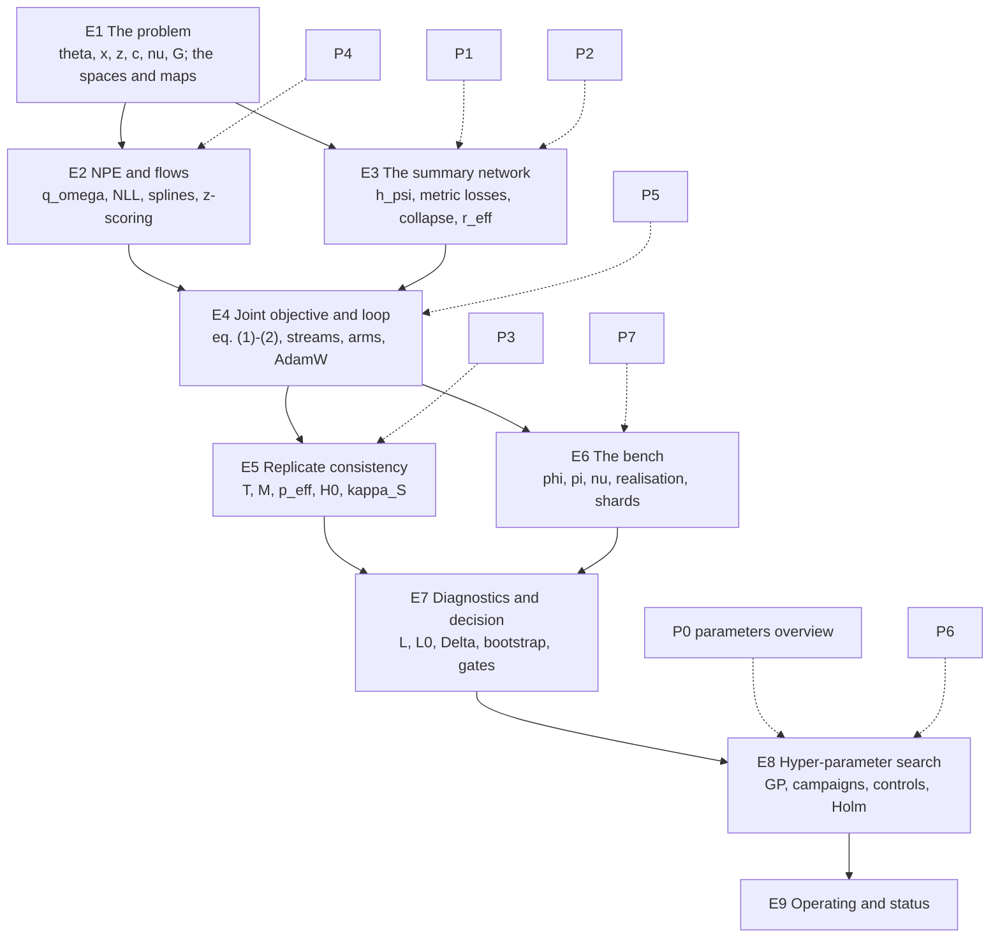

# E0 -- Reader's guide and master notation for the joint DSN + NPE documentation set

**Document E0 of the joint documentation set.** The master notation table
and glossary for both sets (P0-P7, E1-E9); the reading map; the
prerequisites; the running example. Index and status: `00_INDEX.md`.
**Date:** 2026-10-02 (v1.6). **Applies to:** the repository
`Simulation-Based-Inference` at `834eb41`, `hpc/joint/` (D-037), and the
project documents named in S6.

| date | change |
|---|---|
| 2026-10-02 | v1.6. Appended the search-driver group (41 rows, 48 symbols) for P6, under convention 14: the GP surrogate's mean, standard deviation and acquisition margin, reserved for E8, are declared here because P6 needed them first, as the flow's symbols were by P4; nothing renamed. One row annotated, not changed: $L_{\rm sel}, L_{\rm gate}$ now also says that at `834eb41` no gate split exists and the driver's `--rank-split` / `--gate-split` are labels (P6 F-am). Convention 14 annotated. The checker is unchanged; smoke test T4.9 adds P6 to the suite. |
| 2026-10-02 | v1.5. Appended the optimiser-and-schedule group (15 rows; 297 declared `[RAN]`) for P5, under convention 14; nothing renamed. One row annotated, not changed: $L_{\rm sel}$ keeps the plan's gloss "the search objective" and now says that at `834eb41` the tuner's objective `nll` is $L$ on the report split while $L_{\rm sel}$ feeds the stopping rule alone (P5 F-al), the assignment being an open decision. The checker is unchanged; smoke test T4.8 adds P5 to the suite. |
| 2026-10-02 | v1.4. Appended the flow group (15 rows, 15 symbols; 272 declared `[RAN]`, the v1.3 count being 257 as `--list` reports it, not 256) for P4, under convention 14: the flow's base variable and transform, reserved there for the first chapter to need them, are now declared ($\zeta$, $p_\zeta$, $\mathcal{F}_\omega$, $\mathcal{F}_{\rm box}$) and convention 14 says so; nothing renamed. The checker is unchanged; smoke test T4.7 adds P4 to the suite. |
| 2026-10-02 | v1.3. Appended the replicate-term group (13 rows, 13 symbols) for P3, under convention 14; nothing renamed. The checker is unchanged; smoke test T4.6 adds P3 to the suite. |
| 2026-10-01 | v1.2. Appended the DSN-loss group (26 rows, 31 symbols) for P2, under convention 14; nothing renamed. The checker gained two index forms P2 needs (a primed declared index; a relation inside a script) and a recursion guard, `tools/check_notation.py`, smoke tests T2.10-T2.11, T4.4-T4.5. |
| 2026-10-01 | v1.1. Appended the encoder-architecture group (29 symbols) for P1, under convention 14; nothing renamed. |
| 2026-10-01 | v1. Built from the joint plan's S1 (`JOINT_DSN_NPE_PLAN_v0_6.md` at `834eb41`, with its v0.6 collision repairs), the deck pack's `09_NOTATION_AND_GLOSSARY.md` (its conventions 1-12 and glossary), the metric document's notation (`METRIC_REPLICATE_v1_4.md`: the computed-versus-true covariance convention, $\kappa_S$, the draw and error symbols) and P0's table. Seventeen symbol repairs beyond the plan's two, each listed in S1.1 with what it replaces. The checker `tools/check_notation.py` (26 fixture checks, run twice `[RAN]`) reads this table and passes on P0 and on this document's own prose. |

**Abstract.** Nineteen documents share one notation, and a reader who moves
between them must never meet one letter with two meanings or two letters for
one object. The question this document answers is practical: what every
symbol of the set denotes, with its type, domain, units and the chapter that
first uses it; which words of the field the set uses in a technical sense;
in what order the chapters build and what each assumes of its reader; and
what the one running example is that every chapter instantiates. **Covered:**
the master symbol table (S1) that every later document's own table is a
subset of; the conventions, including every overload the sources carry and
how this set resolves it (S1.1); the two-level separation of every quantity
that exists both as a property of a distribution and as a number computed
from draws (S1.1, S3.5); the glossary ordered by first appearance in the E
set (S2); the reading map and chapter skeleton (S3.1); the prerequisites
(S3.2); the running example at the DUP15HD and bench shapes (S3.3); the
spaces and the maps between them (S3.4); the checker that enforces the table
(S3.6). **Deliberately excluded:** any derivation (E2-E8), any parameter's
meaning (P1-P7), any literature claim -- a named method appears here only as
the name of an object, and the chapter that owns it carries the grounding
(plan S6). Nothing in this document is a result; every number is tagged.

---

## 1. Notation and symbols

The master table. A later document's own table is a subset of this one
(same symbol, same type, same units); a symbol a chapter needs that is not
here is added here, in the same turn, with that chapter in the last column
-- the table grows by appending, never by renaming (S3.6). Group rows in
bold are headings, not symbols.

| Symbol | Name / Meaning | Type & domain | Units | First used in |
|---|---|---|---|---|
| **Indices** | | | | |
| $i$ | row (window) index | $i \in \{1, \dots, n\}$ for the split or batch in play | -- | E2 |
| $k$ | axis index of the parameter vector | $k \in \{1, \dots, d_\theta\}$ | -- | E1 |
| $j$ | direction index: the $j$-th generalised eigendirection of a pair of matrices | $j \in \{1, \dots, d_\theta\}$ | -- | E5 |
| $s$ | posterior-draw index | $s \in \{1, \dots, S_{\rm mc}\}$ | -- | E5 |
| $m$ | nuisance-direction index | $m \in \{1, \dots, d_\nu\}$ | -- | E7 |
| $g, g'$ | two wells (cultures) of one donor | indices into the real bank | -- | E5 |
| $P$ | a donor | index | -- | E5 |
| $t$ | training progress, as a fraction of the planned optimiser steps | $t \in [0, 1]$ | -- | E4 |
| $n$ | a generic count, always qualified in prose (rows of a split, draws, ...) | $\mathbb{N}$ | -- | E2 |
| $d$ | two senses, stated at each use: the degrees of freedom of a chi-square or Wishart law ($\chi^2_d$, $\mathcal{W}_d$); the index of a compound in $\delta_d$ | $\mathbb{N}$; index | -- | E5; E7 |
| **Data: windows and banks** | | | | |
| $x$ | one IFR window: the pooled instantaneous firing rate of one subregion over $T_{\rm win}$ | $x \in \mathbb{R}^{W}_{\ge 0}$ | Hz on the cohort; counts per bin per unit on the bench (`per_unit_mean`) | E1 |
| $W$ | window length in samples, $W = \mathrm{round}(T_{\rm win} f_s)$ | $\mathbb{N}$ | samples | E1 |
| $T_{\rm win}$ | window duration | $\mathbb{R}_{>0}$ | s | E1 |
| $f_s$ | IFR sampling rate, $f_s = 1 / \Delta t$ | $\mathbb{R}_{>0}$ | Hz | E1 |
| $\Delta t$ | IFR bin width (`w_size`) | $\mathbb{R}_{>0}$ | s | E1 |
| $\sigma_{\rm sm}$ | Gaussian smoothing width of the IFR (`gaussian_window`) | $\mathbb{R}_{>0}$ | s | E1 |
| $n_e$ | electrodes pooled per subregion | $\mathbb{N}$ | -- | E1 |
| $n_{\rm win}$ | windows per culture after windowing (the plan's `N` in its S2.7) | $\mathbb{N}$ | -- | E1 |
| $G$ | number of real cultures (wells) in the cohort | $\mathbb{N}$ | -- | E1 |
| $G_{\rm don}$ | number of distinct donors behind them | $\mathbb{N}$ | -- | E1 |
| $N_{\rm pair}$ | same-donor well pairs available | $\mathbb{N}$ | pairs | E5 |
| $N_{\rm train}$ | rows of the training split (the search's `n_train` anchor) | $\mathbb{N}$ | rows | E4 |
| $p$ | latent dimension of a bank, as its sidecar records it (`n_latent`; the search's `--p` anchor). Bare $p$ is never a density: every density carries a subscript (S1.1) | $\mathbb{N}$ | -- | E6 |
| $\mathcal{D}$ | a dataset of rows, qualified in prose (`sim`, `met`, `rep`, a split) | a finite set of rows | -- | E2 |
| **Parameters, prior, latent structure** | | | | |
| $\theta$ | the inference parameters of one row, in inference coordinates | $\theta \in \Theta \subset \mathbb{R}^{d_\theta}$ | mixed: $\ln$ of a natural unit on the log axes, linear on the others | E1 |
| $\Theta$ | the prior box in inference coordinates | $\Theta = \prod_{k} [a_k, b_k]$ | -- | E1 |
| $d_\theta$ | parameter-space dimension | $\mathbb{N}$ | -- | E1 |
| $a_k, b_k$ | lower and upper bound of the box on axis $k$, in inference coordinates | $a_k < b_k$ reals | as axis $k$ | E1 |
| $a_k^{\rm nat}, b_k^{\rm nat}$ | the same bounds in natural units; on a log axis $a_k = \ln a_k^{\rm nat}$ | $0 < a_k^{\rm nat} < b_k^{\rm nat}$ on log axes | physical | E1 |
| $\theta^{\rm ns}$ | the neuron/synapse block of $\theta$ (23 axes on the cohort); descriptive only | subvector of $\theta$ | mixed | E1 |
| $\theta^{\rm topo}$ | the Weibull connectivity-kernel axes (`p0_conn`, `d0_conn`, `beta_conn`) | subvector of $\theta$, $\mathbb{R}^3$ | mixed | E1 |
| $\theta^*$ | the true parameter of one well; measured on the bench, derivation-only on real data | $\theta^* \in \Theta$ | mixed | E5 |
| $\theta^{(s)}_g$ | the $s$-th posterior draw for well $g$, i.i.d. from $q_\omega(\cdot \mid z_g)$ for each fixed $z_g$ | $\Theta$ | mixed | E5 |
| $p_\Theta$ | the prior density, uniform on $\Theta$ in inference coordinates; written $p_\Theta(\theta)$ (the plan's `p(\theta)`) | density on $\Theta$ | (param units)$^{-d_\theta}$ | E2 |
| $p_{\rm sim}$ | the simulator's joint law, $p_{\rm sim}(\theta, x) = p_\Theta(\theta)\, p_{\rm sim}(x \mid \theta)$; its conditional $p_{\rm sim}(\theta \mid x)$ is the true posterior that NPE targets | density on $\Theta \times \mathbb{R}^{W}$ | -- | E2 |
| $p_{\rm real}$ | the law of real windows, $p_{\rm real}(x)$; unknown, sampled by the cohort | density on $\mathbb{R}^{W}$ | -- | E1 |
| $\mathcal{G}$ | a realised connectivity graph drawn from the kernel at fixed $\theta^{\rm topo}$; a latent inside the likelihood, not a parameter | adjacency matrix | -- | E1 |
| $\nu$ | observation-level nuisance (gain, baseline, threshold shift, electrode dropout, drift); acts on the observation map, outside $\Theta$ | $\nu \in \mathcal{N}$ | mixed | E6 |
| $\mathcal{N}$ | the nuisance space | a set, $\mathbb{R}^{d_\nu}$ in the bench's parameterisation | -- | E6 |
| $d_\nu$ | nuisance dimension | $\mathbb{N}$ | -- | E6 |
| $\phi$ | the bench generator's latent factor vector; on the bench $\theta := \phi$ | $\phi \in (0, 1)^{d_\theta}$ | dimensionless | E6 |
| $\mathcal{A}_{\rm lab}, \mathcal{A}_{\rm free}$ | label-carrying and label-irrelevant axes of the bench latent (the plan's `S`, `F`) | disjoint index sets, $\mathcal{A}_{\rm lab} \cup \mathcal{A}_{\rm free} = \{1, \dots, d_\theta\}$ | -- | E6 |
| $c$ | phenotype (class) label | $c \in \{0, \dots, C - 1\}$ | -- | E1 |
| $C$ | number of classes (`n_classes`); never a covariance (S1.1) | $\mathbb{N}$ | -- | E1 |
| **Networks and embeddings** | | | | |
| $h_\psi$ | the encoder (DSN backbone), $h_\psi : \mathbb{R}^{W} \to S^{E-1}$ | map; weights $\psi$ | -- | E1 |
| $\psi$ | encoder weights | $\psi \in \mathbb{R}^{n_\psi}$ | -- | E3 |
| $n_\psi, n_\omega$ | number of encoder and flow weights | $\mathbb{N}$ | -- | E3 |
| $\psi^\star$ | the encoder weights arm `A0` converged to (the warm start of `A3`) | $\mathbb{R}^{n_\psi}$ | -- | E4 |
| $z$ | the embedding of a window, $z = h_\psi(x)$, L2-normalised | $z \in S^{E-1} \subset \mathbb{R}^{E}$ | dimensionless | E1 |
| $S^{E-1}$ | the unit sphere in $\mathbb{R}^{E}$ | $\{z \in \mathbb{R}^{E} : z^\top z = 1\}$ | -- | E1 |
| $E$ | embedding dimension (`embedding_size`) | $\mathbb{N}$ | -- | E1 |
| $q_\omega$ | the conditional flow (zuko NSF through sbi), written $q_\omega(\theta \mid z)$: a density on $\Theta$ for each fixed $z$ | conditional density; weights $\omega$ | (param units)$^{-d_\theta}$ | E2 |
| $\omega$ | flow weights | $\omega \in \mathbb{R}^{n_\omega}$ | -- | E2 |
| $K_{\rm bins}$ | bins of each rational-quadratic spline of the flow (`num_bins`) | $\mathbb{N}$ | -- | E2 |
| $n_{\rm tf}$ | transforms stacked in the flow (`num_transforms`) | $\mathbb{N}$ | -- | E2 |
| $n_{\rm hid}$ | hidden features of each transform's conditioner (`hidden_features`) | $\mathbb{N}$ | -- | E2 |
| $\bar z_c$ | mean embedding of class $c$ (the deck's `\mu_c`); at the collapse point one point per class on a simplex ETF | $\bar z_c \in \mathbb{R}^{E}$ | dimensionless | E3 |
| $\xi$ | within-class residual of an embedding, $\xi = z - \bar z_c$ (the deck's `\eta`) | $\mathbb{R}^{E}$ | dimensionless | E3 |
| $r_{\rm eff}$ | participation-ratio effective rank of an embedding cloud | $[1, E]$ | -- | E3 |
| $\rho_{\rm grad}$ | cosine between the NPE and DSN terms' gradients with respect to $\psi$ | $[-1, 1]$ | -- | E4 |
| $I(\cdot\,;\cdot)$, $H[\cdot]$ | mutual information; entropy, both in nats | $\mathbb{R}_{\ge 0}$ | nats | E3 |
| **Objective, losses, training** | | | | |
| $\mathcal{L}$ | the joint objective of plan eq. (1), $\mathcal{L}(\psi, \omega)$ | $\mathbb{R}$ | nats/row plus dimensionless terms | E4 |
| $\mathcal{L}^{\rm sim}_{\rm NPE}$ | expected NLL of $\theta$ given $h_\psi(x)$ under $p_{\rm sim}$, plan eq. (1a); analytic level, estimated by $L$ | $\mathbb{R}$ | nats/row | E2 |
| $\mathcal{L}^{\rm real}_{\rm DSN}$ | expectation of $\ell_{\rm DSN}$ over real class-labelled windows | $\mathbb{R}_{\ge 0}$ | dimensionless | E3 |
| $\ell_{\rm DSN}$ | the composite metric loss of one batch: triplet margin + angular hinge + $\lambda_{\rm sep}(t)$ times the simplex-ETF separation penalty | $\mathbb{R}_{\ge 0}$ | dimensionless | E3 |
| $\mathcal{L}^{\rm real}_{\rm rep}$ | the replicate-consistency loss on same-donor pairs, plan eq. (3c) | $\mathbb{R}_{\ge 0}$ | dimensionless | E5 |
| $\lambda_{\rm dsn}, \lambda_{\rm rep}$ | weights of the DSN and replicate terms in $\mathcal{L}$ | $\mathbb{R}_{\ge 0}$ | dimensionless | E4 |
| $\lambda_{\rm sep}$ | the scheduled weight of the ETF separation term inside $\ell_{\rm DSN}$, written $\lambda_{\rm sep}(t)$ (`lambda_sep`, `sep_warmup_frac`) | $\mathbb{R}_{\ge 0}$ | dimensionless | E3 |
| $m_{\cos}$ | triplet cosine margin (`margin`) | $(0, 1)$ | dimensionless | E3 |
| $\alpha$ | angular half-angle of the angular hinge (`angular_alpha_deg`); never a test level (S1.1) | $(0^\circ, 90^\circ)$ | degrees | E3 |
| $B_{\rm sim}, B_{\rm met}, B_{\rm rep}$ | rows per optimiser step in the simulated, metric and replicate streams (`--b-sim`, `--b-met`, `--b-rep`) | $\mathbb{N}$ | rows; pairs for $B_{\rm rep}$ | E4 |
| $\mathcal{B}_{\rm sim}$ | one i.i.d. prior-faithful minibatch of simulated rows | index set of size $B_{\rm sim}$ | -- | E4 |
| $X^{\rm real}_{\rm met}, y^{\rm real}_{\rm met}$ | the DSN's class-balanced real batch and its labels | batch of $B_{\rm met}$ rows; labels in $\{0, \dots, C-1\}$ | -- | E3 |
| $\mathcal{T}_{\rm mined}$ | the triplets the miner selects from a batch | a set of index triples | -- | E3 |
| $t_{\rm warm}$ | fraction of training before $\lambda_{\rm rep}$ ramps in (`warmup_frac_rep`) | $[0, 1)$ | -- | E5 |
| $\eta$ | the AdamW learning rate (`lr`); never the deck's residual (S1.1) | $\mathbb{R}_{>0}$ | dimensionless | E4 |
| $\beta_1, \beta_2$ | AdamW exponential decay rates; $\beta_1 = 1 - $ `one_minus_beta1` | $(0, 1)$ | dimensionless | E4 |
| $\gamma_{\rm wd}$ | the AdamW decoupled weight-decay coefficient (`weight_decay`) | $\mathbb{R}_{\ge 0}$ | dimensionless | E4 |
| $n_{\rm ep}, n_{\rm step}$ | epochs, and optimiser steps per epoch (`epochs`, `steps_per_epoch`) | $\mathbb{N}$ | -- | E4 |
| **Evaluation and decision** | | | | |
| $\ell_i$ | per-row held-out NLL, $\ell_i = -\log q_\omega(\theta_i \mid z_i)$ | $\mathbb{R}$ | nats | E7 |
| $L$ | held-out NLL of an arm: the mean of $\ell_i$ over a split (computed level; estimates $\mathcal{L}^{\rm sim}_{\rm NPE}$ at the fitted weights) | $\mathbb{R}$ | nats/row | E4 |
| $L_{\rm sel}, L_{\rm gate}$ | $L$ on the selection split (the search objective, as the plan's S2.4 and E8 assign it) and on the gate split [2026-10-02: at `834eb41` the runner scores $L_{\rm sel}$ once per epoch for the stopping rule and the best-state restore only, and the tuner's objective `nll` is $L$ on the report split; which assignment is wanted is open, P5 F-al] [2026-10-02, P6 F-am: no gate split exists at `834eb41`; the driver's `--rank-split` and `--gate-split` are labels written into `finalists.json`, and the control test's gain is `delta` from the same report-split record] | $\mathbb{R}$ | nats/row | E8 |
| $L_0$ | the prior floor, $L_0 = -\mathbb{E}_{p_\Theta} \log p_\Theta(\theta)$ | $\mathbb{R}$ | nats/row | E7 |
| $\hat\Delta$ | the information gain, $\hat\Delta = L_0 - L$ | $\mathbb{R}$ | nats/row | E7 |
| $\hat\Delta^{(k)}$ | per-axis gain on axis $k$ | $\mathbb{R}$ | nats | E7 |
| $\hat\Delta_{{\rm lab}\mid c}$ | within-class gain on the label axes $\mathcal{A}_{\rm lab}$ (the plan's `\hat\Delta_{S|c}`) | $\mathbb{R}$ | nats | E7 |
| $\delta_{\min}$ | the "learned nothing" floor of gate G1: the gain of the shuffled-pairs control, which an arm must exceed | $\mathbb{R}$ | nats/row | E7 |
| $\kappa_k$ | posterior contraction on axis $k$, $1 - \mathrm{Var}[\theta^{(k)} \mid z] / \mathrm{Var}_{p_\Theta}[\theta^{(k)}]$ | $(-\infty, 1]$ | -- | E7 |
| $d_i$ | paired per-row NLL difference between two arms on the same held-out row | $\mathbb{R}$ | nats | E7 |
| $D$ | population mean of $d_i$ (analytic level); $D > 0$ means the first arm is worse | $\mathbb{R}$ | nats/row | E7 |
| $\hat D$ | the sample mean of $d_i$ over the report split (computed level) | $\mathbb{R}$ | nats/row | E7 |
| $g_{\rm grp}$ | resampling group of the paired cluster bootstrap: topology draw (simulated bank) or culture (real bank) | index | -- | E7 |
| $n_g, \bar n, n_0$ | group sizes, their mean, and the unequal-size correction of the design effect | $\mathbb{N}$, $\mathbb{R}_{>0}$, $\mathbb{R}_{>0}$ | rows | E7 |
| $\rho_{\rm icc}$ | intraclass correlation of $d_i$ within groups (the plan's `\rho(d)`) | $[0, 1]$ | -- | E7 |
| $\sigma_b, \sigma_w$ | between- and within-group standard deviations of $d_i$ | $\mathbb{R}_{\ge 0}$ | nats | E7 |
| $\sigma_{\rm seed}$ | across-seed standard deviation of an arm's held-out NLL | $\mathbb{R}_{\ge 0}$ | nats/row | E7 |
| $n_{\rm seed}$ | seeds per arm | $\mathbb{N}$ | -- | E7 |
| $M_{\rm ens}$ | ensemble members (independent (encoder, flow) pairs); never the metric $M$ | $\mathbb{N}$ | -- | E7 |
| $\alpha_{\rm H}$ | the family-wise level of the Holm step-down over finalists (`--alpha`) | $(0, 1)$ | -- | E8 |
| $\mathrm{p}_{\rm grp}$ | group-aware permutation p-value of the misspecification gate (the deck's `p_{group}`) | $(0, 1]$ | -- | E7 |
| $\varepsilon$ | per-window truncation mass of TSNPE, named in E1 and E7 only | $(0, 0.5)$ | -- | E1 |
| **The replicate statistic and its justification** | | | | |
| $m_g$ | culture-level posterior mean, $m_g = \mathbb{E}_{q_\omega}[\theta \mid x_g]$ for each fixed $x_g$, over all $d_\theta$ axes (analytic level) | $\mathbb{R}^{d_\theta}$ | param units | E5 |
| $\hat m_g$ | the $S_{\rm mc}$-draw Monte Carlo estimate of $m_g$ (computed level) | $\mathbb{R}^{d_\theta}$ | param units | E5 |
| $e_g$ | the Monte Carlo error of the mean, $e_g = \hat m_g - m_g$; derivation-only | random vector in $\mathbb{R}^{d_\theta}$ | param units | E5 |
| $C_g$ | posterior covariance $\mathrm{Cov}_{q_\omega}(\theta \mid x_g)$ for one fixed $x_g$ (analytic level) | PSD $d_\theta \times d_\theta$ | (param units)$^2$ | E5 |
| $\hat C_g$ | the $S_{\rm mc}$-draw sample covariance (`ddof=1`) estimating $C_g$ (computed level) | PSD; PD for $S_{\rm mc} > d_\theta$ | (param units)$^2$ | E5 |
| $\bar C$ | the symmetrised covariance the code builds, $\bar C = (\hat C_g + \hat C_{g'})/2$ (computed level; the metric document's convention) | PSD $d_\theta \times d_\theta$ | (param units)$^2$ | E5 |
| $\bar C_{\rm true}$ | the exact symmetrised covariance $(C_g + C_{g'})/2$ that $\bar C$ estimates; derivation-only (the plan's `\bar C`) | PD $d_\theta \times d_\theta$ | (param units)$^2$ | E5 |
| $\Sigma_{\rm post}$ | in the conjugate Gaussian anchor only: the data-independent posterior covariance, where $C_g = C_{g'} = \bar C_{\rm true} = \Sigma_{\rm post}$ (the plan's and deck's `C`) | PD $d_\theta \times d_\theta$ | (param units)$^2$ | E5 |
| $\Delta_{gg'}$ | replicate disagreement, $\Delta_{gg'} = m_g - m_{g'}$ (analytic level) | $\mathbb{R}^{d_\theta}$ | param units | E5 |
| $\hat\Delta_{gg'}$ | the disagreement computed, $\hat m_g - \hat m_{g'}$ (computed level); not the gain $\hat\Delta$ | $\mathbb{R}^{d_\theta}$ | param units | E5 |
| $M$ | the metric of the statistic: a symmetric positive-definite quadratic form, $M = (2 \bar C)^{-1}$ in the code | SPD $d_\theta \times d_\theta$ | (param units)$^{-2}$ | E5 |
| $M_{\rm fix}$ | any symmetric matrix that does not depend on the posterior draws (the metric document's device for the bias argument) | symmetric $d_\theta \times d_\theta$ | (param units)$^{-2}$ | E5 |
| $T_{gg'}$ | the disagreement scalar, $T_{gg'} = \Delta_{gg'}^\top M \Delta_{gg'}$ (analytic level); always written with its pair | $\mathbb{R}_{\ge 0}$ | dimensionless | E5 |
| $\hat T_{gg'}$ | the finite-$S_{\rm mc}$ statistic the code computes, after the $d_\theta / S_{\rm mc}$ subtraction of plan eq. (3h) (computed level) | $\mathbb{R}$; can be negative | dimensionless | E5 |
| $u$ | the auxiliary vector of the Cholesky solve $(2 \bar C)\, u = \hat\Delta_{gg'}$, so that $\hat T_{gg'} = \hat\Delta_{gg'}^\top u$ before correction (the plan writes `z` there) | $\mathbb{R}^{d_\theta}$ | (param units)$^{-1}$ | E5 |
| $H_0$ | the composite null of plan eq. (3e): shared $\theta^*$ and a calibrated posterior | a hypothesis | -- | E5 |
| $S_{\rm mc}$ | posterior draws per well (`n_posterior_draws`); hard floor $4 d_\theta$ | $\mathbb{N}$ | draws | E5 |
| $n_{\rm W}$ | degrees of freedom of $\bar C$, $n_{\rm W} = 2 (S_{\rm mc} - 1)$ | $\mathbb{N}$ | -- | E5 |
| $\mathcal{W}_d$ | the Wishart law of a $d \times d$ scatter matrix, written $\mathcal{W}_d(n, \Sigma)$ with $n$ degrees of freedom and scale $\Sigma$ | distribution on PSD $d \times d$ | -- | E5 |
| $\Sigma$ | a generic covariance argument, used only inside $\mathcal{W}_d(n, \Sigma)$ | PSD | (param units)$^2$ | E5 |
| $\kappa_S$ | the inflation of $\hat T_{gg'}$ from inverting the estimated $\bar C$, $\kappa_S = n_{\rm W} / (n_{\rm W} - d_\theta - 1)$ for Gaussian draws; the subscript names its $S_{\rm mc}$-dependence, it is not an index | $\mathbb{R}_{> 1}$ | dimensionless | E5 |
| $V$ | $\mathrm{Var}(\Delta_{gg'} \mid \theta^*)$ over replicate datasets at fixed $\theta^*$; $V = 2 \Sigma_{\rm post} F \Sigma_{\rm post}$ in the conjugate anchor; derivation-only | PSD $d_\theta \times d_\theta$ | (param units)$^2$ | E5 |
| $F$ | Fisher information of one well's data about $\theta$ at $\theta^*$; derivation-only. Never an index set (S1.1) | PSD $d_\theta \times d_\theta$ | (param units)$^{-2}$ | E5 |
| $\Sigma_0$ | prior covariance; for the box, $\mathrm{diag}((b_k - a_k)^2 / 12)$, the box's second moment used as a Gaussian covariance; analytic | PD diagonal $d_\theta \times d_\theta$ | (param units)$^2$ | E5 |
| $\lambda_j$ | $j$-th generalised eigenvalue of $(F, \Sigma_0^{-1})$: the data-to-prior precision ratio along direction $j$ | $\mathbb{R}_{\ge 0}$ | dimensionless | E5 |
| $c_j$ | the prior's share of the posterior precision along direction $j$, $c_j = 1 / (1 + \lambda_j)$ | $(0, 1]$ | dimensionless | E5 |
| $p_{\rm eff}$ | the effective number of data-constrained directions, $\sum_{j} \lambda_j / (1 + \lambda_j) = d_\theta - \mathrm{tr}(\Sigma_0^{-1} \bar C_{\rm true})$ (analytic level) | $[0, d_\theta]$ | dimensionless | E5 |
| $\hat p_{\rm eff}$ | its estimate, $d_\theta - \mathrm{tr}(\Sigma_0^{-1} \bar C)$, affine in $\bar C$ and unbiased for any flow (computed level) | $\mathbb{R}$, clamped in the code | dimensionless | E5 |
| $\tau_j$ | the per-direction term of $T_{gg'}$ along direction $j$ (analytic level; mean 1 under $H_0$ with the true-covariance metric) | $\mathbb{R}_{\ge 0}$ | dimensionless | E5 |
| $\hat\tau_j$ | its finite-draw counterpart (computed level) | $\mathbb{R}$ | dimensionless | E5 |
| $d_{\rm eff}$ | effective degrees of freedom of the weighted chi-square null law of $T_{gg'}$, with $d_{\rm eff} \ge p_{\rm eff}$ (the metric document's `h`) | $\mathbb{R}_{>0}$ | dimensionless | E5 |
| $\chi^2_d$ | the chi-square law with $d$ degrees of freedom | distribution | -- | E5 |
| $A$ | an invertible linear reparameterisation $\theta' = A \theta$ in the invariance argument; never an arm name | $\mathbb{R}^{d_\theta \times d_\theta}$ | -- | E5 |
| $\theta'$ | the reparameterised parameter, $\theta' = A \theta$ | $\mathbb{R}^{d_\theta}$ | mixed | E5 |
| **Nuisance, aliasing, stratification, intervention** | | | | |
| $J_\theta, J_\nu$ | Jacobians $\partial z / \partial \theta$ and $\partial z / \partial \nu$ of the simulator-plus-encoder map, by finite differences | $E \times d_\theta$, $E \times d_\nu$ | -- | E7 |
| $\Pi_\theta$ | orthogonal projector onto the column span of $J_\theta$ (the deck's `P_{col(J_theta)}`) | $E \times E$ | -- | E7 |
| $a_m$ | aliasing coefficient of nuisance direction $m$, plan eq. (4) | $[0, 1]$ | -- | E7 |
| $\delta\theta_m$ | the parameter shift that nuisance direction $m$ is mistaken for, plan eq. (4) | $\mathbb{R}^{d_\theta}$ | param units | E7 |
| $\Sigma_{\rm rep}$ | covariance of $m_g - m_{g'}$ over same-donor pairs, about zero: the empirical nuisance floor | PSD $d_\theta \times d_\theta$ | (param units)$^2$ | E7 |
| $\Sigma_{\rm pat}$ | covariance of donor means within one diagnosis | PSD $d_\theta \times d_\theta$ | (param units)$^2$ | E7 |
| $\Sigma_{\rm dx}$ | covariance of diagnosis means | PSD $d_\theta \times d_\theta$ | (param units)$^2$ | E7 |
| $\mu_j, v_j$ | generalised eigenvalue and eigenvector of $(\Sigma_{\rm pat}, \Sigma_{\rm rep})$, plan eq. (5); never the Fisher spectrum $\lambda_j$ | $\mathbb{R}_{\ge 0}$, $\mathbb{R}^{d_\theta}$ | -- | E7 |
| $n_{\rm wd}$ | wells per donor behind one donor mean; the code's null for $\mu_j$ is $1 / (2 n_{\rm wd})$ (the deck's `k`) | $\mathbb{N}$ | -- | E7 |
| $\delta_d$ | the intervention of compound $d$ on the mechanism, $\theta \mapsto \theta \oplus \delta_d$ | $\mathbb{R}^{d_\theta}$ | param units | E7 |
| $f$ | the forward map from parameters to an observed summary, $f : \Theta \to \mathbb{R}^{n_y}$, plan eq. (6) | map | -- | E7 |
| $n_y$ | dimension of that summary | $\mathbb{N}$ | -- | E7 |
| $\Delta y_g$ | predicted post-treatment change of culture $g$, plan eq. (6) | $\mathbb{R}^{n_y}$ | as $f$ | E7 |
| **The bench** | | | | |
| $\pi$ | simulation-gap severity of the pseudo-real bench arm; $\pi = 0$ means no gap (`--pi`) | $[0, 1]$ | -- | E6 |
| $\mathcal{S}, \mathcal{R}$ | the bench's simulated and pseudo-real arms (`--arm S`, `--arm R`) | arms | -- | E6 |
| $p_0, p_\pi$ | the base and the perturbed bench generators (laws of a trace) | generative laws | -- | E6 |
| $\tau_{\rm ov}$ | within-class spread of the label axes on the bench (`--tau-ov`) | $\mathbb{R}_{>0}$ | dimensionless | E6 |
| $m_{c,k}$ | bench class centre of class $c$ on label axis $k$ | $(0, 1)$ | dimensionless | E6 |
| $\mathcal{TN}$ | the truncated normal law of plan eq. (7) | distribution on $(0, 1)$ | -- | E6 |
| $\mathcal{T}_\nu$ | the observation-level nuisance transformation of the bench, plan eq. (8), applied to a trace (the plan's `T_{\nu_g}[.]`) | map on traces | -- | E6 |
| $N_{\rm tr}, J$ | bench traces (cultures) and windows per trace (`--n-traces`, `--n-windows`; the plan's `G`, `J`) | $\mathbb{N}$ | -- | E6 |
| $N_{\rm neu}$ | bench neurons per trace (`--n-neurons`; the plan's `N`) | $\mathbb{N}$ | -- | E6 |
| $n_{\rm rl}$ | realisations per $\theta$ in a bank (`--n-per-theta`) | $\mathbb{N}$ | -- | E6 |
| **Encoder architecture (P1)** | | | | |
| $d_{\rm exp}$ | depth exponent (`depth_exponent`): the backbone stacks $B_{\rm blk} = 2^{d_{\rm exp}}$ residual blocks | $\mathbb{N}$; searched in $\{3, \dots, 6\}$ | -- | P1 |
| $B_{\rm blk}$ | number of residual blocks of the backbone | $\mathbb{N}$ | -- | P1 |
| $b$ | block index, $b \in \{0, \dots, B_{\rm blk} - 1\}$ | index | -- | P1 |
| $w_{\rm m}$ | width multiplier (`width_multiplier`): the slope of the width schedule | $\mathbb{R}_{>1}$ | dimensionless | P1 |
| $w_0$ | stem width (`stem_width`): channels after the stem | $\mathbb{N}$ | channels | P1 |
| $s_b$ | real-valued width exponent of block $b$, $s_b = \ln(b + 1) / \ln w_{\rm m}$ | $\mathbb{R}_{\ge 0}$ | dimensionless | P1 |
| $w_b$ | width (channel count) of block $b$ after rounding and group snapping | $\mathbb{N}$ | channels | P1 |
| $g_{\rm w}$ | group width (`group_width`): channels per group of the ResNeXt grouped convolution, and the unit every width is snapped to | $\mathbb{N}$ | channels | P1 |
| $n_{\rm st}$ | number of stages: distinct consecutive values among $w_0, \dots, w_{B_{\rm blk} - 1}$ | $\mathbb{N}$ | -- | P1 |
| $s_{\rm tot}$ | total stride of the backbone, $s_{\rm tot} = 4 \cdot 2^{n_{\rm st}}$ at the fixed strides | $\mathbb{N}$ | samples | P1 |
| $n_{\rm out}$ | length of the last stage's feature map, $n_{\rm out} = \lceil W / s_{\rm tot} \rceil$ | $\mathbb{N}$ | samples | P1 |
| $R_{\rm f}$ | receptive field of one output sample, in input samples | $\mathbb{N}$ | samples | P1 |
| $G_{\rm gn}$ | number of GroupNorm groups of a layer, a function of its channel count | $\mathbb{N}$ | -- | P1 |
| $c_{\rm pg}$ | target channels per GroupNorm group (`norm_target_cpg`) | $\mathbb{N}$ | channels | P1 |
| $n_{\rm head}$ | input features of the head's linear projection | $\mathbb{N}$ | -- | P1 |
| $\tilde z$ | the head's output before L2 normalisation, $z = \tilde z / \lVert \tilde z \rVert_2$ | $\mathbb{R}^{E}$ | dimensionless | P1 |
| $p_{\rm drop}$ | dropout probability (`dropout`), applied after every residual block in training | $[0, 1)$ | dimensionless | P1 |
| $k_b$ | integer width exponent of block $b$, $k_b = \mathrm{round}(s_b)$ | $\mathbb{N}_0$ | -- | P1 |
| $w_b^{\rm raw}$ | the width of block $b$ before rounding and snapping | $\mathbb{R}_{>0}$ | channels | P1 |
| $g_{\rm eff}$ | effective group size of a block, $\min(g_{\rm w}, w)$ | $\mathbb{N}$ | channels | P1 |
| $w$ | a block's output width when the block index is immaterial ($w_b$ with $b$ dropped; P1 flags the abuse where it uses it) | $\mathbb{N}$ | channels | P1 |
| $w_{\rm in}$ | a block's input width | $\mathbb{N}$ | channels | P1 |
| $C_{\rm ch}$ | the channel count of a normalisation layer | $\mathbb{N}$ | channels | P1 |
| $n^{\rm res}, n^{\rm rx}, n^{\rm blk}$ | weights of one ResNet block, one ResNeXt block, one block of the chosen family | $\mathbb{N}$ | -- | P1 |
| $\mathbb{1}_{\rm proj}, \mathbb{1}_{\rm fusion}$ | indicators: a block carries a projection shortcut; the head fuses all stages | $\{0, 1\}$ | -- | P1 |
| $n_{\rm ops}$ | number of pooled statistics per stage (`head_pool_ops`), 1 or 3 | $\{1, 3\}$ | -- | P1 |
| $\Omega_{\rm st}$ | the set of stage widths | finite set of $\mathbb{N}$ | channels | P1 |
| $u_{\rm head}$ | the concatenated pooled vector entering the head's projection; not the Cholesky vector $u$ | $\mathbb{R}^{n_{\rm head}}$ | dimensionless | P1 |
| $A_{\rm head}, a_{\rm head}$ | weight matrix and bias of the head's linear projection; not the reparameterisation $A$ | $\mathbb{R}^{E \times n_{\rm head}}$, $\mathbb{R}^{E}$ | dimensionless | P1 |
| **DSN loss (P2)** | | | | |
| $y, y_i$ | the labels of the metric batch, and the label of its row $i$ ($y^{\rm real}_{\rm met}$ indexed by row) | labels in $\{0, \dots, C-1\}$ | -- | P2 |
| $\mathcal{P}_i$ | the positives of batch row $i$: the other rows with the same label | index set | -- | P2 |
| $\mathcal{O}_i$ | the negatives of batch row $i$: the rows with another label | index set | -- | P2 |
| $d_{\cos}$ | cosine distance between two unit embeddings, $d_{\cos}(z, z') = 1 - z^\top z'$ | $[0, 2]$ | dimensionless | P2 |
| $Q$ | squared Euclidean distance between two batch rows, $Q(i, i') = \lVert z_i - z_{i'} \rVert_2^2 = 2\, d_{\cos}(z_i, z_{i'})$ on $S^{E-1}$; not the flow $q_\omega$ | $[0, 4]$ | dimensionless | P2 |
| $Q_{\rm mid}$ | squared Euclidean distance from a negative to the anchor-positive midpoint, $Q_{\rm mid}(i, i', i'')$ | $[0, 4]$ | dimensionless | P2 |
| $m_{\rm sq}$ | the triplet margin in squared-Euclidean units, $m_{\rm sq} = 2 m_{\cos}$ | $(0, 2)$ | dimensionless | P2 |
| $\mathcal{T}_{\rm strict}$ | the mined triplets that survive the strict semi-hard filter (all of $\mathcal{T}_{\rm mined}$ when the filter is off) | set of index triples | -- | P2 |
| $\ell_{\rm trip}, \ell_{\rm ang}$ | the per-triplet margin hinge and angular hinge of the composite loss, in squared-Euclidean units | $\mathbb{R}_{\ge 0}$ | dimensionless | P2 |
| $\ell_{\rm pml}$ | the library's per-triplet triplet-margin loss under `loss_type = triplet`, in cosine units | $\mathbb{R}_{\ge 0}$ | dimensionless | P2 |
| $n_{\rm mined}, n_{\rm strict}, n_{\rm act}$ | mined, strict-filtered and active (positive-loss) triplet counts of one batch (`n_mined`, `n_strict`, `n_active`) | $\mathbb{N}_0$ | -- | P2 |
| $\mathcal{L}_{\rm joint}$ | the margin-plus-angular part of $\ell_{\rm DSN}$ for one batch: the mean of $\ell_{\rm trip} + \ell_{\rm ang}$ over the active strict triplets | $\mathbb{R}_{\ge 0}$ | dimensionless | P2 |
| $n_c$ | rows of class $c$ in one metric batch | $\mathbb{N}_0$ | rows | P2 |
| $\bar z^{(B)}_c$ | class-$c$ mean embedding over the rows of one metric batch (computed level); $\bar z_c$ is its population counterpart (analytic level) | $\mathbb{R}^{E}$ | dimensionless | P2 |
| $v_c$ | unit direction of the batch class mean, $v_c = \bar z^{(B)}_c / \lVert \bar z^{(B)}_c \rVert_2$; not the generalised eigenvector $v_j$ | $S^{E-1}$ | dimensionless | P2 |
| $K$ | classes present in one metric batch with at least `min_per_class` rows (computed level; $K \le C$); not $K_{\rm bins}$ | $\mathbb{N}_0$ | -- | P2 |
| $\rho_{\rm ETF}$ | the simplex-ETF target cosine of the separation term, $\rho_{\rm ETF} = -1/(K-1)$ | $[-1, 0)$ | dimensionless | P2 |
| $\mathcal{L}_{\rm sep}$ | the centroid-separation penalty of one batch: mean over ordered pairs of valid classes of $(v_c^\top v_{c'} - \rho_{\rm ETF})^2$ | $\mathbb{R}_{\ge 0}$ | dimensionless | P2 |
| $\tau_{\rm sep}$ | warm-up fraction of the separation weight (`sep_warmup_frac`); fixed at 0 in the joint space; not $\tau_j$ or $\tau_{\rm ov}$ | $[0, 1]$ | dimensionless | P2 |
| $n_{\rm done}$ | optimiser steps completed so far, as the separation ramp counts them (one per evaluation of $\ell_{\rm DSN}$); the DSN's own documents call it `t` | $\mathbb{N}_0$ | steps | P2 |
| $n_{\rm plan}$ | the planned step budget of the ramp: $n_{\rm ep} n_{\rm step}$ in the joint loop, `--encoder-steps` in the encoder-only pre-training | $\mathbb{N}$ | steps | P2 |
| $\gamma_{\rm sep}$ | the ramp factor of the separation weight, $\gamma_{\rm sep}(t) = \min(1, t / \tau_{\rm sep})$ for $\tau_{\rm sep} > 0$ and $1$ for $\tau_{\rm sep} = 0$; not $\gamma_{\rm wd}$ | $[0, 1]$ | dimensionless | P2 |
| $\hat{\mathcal{L}}_{\rm step}$ | the per-step estimate of $\mathcal{L}$, plan eq. (2): the three batch terms of one optimiser step | $\mathbb{R}$ | nats/row plus dimensionless terms | P2 |
| $\mathcal{M}_{\rm trip}, \mathcal{M}_{\rm joint}, \mathcal{M}_{\rm jsep}$ | the activity masks: the loss hyper-parameters each `loss_type` reads (`condition_space.active_loss_hps`); not the bench axis sets $\mathcal{A}_{\rm lab}, \mathcal{A}_{\rm free}$ | sets of knobs | -- | P2 |
| $\Pi$ | the legality projection of a (`mining_strategy`, `loss_type`, `strict_semihard`) triple onto a legal one (`condition_space.project_condition`); not the projector $\Pi_\theta$ | map on triples | -- | P2 |
| $S_{\rm sil}$ | the cosine silhouette of an embedding cloud against its labels; not $S_{\rm mc}$ | $[-1, 1]$ | dimensionless | P2 |
| **Replicate term (P3)** | | | | |
| $\hat T^{\rm raw}_{gg'}$ | the replicate statistic before the $d_\theta / S_{\rm mc}$ subtraction, $\hat\Delta_{gg'}^\top (2 \bar C)^{-1} \hat\Delta_{gg'}$ (computed level; the metric document's eq. (76)); $\hat T_{gg'}$ is this minus $d_\theta / S_{\rm mc}$ | $\mathbb{R}_{\ge 0}$ | dimensionless | P3 |
| $\ell_{\rm rep}$ | the per-pair replicate loss as the code evaluates it, with both clamps, P3 eq. (P3.7) (computed level); its batch mean times the ramp is the step's replicate term; not $\mathcal{L}^{\rm real}_{\rm rep}$, its expectation | $\mathbb{R}_{\ge 0}$ | dimensionless | P3 |
| $r_{\rm rep}$ | the warm-up ramp of the replicate term, $r_{\rm rep}(t) = \min(1, t / t_{\rm warm})$ for $t_{\rm warm} > 0$ and $1$ for $t_{\rm warm} = 0$ (the metric document's `r(t)`); not $r_{\rm eff}$, not $\gamma_{\rm sep}$ | $[0, 1]$ | dimensionless | P3 |
| $\epsilon_{\rm jit}$ | relative Cholesky jitter of the replicate term (`jitter`, `DEFAULT_JITTER`); not the TSNPE mass $\varepsilon$ | $\mathbb{R}_{>0}$ | dimensionless | P3 |
| $T_{\rm floor}$ | the clamp on $\hat T_{gg'}$ and on the target before the logarithm (`t_floor`, `DEFAULT_T_FLOOR`); not $T_{gg'}$, not $T_{\rm win}$ | $\mathbb{R}_{>0}$ | dimensionless | P3 |
| $p_{\rm min}$ | the clamp on $\hat p_{\rm eff}$ (`p_eff_min`, `DEFAULT_P_EFF_MIN`); not a density | $\mathbb{R}_{>0}$ | dimensionless | P3 |
| $n_{\rm inv}$ | pairs of one replicate batch whose unclamped target $\hat p_{\rm eff}$ is non-positive (`n_p_eff_invalid`), summed per epoch in the history | $\mathbb{N}_0$ | pairs | P3 |
| $n_{\rm neg}$ | pairs of the diagnostic set with $\hat T_{gg'} \le 0$ (`n_T_nonpositive` of `replicate_report`) | $\mathbb{N}_0$ | pairs | P3 |
| $\mathrm{res}_S$ | the bias the subtraction leaves under the realised metric, $(\kappa_S - 1)(p_{\rm eff} + d_\theta / S_{\rm mc})$ (`FINITE_DRAW_CORRECTION_v1` eq. (88)); the subscript names its $S_{\rm mc}$-dependence | $\mathbb{R}_{\ge 0}$ | dimensionless | P3 |
| $p_\times$ | the value of $p_{\rm eff}$ above which $\mathrm{res}_S$ exceeds $d_\theta / S_{\rm mc}$, written $p_\times(S_{\rm mc})$ (`FINITE_DRAW_CORRECTION_v1` eq. (89)); not a density | $\mathbb{R}$ | dimensionless | P3 |
| $I_{d_\theta}$ | the $d_\theta \times d_\theta$ identity matrix; not the mutual information $I(\cdot\,;\cdot)$ | matrix | -- | P3 |
| $\mathcal{U}$ | the set of same-donor unordered row pairs of the real bank after surrogate rows are masked, $\lvert \mathcal{U} \rvert = N_{\rm pair}$ (`enumerate_donor_pairs`); not the bench arm $\mathcal{R}$ | set of index pairs | -- | P3 |
| $\mathcal{B}_{\rm rep}$ | the replicate minibatch: the pairs drawn at one optimiser step, $\lvert \mathcal{B}_{\rm rep} \rvert = \min(B_{\rm rep}, N_{\rm pair})$ | subset of $\mathcal{U}$ | -- | P3 |
| **Flow (P4)** | | | | |
| $r$ | transform (stage) index along the flow's chain | $r \in \{1, \dots, n_{\rm tf}\}$ | -- | P4 |
| $\mathcal{F}_{\rm box}$ | the box-to-unconstrained map prepended to the flow (sbi's `transform_to_unconstrained`, torch's `biject_to` of the prior's support, inverted), $\mathcal{F}_{\rm box} : \Theta \to \mathbb{R}^{d_\theta}$; no weights; not the Fisher matrix $F$, not the forward map $f$ | map | -- | P4 |
| $\vartheta$ | the unconstrained parameter, $\vartheta = \mathcal{F}_{\rm box}(\theta)$, with $\vartheta^{(k)} = \mathrm{logit}((\theta^{(k)} - a_k)/(b_k - a_k))$ for each axis $k$, the plain logit on the unit cube; not $\theta$ | $\vartheta \in \mathbb{R}^{d_\theta}$ | dimensionless | P4 |
| $\mathcal{F}_\omega$ | the flow's whole transform in zuko's direction, data to base: $\mathcal{F}_\omega(\cdot \mid z) : \Theta \to \mathbb{R}^{d_\theta}$ for each fixed $z$, the composition of $\mathcal{F}_{\rm box}$ and the stacked transforms; its inverse is the sampler; not $F$, not $f$ | map; weights $\omega$ | -- | P4 |
| $\mathcal{F}^{(r)}_\omega$ | the $r$-th stacked autoregressive transform of the flow (zuko `MaskedAutoregressiveTransform` with spline univariate maps), $\mathbb{R}^{d_\theta} \to \mathbb{R}^{d_\theta}$ for each fixed $z$ | map | -- | P4 |
| $v$ | the input vector of one stacked transform: the output of transform $r - 1$, and $\vartheta$ for $r = 1$; $v^{(k)}$ its $k$-th component; not $v_j$ (generalised eigenvector), not $v_c$ (class direction) | $v \in \mathbb{R}^{d_\theta}$ | dimensionless | P4 |
| $n_\varphi$ | spline parameters per axis per transform, $n_\varphi = 3 K_{\rm bins} - 1$ | $\mathbb{N}$ | -- | P4 |
| $\mathcal{C}^{(r)}_\omega$ | the conditioner (hyper-network) of transform $r$, a zuko `MaskedMLP`: $\mathbb{R}^{d_\theta + E} \to \mathbb{R}^{d_\theta \times n_\varphi}$, masked so that the parameters of axis $k$ depend on the axes before $k$ in the transform's order and on all of $z$; the only part of the flow that carries weights; not $C$ (class count), not $C_g$, not $\bar C$ | masked MLP | -- | P4 |
| $\varphi$ | the spline parameters of one axis of one transform (zuko's `phi`): $K_{\rm bins}$ width logits, $K_{\rm bins}$ height logits, $K_{\rm bins} - 1$ interior log-slopes; $\varphi^{(r)}_k$ those of axis $k$ in transform $r$; not $\phi$ (bench latent), not $\psi$ | $\varphi \in \mathbb{R}^{n_\varphi}$ | dimensionless | P4 |
| $S_{\rm rqs}$ | the monotonic rational-quadratic spline of zuko on $[-B_{\rm rqs}, B_{\rm rqs}]$ with $K_{\rm bins}$ bins and the identity outside, written $S_{\rm rqs}(\cdot\,; \varphi)$; not $S_{\rm mc}$, not $S_{\rm sil}$, not $S^{E-1}$ | map $\mathbb{R} \to \mathbb{R}$ | -- | P4 |
| $B_{\rm rqs}$ | the spline's domain bound (zuko `bound`), 5, fixed below every flag of the stack; not $B_{\rm sim}$, not $B_{\rm blk}$ | $\mathbb{R}_{>0}$ | dimensionless | P4 |
| $\delta_{\rm rqs}$ | the spline's slope floor (zuko `slope`), $10^{-3}$: interior slopes lie in $[\delta_{\rm rqs}, 1/\delta_{\rm rqs}]$; not $\delta_{\min}$, not $\delta_d$ | $\mathbb{R}_{>0}$ | dimensionless | P4 |
| $\zeta$ | the flow's base variable, $\zeta = \mathcal{F}_\omega(\theta \mid z)$, standard normal under the flow; $\zeta^{(s)}$ the $s$-th base draw of a sample, $\zeta_i$ the image of row $i$; not $z$ (embedding), not $\xi$ (within-class residual) | $\zeta \in \mathbb{R}^{d_\theta}$ | dimensionless | P4 |
| $p_\zeta$ | the base density: the standard normal on $\mathbb{R}^{d_\theta}$ (zuko `DiagNormal(0, I)`, buffers, no weights) | density on $\mathbb{R}^{d_\theta}$ | -- | P4 |
| $n^{\rm live}_\omega$ | the flow weights the autoregressive masks leave live (the elements of the weight matrices the masks do not zero, plus every bias); $n_\omega$ counts every element, masked or not | $\mathbb{N}$ | -- | P4 |

| **Optimiser and schedule (P5)** | | | | |
| $\varpi$ | the trainable weight vector of the joint loop: the concatenation of the `requires_grad` tensors of $(\psi, \omega)$, which AdamW updates; $\varpi_\tau$ its value after step $\tau$, $\varpi_0$ the initial value; not $\varphi$ (spline parameters), not $\pi$ | $\varpi \in \mathbb{R}^{n_\varpi}$ | mixed | P5 |
| $n_\varpi$ | its length: $n_\psi + n_\omega$ when nothing is frozen, $n_\omega$ on the frozen-encoder arms | $\mathbb{N}$ | -- | P5 |
| $\tau$, $\tau'$ | optimiser step index: the $\tau$-th call of `opt.step()` of one run, AdamW's own counter, from 1; $\tau' \le \tau$ an earlier step of the same run; the loop's `step` is $n_{\rm done} = \tau - 1$ and $t = n_{\rm done} / n_{\rm plan}$; not $\tau_j$, $\tau_{\rm sep}$, $\tau_{\rm ov}$ | $\tau, \tau' \in \{1, \dots, n_{\rm plan}\}$ | steps | P5 |
| $\iota$ | epoch index of the joint loop (the loop's `epoch`) | $\iota \in \{0, \dots, n_{\rm ep} - 1\}$ | -- | P5 |
| $\iota_{\rm best}$ | the epoch with the lowest $L_{\rm sel}$ so far (`best_epoch`), $-1$ before any validation | $\{-1, 0, \dots, n_{\rm ep} - 1\}$ | -- | P5 |
| $n_{\rm pat}$ | early-stopping patience in epochs (`patience`): the loop breaks after epoch $\iota$ iff $\iota - \iota_{\rm best} \ge n_{\rm pat}$ | $\mathbb{N}$ | epochs | P5 |
| $\upsilon_1, \upsilon_2$ | the complements of AdamW's decay rates, $\upsilon_1 = 1 - \beta_1$ (`one_minus_beta1`, searched) and $\upsilon_2 = 1 - \beta_2$ (`one_minus_beta2`, fixed); TUNING_1's $u_1, u_2$, letters taken here by the Cholesky vector $u$ | $(0, 1)$ | dimensionless | P5 |
| $\mathcal{H}_1, \mathcal{H}_2, \mathcal{H}_{\rm wd}$ | averaging horizons of AdamW's first and second moment, $\mathcal{H}_1 = 1/\upsilon_1$, $\mathcal{H}_2 = 1/\upsilon_2$, and the decay horizon $\mathcal{H}_{\rm wd} = 1/(\eta \gamma_{\rm wd})$, the steps after which the decoupled decay alone would shrink a weight by the factor $\exp(-1)$; not $H_0$ | $\mathbb{R}_{>0}$ | steps | P5 |
| $\gamma_{\rm clip}$ | the global gradient-norm clip threshold (`grad_clip`, 5.0); not $\gamma_{\rm wd}$, not $\gamma_{\rm sep}$ | $\mathbb{R}_{\ge 0}$ | dimensionless | P5 |
| $\epsilon_{\rm adam}$ | AdamW's denominator constant (torch `eps`, $10^{-8}$); not $\epsilon_{\rm jit}$, not $\varepsilon$ | $\mathbb{R}_{>0}$ | mixed | P5 |
| $\Gamma_\tau$, $\tilde\Gamma_\tau$ | the gradient of $\hat{\mathcal{L}}_{\rm step}$ with respect to $\varpi$ at step $\tau$, before and after the clip; not $\gamma_{\rm wd}$, not $\mathcal{G}$ | $\mathbb{R}^{n_\varpi}$ | mixed | P5 |
| $\varrho_\tau$ | the clip coefficient of step $\tau$, $\min(1, \gamma_{\rm clip} / (\lVert \Gamma_\tau \rVert_2 + 10^{-6}))$; not $\rho_{\rm grad}$, not $\rho_{\rm ETF}$ | $(0, 1]$ | dimensionless | P5 |
| $\mu^{(1)}_\tau, \mu^{(2)}_\tau$, $\bar\mu^{(1)}_\tau, \bar\mu^{(2)}_\tau$ | AdamW's exponential moving averages of the clipped gradient and of its elementwise square after step $\tau$ (optimiser state, computed level), and their bias-corrected forms $\mu^{(1)}_\tau / (1 - \beta_1^{\tau})$, $\mu^{(2)}_\tau / (1 - \beta_2^{\tau})$: the bar is torch's normalisation, not this set's computed-level hat; not $\mu_j$ | $\mathbb{R}^{n_\varpi}$ | mixed | P5 |
| $\varsigma_{\rm tr}, \varsigma_{\rm sel}, \varsigma_{\rm rep}$ | the three fractions of `grouped_split`, $(0.7, 0.15, 0.15)$, applied to the count of donors, not of rows; not $\sigma_b$, $\sigma_w$, $\sigma_{\rm seed}$ | $[0, 1]$, summing to 1 | -- | P5 |
| $s_{\rm seed}$ | the run seed (`--seed`): the donor permutation of the split, the encoder's initialisation, the three stream generators ($s_{\rm seed} + 1, + 2, + 3$), the loop's dropout and posterior draws, the shuffled control ($s_{\rm seed} + 777$); not $s$ (draw index) | $\mathbb{N}_0$ | -- | P5 |

| **Search driver (P6)** | | | | |
| $\varkappa$ | search-axis index: the position of an axis in `JOINT_KNOB_ORDER`; not $\kappa_k$, not $\kappa_S$ | $\varkappa \in \{1, \dots, 23\}$ | -- | P6 |
| $\mathcal{X}_\varkappa$, $\mathcal{X}$ | the range of search axis $\varkappa$ (an interval, an integer interval or a finite set) and the joint search space, their product (plan S5.1) | set; $\mathcal{X} = \prod_{\varkappa} \mathcal{X}_\varkappa$ | mixed | P6 |
| $\mathrm{lo}_\varkappa, \mathrm{hi}_\varkappa$ | the two ends of a numeric search axis's range; not the prior box's $a_k, b_k$ | reals or integers, $\mathrm{lo}_\varkappa < \mathrm{hi}_\varkappa$ | as the axis | P6 |
| $\mathcal{V}$ | the set of FREE axes of the campaign in play (`Campaign.free`); its complement is pinned | $\mathcal{V} \subseteq \{1, \dots, 23\}$ | -- | P6 |
| $n_{\rm free}$ | the number of free axes, $\lvert \mathcal{V} \rvert$: 12, 19, 16, 23 for `S-A1`, `S-A2`, `S-A5`, `S-A25` | $\mathbb{N}$ | -- | P6 |
| $n_{\rm dim}$ | the dimension of the surrogate's input after scikit-optimize's transformation (one-hot categoricals, log-scaled and unit-normalised numerics): 14, 25, 18, 29 | $\mathbb{N}$ | -- | P6 |
| $\mathcal{X}_{\rm free}$ | the campaign's search space as the optimiser sees it, $\prod_{\varkappa \in \mathcal{V}} \mathcal{X}_\varkappa$ | set | mixed | P6 |
| $\mathsf{c}$ | a configuration: one value per axis of `JOINT_KNOB_ORDER`, $\mathsf{c}_\varkappa \in \mathcal{X}_\varkappa$, plus the bookkeeping fields the code attaches; not the class $c$ | $\mathsf{c} \in \mathcal{X}$ | mixed | P6 |
| $\mathsf{c}_{\rm dsn}, \mathsf{c}_{\rm rep}$ | the two switch coordinates of a configuration (`dsn_on`, `rep_on`) | $\{0, 1\}$ | -- | P6 |
| $\mathsf{c}^{\rm can}_\varkappa$ | the canonical value of axis $\varkappa$: the `INACTIVE_CANONICAL` entry, with `n_posterior_draws` resolved to its lower bound $4 d_\theta$ | $\mathcal{X}_\varkappa$ | as the axis | P6 |
| $\mathsf{x}$ | a search point: the free coordinates of a configuration in `JOINT_KNOB_ORDER`, the positional list scikit-optimize proposes and is told; not the window $x$ | $\mathsf{x} \in \mathcal{X}_{\rm free}$ | mixed | P6 |
| $\mathcal{K}$ | canonicalisation (`canonicalise_config`): pins every coordinate the configuration does not read and projects the loss condition; idempotent; not $K$, not $K_{\rm bins}$, not $K_{\rm fin}$ | $\mathcal{K} : \mathcal{X} \to \mathcal{X}$ | -- | P6 |
| $\Pi_{\rm leg}$ | the DSN's legality projection (`condition_space.project_condition`): moves only `strict_semihard`; not $\Pi_\theta$ | map on (mining, loss, filter) triples | -- | P6 |
| $\imath$ | ledger-observation index: the $\imath$-th completed, untagged, finite trial of a campaign in file order; not the row index $i$ | $\imath \in \{1, \dots, n_{\rm obs}\}$ | -- | P6 |
| $n_{\rm obs}$ | observations the surrogate is told: completed, untagged trials with a finite `nll` | $\mathbb{N}_0$ | -- | P6 |
| $n_{\rm init}$ | random points before the surrogate is consulted (`--n-initial-points`, 12); positional | $\mathbb{N}$ | -- | P6 |
| $n_{\rm batch}$ | configurations proposed per round (`--n-points`, 8) | $\mathbb{N}$ | -- | P6 |
| $\bar L_{\rm obs}$, $s_{\rm obs}$ | mean and standard deviation of the observed objectives $L_1, \dots, L_{n_{\rm obs}}$, the standardisation scikit-learn applies before fitting the kernel (`normalize_y`) | $\mathbb{R}$, $\mathbb{R}_{\ge 0}$ | nats/row | P6 |
| $\tilde L_\imath$ | the standardised target of observation $\imath$, $(L_\imath - \bar L_{\rm obs}) / s_{\rm obs}$ | $\mathbb{R}$ | dimensionless | P6 |
| $k_{\rm GP}$ | the surrogate's covariance function on the transformed coordinates, $a_{\rm GP} k_{\rm M} + \sigma^2_{\rm noise} \mathbb{1}[\mathsf{x} = \mathsf{x}']$ (P6 eq. (P6.4)); not the axis index $k$ | $\mathcal{X}_{\rm free} \times \mathcal{X}_{\rm free} \to \mathbb{R}$ | dimensionless | P6 |
| $k_{\rm M}$ | the Matern kernel of smoothness $5/2$ with one length scale per transformed coordinate, unit amplitude | kernel | dimensionless | P6 |
| $a_{\rm GP}$ | the kernel's amplitude (`ConstantKernel`), fitted in $[0.01, 1000]$; not $a_k$, not $a_m$ | $\mathbb{R}_{>0}$ | dimensionless | P6 |
| $\sigma_{\rm noise}$ | the surrogate's observation-noise standard deviation in standardised units; $\sigma^2_{\rm noise}$ is the `WhiteKernel` level, fixed at $\sigma_{\rm seed}^2$ when `--sigma-seed` is given and fitted otherwise; not $\sigma_{\rm seed}$ (P6 F-aq) | $\mathbb{R}_{\ge 0}$ | dimensionless | P6 |
| $\mu_{\rm GP}$, $\sigma_{\rm GP}$ | the surrogate's posterior predictive mean and standard deviation at a point $\mathsf{x}$, un-standardised to nats/row (analytic with respect to the GP model, computed from the ledger); not $\mu_j$, $\mu^{(1)}_\tau$ | $\mathcal{X}_{\rm free} \to \mathbb{R}$, $\mathcal{X}_{\rm free} \to \mathbb{R}_{\ge 0}$ | nats/row | P6 |
| $L_{\rm inc}$ | the incumbent: the smallest observed objective, $\min_\imath L_\imath$, lies included while a batch is built | $\mathbb{R}$ | nats/row | P6 |
| $L_{\rm lie}$ | the constant-liar value told to the optimiser's copy for each point of a batch: $L_{\rm inc}$, or $0.0$ on an empty ledger | $\mathbb{R}$ | nats/row | P6 |
| $\xi_{\rm EI}$ | the expected-improvement margin (scikit-optimize `xi`, 0.01); not the residual $\xi$ | $\mathbb{R}_{\ge 0}$ | nats/row | P6 |
| $\Phi$ | the standard normal distribution function; $\Phi'$ its density | $\mathbb{R} \to (0, 1)$ | -- | P6 |
| $\tau_{\rm stop}$ | the escalation threshold on the recent improvement of the best-so-far (`--sigma-seed`, or 0.0 without it); not the step index $\tau$ | $\mathbb{R}_{\ge 0}$ | nats/row | P6 |
| $w_{\rm esc}$ | the escalation window, $\min(\max(5, \lfloor n_{\rm obs}/3 \rfloor), n_{\rm obs} - 1)$; not a width $w$ | $\mathbb{N}_0$ | observations | P6 |
| $\delta_{\rm esc}$ | the recent improvement: the best-so-far before the window minus the best-so-far now; not $\delta_{\min}$, not $\delta_d$ | $\mathbb{R}_{\ge 0}$ | nats/row | P6 |
| $\epsilon_{\rm edge}$ | the boundary band of a free numeric axis, $10^{-6} \max(1, \lvert \mathrm{lo}_\varkappa \rvert, \lvert \mathrm{hi}_\varkappa \rvert)$ (`rel_tol`); not $\epsilon_{\rm adam}$ | $\mathbb{R}_{>0}$ | as the axis | P6 |
| $\jmath$ | finalist index, by rank on the objective; not the direction index $j$ | $\jmath \in \{1, \dots, K_{\rm fin}\}$ | -- | P6 |
| $K_{\rm fin}$ | the number of finalists (`--top-k`, 3); the handoff's $K$, a letter this table gives to the classes of a metric batch | $\mathbb{N}$ | -- | P6 |
| $n_{\rm ctrl}$ | shuffled-control runs per finalist (`--n-control`, 5) | $\mathbb{N}$ | -- | P6 |
| $\hat\Delta^{\rm ctrl}_\jmath$ | the gain $L_0 - L$ of one control run of finalist $\jmath$ (the `delta` of a record tagged `control`; computed level) | $\mathbb{R}$ | nats/row | P6 |
| $\bar\Delta^{\rm ctrl}_\jmath$, $s^{\rm ctrl}_\jmath$ | mean and sample standard deviation (`ddof=1`) of finalist $\jmath$'s $n_{\rm ctrl}$ control gains | $\mathbb{R}$, $\mathbb{R}_{\ge 0}$ | nats/row | P6 |
| $t^{\rm ctrl}_\jmath$ | the per-finalist one-sided statistic of the handoff's eq. (S4.1), P6 eq. (P6.10) | $\mathbb{R}$ | dimensionless | P6 |
| $\mathrm{p}_\jmath$, $\tilde{\mathrm{p}}_\jmath$ | its p-value, and the Holm-adjusted p-value; upright like $\mathrm{p}_{\rm grp}$, never the latent dimension $p$ | $(0, 1]$ | -- | P6 |
| $\delta_{\rm floor}$ | the hard minimum a finalist's gain must exceed whatever its p-value (`--floor`, 0.0); not $\delta_{\min}$ | $\mathbb{R}$ | nats/row | P6 |
| $s_{\rm perm}$ | the permutation seed written into a control's configuration (`shuffle_seed`, $1000 +$ the control's index); never read by the runner (P6 F-an); not $s$, not $s_{\rm seed}$ | $\mathbb{N}$ | -- | P6 |

### 1.1 Conventions

1. **Conditional quantities are written conditionally, every time.**
   $m_g = \mathbb{E}_{q_\omega}[\theta \mid x_g]$, never $\mathbb{E}[\theta]$;
   $C_g = \mathrm{Cov}_{q_\omega}(\theta \mid x_g)$; $V = \mathrm{Var}(\Delta_{gg'} \mid \theta^*)$;
   $q_\omega(\theta \mid z)$ for each fixed $z$. A quantifier ("for each fixed
   $x_g$", "under $H_0$", "in the conjugate anchor") travels in the sentence
   that uses the quantity.
2. **Inference coordinates.** An axis of $\theta$ is stored as $\ln$ of its
   natural value iff both bounds are positive and the box spans at least one
   decade; on the DUP15HD bank that is 17 axes, the other 9 are linear `[KB]`
   (deck 09, convention 3). Boxes, distances, covariances and $\Sigma_0$ live
   in these coordinates; natural-unit bounds carry the superscript
   $a_k^{\rm nat}, b_k^{\rm nat}$.
3. **$d_\theta$ for the parameter dimension; bare $p$ for a bank's latent
   dimension; a density always carries a subscript.** The plan reserves $p$
   for densities and writes the parameter dimension as $d_\theta$; the code
   and the usage reference use `p` for the latent dimension (the `--p` anchor
   of the search), and P0 followed them. This set keeps both and removes the
   ambiguity at the density: the prior is $p_\Theta(\theta)$ (the plan's
   $p(\theta)$), the simulator's law $p_{\rm sim}$, the real law
   $p_{\rm real}$, the bench generators $p_0, p_\pi$; a p-value is upright,
   $\mathrm{p}_{\rm grp}$. On every bank built so far $p = d_\theta$
   `[REPO]` (`build_latent_bank.py:247` stores $\theta := \phi$, and `latent_sbi_simulator.py:466-469` never shifts $\phi$); the two stay
   distinct because the search reads one for the width rule and the other
   for the draws floor (P0 S3.2).
4. **Levels (R8).** A quantity that exists as a property of a distribution
   and as a number computed from draws carries two symbols, hat for the
   computed one: $m_g$ / $\hat m_g$, $C_g$ / $\hat C_g$,
   $\Delta_{gg'}$ / $\hat\Delta_{gg'}$, $T_{gg'}$ / $\hat T_{gg'}$,
   $p_{\rm eff}$ / $\hat p_{\rm eff}$, $\tau_j$ / $\hat\tau_j$, $D$ / $\hat D$,
   $\mathcal{L}^{\rm sim}_{\rm NPE}$ / $L$. The one exception is inherited
   from the metric document and kept because its derivations are written in
   it: $\bar C$ is the **computed** symmetrised covariance and
   $\bar C_{\rm true}$ the analytic one. The plan (S1) and the deck (09) wrote
   $\bar C$ for the analytic object [corrected here, 2026-10-01: the set
   follows `METRIC_REPLICATE_v1_4.md`, whose S3.13.1 is the derivation of
   record for E5 and P3]. S3.5 tabulates the pairs with the moves between
   levels.
5. **Evaluated versus derivation-only.** $\Sigma_0$, $\bar C$, $\hat m_g$,
   $\hat T_{gg'}$, $\hat p_{\rm eff}$ are computed by the pipeline. $V$, $F$,
   $\theta^*$, $\lambda_j$, $c_j$, $e_g$, $\bar C_{\rm true}$ appear only in the
   justification of the target and are never computed on real data (bench
   helpers exist for $\theta^*$). The Provenance model's status of each
   object is in the chapter that uses it; P0 carries the statuses of the
   knobs.
6. **One culture is one well.** One donor may contribute several wells
   (plan D12, open). Windows of one culture never split across the train /
   selection / report splits. The plan's Stage 6 (D6-4) uses "well" for a
   realisation = subregion; the set states both senses where they meet (E6)
   and does not resolve the plan's own inconsistency.
7. **Four distinct symbols on purpose**: $\psi$ (encoder weights), $\omega$
   (flow weights), $\phi$ (bench latent vector), $\nu$ (nuisance).
8. **Overloads removed, with what each replaces** (the plan's two repairs
   are kept: $M$ metric / $M_{\rm ens}$ ensemble; $\lambda_j$ Fisher-prior /
   $\mu_j$ stratification):

   | this set | replaces | in |
   |---|---|---|
   | $\mathcal{A}_{\rm lab}, \mathcal{A}_{\rm free}$ (bench axis sets) | `S`, `F` | plan S4; deck C, F |
   | $F$ (Fisher matrix only) | `F` as an index set | plan S4 |
   | $C$ (class count only); $\Sigma_{\rm post}$ (conjugate anchor's covariance) | `C` as the anchor's covariance | plan S2.5; deck D |
   | $\bar z_c$ (class mean embedding) | `\mu_c` | deck C |
   | $\xi$ (within-class residual); $\eta$ (learning rate) | `\eta` as the residual | deck C |
   | $\alpha$ (angular half-angle only); $\alpha_{\rm H}$ (Holm level) | `--alpha` of the driver | P0 Table D |
   | $G$ (real cultures only); $N_{\rm tr}$, $J$ (bench traces, windows per trace); $N_{\rm neu}$ (bench neurons); $n_{\rm win}$ (windows per culture) | `G`, `N` for the bench; `N` for composed windows | plan S4, S2.7; deck F, E |
   | $T_{gg'}$ (statistic, always with its pair); $\mathcal{T}_\nu$ (nuisance transform); $T_{\rm win}$ (duration) | `T` bare; `T_{\nu_g}[.]` | P0 v1 (bare `T`, fixed in v1.1); plan eq. (8) |
   | $\rho_{\rm icc}$ (intraclass correlation) | `\rho(d)` | plan S2.4 |
   | $d_{\rm eff}$ (effective degrees of freedom of the null law) | `h` | metric document S3.9 |
   | $n_{\rm wd}$ (wells per donor) | `k` | deck E |
   | $\Pi_\theta$ (projector onto the span of $J_\theta$) | `P_{col(J_theta)}` | deck E |
   | $p_\Theta(\theta)$ (prior density) | `p(\theta)` | plan S3; deck A |
   | $\mathrm{p}_{\rm grp}$ (permutation p-value) | `p_{group}` | deck A |
   | $u$ (Cholesky auxiliary vector) | `z` | plan S2.5 (the deck had already renamed it) |
   | $\hat\Delta_{{\rm lab}\mid c}$ (within-class gain) | `\hat\Delta_{S|c}` | plan S2.3 |
   | $d$ with two declared senses (degrees of freedom; compound index) | the same two senses, undeclared | plan S2.5, S2.8 |

   The TSNPE truncation box of `SBI_PIPELINE.md` eq. (9), written `T` there,
   is not used by the set; E1 and E7 name TSNPE in words.
9. **Index conventions.** An indexed or decorated instance of a declared
   symbol needs no row of its own: $x_g$, $z_g$, $x_{g'}$, $\hat m_{g'}$,
   $\theta^{(k)}$ (the $k$-th component of $\theta$), $\theta^{(s)}_g$,
   $\Sigma_0^{-1}$, $\Delta_{gg'}^\top$, $\chi^2_{26}$ (the law $\chi^2_d$ at
   $d = 26$), $I(c\,; z)$ as an instance of $I(\cdot\,;\cdot)$. The checker of
   S3.6 accepts exactly these forms.
10. **Equation numbers are the plan's** -- (1), (1a), (2), (3), (3a)-(3h),
    (4)-(9) -- cited as "plan eq. (n)"; equations of `SBI_PIPELINE.md` as
    "pipeline eq. (n)"; equations of the metric document as "metric doc
    eq. (n)". A chapter that derives something new numbers it (En.m) and
    never renumbers a source.
11. **Log base** natural throughout; information in nats; $\log_{10}$ is
    written out where the search space uses it (`log10_lambda_dsn`).
12. **Claim tags**, as fixed by the plan: `[KB]`, `[KB-PDF p.n]`,
    `[REPO file:line]`, `[RAN]`, `[PubMed full text]`, `[PubMed abstract only]`,
    `[bioRxiv preprint, abstract only]` / `[bioRxiv preprint, full text]`,
    `[textbook, from memory]`, `[reasoning]`, `[STATED]`. No number appears
    without one of `[KB]`, `[KB-PDF]`, `[REPO]`, `[RAN]`, `[PubMed full text]`,
    `[STATED]`.
13. **Hygiene.** ASCII only, LF only; math in `$...$`; a literal vertical
    bar never appears inside math in a table (`\mid`); code names in
    backticks are not symbols and are not scanned by the checker.
14. **Reserved, not yet declared.** The GP surrogate's mean and variance
    and the acquisition function (E8), the bootstrap replicate index (E7).
    The chapter that first needs them appends their rows here in its own
    turn. [2026-10-02: the flow's base variable and transform, reserved
    here for E2 at v1, were needed first by P4 and are declared in the
    "Flow (P4)" group ($\zeta$, $p_\zeta$, $\mathcal{F}_\omega$,
    $\mathcal{F}^{(r)}_\omega$, $\mathcal{F}_{\rm box}$); E2 uses them as
    declared.] [2026-10-02: the GP surrogate's mean and standard deviation
    and the acquisition margin, reserved here for E8, were needed first by
    P6 and are declared in the "Search driver (P6)" group ($\mu_{\rm GP}$,
    $\sigma_{\rm GP}$, $\xi_{\rm EI}$, with the kernel $k_{\rm GP}$ and the
    incumbent $L_{\rm inc}$); E8 uses them as declared. Still reserved: the
    bootstrap replicate index (E7).]

---

## 2. Glossary

Ordered by first appearance in the E set (E1 to E9), because the concepts
build on each other; the pointer names the chapter where the term becomes
operative, and the P document where a term is a knob. *Everyday meaning
differs* is flagged where it does.

- **DUP15HD** -- the user's name for the project: the real MEA cohort
  (`DATA_C` control / `DATA_P` pathological, $G = 35$ wells) and the
  simulated campaigns. The acronym is not expanded anywhere. E1.
- **MEA (multi-electrode array)** -- the recording device: a grid of
  electrodes under a cultured neuronal network; each electrode yields a
  spike train. E1.
- **IFR window** -- a pooled instantaneous-firing-rate trace over one
  subregion of $n_e$ electrodes, of duration $T_{\rm win}$ and length $W$
  samples: the observable $x$. E1.
- **Culture / well / subregion / window** -- one culture is one well
  (biological replicate); each well contributes spatially disjoint
  subregions, each windowed in time. Convention 6 states the plan's two
  senses of "well". E1, E6.
- **Inference coordinates** -- the coordinates $\theta$ is stored in: $\ln$ of
  the natural value on the log axes, linear on the others (convention 2). E1.
- **Prior box $\Theta$** -- the axis-aligned box the prior is uniform on, in
  inference coordinates. The flow's `BoxUniform(0, 1)` prior is the unit cube,
  which is $\Theta$ only when the bank stores $\theta$ normalised to it: true
  by construction for every bank `build_latent_bank.py` writes ($\theta := \phi$
  with $\phi \in (0, 1)^{d_\theta}$ `[REPO]`), an open contract question for a
  real bank in inference coordinates (P0 S5). E1, E2.
- **Simulator** -- the mechanistic model that turns $\theta$ (and the latent
  $\mathcal{G}$, the nuisance $\nu$) into a window $x$; it defines
  $p_{\rm sim}(x \mid \theta)$ and is never evaluated as a density. E1.
- **Two data domains** -- simulated windows, which carry $\theta$, and real
  windows, which carry at most a label $c$ and a donor; the covariate shift
  between them is what the bench's gap knob $\pi$ imitates. E1, E6.
- **Amortised inference** -- one network answers for any $z$ without
  re-training; the opposite of a per-observation fit. *Everyday meaning
  differs*: nothing is paid off, the cost is moved up front. E1, E2.
- **Likelihood-free / simulation-based inference (SBI)** -- inference when
  $p_{\rm sim}(x \mid \theta)$ cannot be evaluated but can be sampled. E1, E2.
- **TSNPE** -- truncated sequential NPE: the prior restricted to the union of
  per-window highest-probability regions, then retrained; named in E1 and
  E7, with its truncation mass $\varepsilon$, as the pipeline's earlier route;
  not part of the joint stack. E1.
- **NPE (neural posterior estimation)** -- conditional density estimation of
  $\theta \mid z$ by a normalising flow $q_\omega$, trained by maximum
  likelihood on simulated $(\theta, z)$ pairs. E2; P4.
- **Negative log-likelihood (NLL)** -- the training loss of NPE and the
  held-out score of every arm: $-\log q_\omega(\theta \mid z)$ per row, in
  nats. E2, E7.
- **Normalising flow** -- an invertible, differentiable map from a base
  density to the target, whose density is read off by the change of
  variables; **neural spline flow (NSF)** uses rational-quadratic splines
  with $K_{\rm bins}$ bins as the elementwise transforms; **zuko** is the
  library, reached through **sbi**'s `posterior_nn`. E2; P4.
- **z-scoring / unconstrained transform** -- sbi's standardisation of
  $\theta$ (`z_score_theta="transform_to_unconstrained"` maps the box to
  $\mathbb{R}^{d_\theta}$) and of $x$ (`"none"` here). E2; P4.
- **Summary network / DSN (Deep Summary Network)** -- the encoder $h_\psi$,
  a RegNet-style 1D CNN with GroupNorm and an L2-normalised output; trained
  jointly here, frozen in the earlier pipeline. E3; P1.
- **Embedding $z$** -- the point on the unit sphere $S^{E-1}$ the encoder
  maps a window to; **embedding dimension $E$**. E1, E3.
- **Metric learning** -- fitting an encoder so that distances between
  embeddings reflect a label. *Everyday meaning differs*: here "metric" is
  the learned embedding geometry, while in E5 "metric" is the quadratic form
  $M$ of the replicate statistic. E3, E5.
- **Triplet loss / semi-hard mining** -- anchor-positive closer than
  anchor-negative by a margin $m_{\cos}$; the miner selects which triplets of
  a batch enter the loss (`mining_strategy`, `strict_semihard`). E3; P2.
- **Angular loss** -- a hinge on the angle at the negative, half-angle
  $\alpha$. E3; P2.
- **Simplex ETF / separation term** -- the configuration of $C$ class means
  at equal pairwise angles that the separation penalty, weighted by
  $\lambda_{\rm sep}(t)$, pushes toward. E3; P2.
- **Collapse (neural collapse)** -- the regime where within-class residuals
  $\xi$ vanish and the embedding is a relabelling of $c$. E3.
- **Label ceiling** -- at the DSN's global minimum the information gain
  about $\theta$ is at most $\log C$ nats. E3.
- **Information argument $c \to \theta \to x \to z$** -- the data-processing
  chain that makes $\theta$-sufficiency imply $c$-sufficiency and not the
  converse. E3.
- **Sufficiency (for $\theta$ / for $c$)** -- $z$ is sufficient for $\theta$
  if $p_{\rm sim}(\theta \mid x) = p_{\rm sim}(\theta \mid z)$. E3.
- **Effective rank $r_{\rm eff}$** -- participation-ratio rank of an
  embedding cloud; 1 means the cloud lies on a line. E3, E7.
- **Joint training** -- back-propagating the NPE loss (and any other term)
  into the encoder, so $\psi$ and $\omega$ are fitted together; the
  BayesFlow construction. E4.
- **Three-stream batch** -- per optimiser step: an i.i.d. simulated batch
  (`sim`), a class-balanced real batch (`met`), same-donor real pairs
  (`rep`). E4; P5.
- **Stop-gradient** -- evaluating a term with the current weights while
  blocking its gradient into a chosen set of parameters ($\omega$, and
  $\bar C$, for the replicate term). E4, E5.
- **Arm** -- a named experiment of Stage 3: which terms are on, on which
  domain, whether the encoder is frozen (`A0`, `A0s`, `A1`, `A2`, `A2s`,
  `A3`, `A5`, `A_ref`, `shuffled`). E4; P0 S3.3.
- **Early stopping / patience** -- stopping on the NPE validation score only,
  restoring the best state; `patience` is the number of epochs without
  improvement tolerated. E4; P5.
- **AdamW** -- the optimiser: Adam with decoupled weight decay
  $\gamma_{\rm wd}$; rates $\beta_1, \beta_2$, learning rate $\eta$. E4; P5.
- **Warm-up $t_{\rm warm}$** -- the fraction of training before the
  replicate term ramps in. E5; P3.
- **Replicate consistency** -- two wells of one donor must imply the same
  $\theta$; the disagreement of their posterior means, judged against the
  posterior's own covariance, should equal $p_{\rm eff}$ in expectation. E5.
- **Mahalanobis form** -- $\Delta_{gg'}^\top M \Delta_{gg'}$ with $M$ an inverse
  covariance; invariant under invertible linear reparameterisation $A$,
  unlike the Euclidean norm. E5.
- **Composite null $H_0$** -- a conjunction (shared $\theta^*$ and
  calibration); rejecting it does not say which conjunct failed. E5.
- **Conjugate Gaussian anchor** -- the one model where $\Sigma_{\rm post}$,
  $V$, $F$ have closed forms; the derivation lives there, the implementation
  does not depend on it. E5.
- **Sloppy / stiff direction** -- generalised eigendirections of
  $(F, \Sigma_0^{-1})$ with small / large $\lambda_j$. E5.
- **$p_{\rm eff}$ (effective number of constrained directions)** -- each
  direction counted by the data's share of its posterior precision; a soft,
  non-integer, prior-relative count. E5; P3.
- **Finite-draw correction and $\kappa_S$** -- the $d_\theta / S_{\rm mc}$
  subtraction of plan eq. (3h) removes the inflation of $\hat T_{gg'}$ from
  the Monte Carlo error of the means with a draw-independent metric; the
  code's metric is built from the estimated $\bar C$, which leaves the
  multiplicative $\kappa_S$ `[KB]` (metric document S3.13.1). E5; P3.
- **Collapse / inflation / desensitisation** -- the three ways a model could
  cheat the replicate loss, each blocked by a different device (non-zero
  target / NPE term / stop-gradient). E5.
- **Constant-map minimum** -- every invariance loss is minimised by a
  constant encoder; the two-sided target turns that minimum into a
  divergence. E5.
- **Bench** -- the synthetic two-arm test-bed where $\theta$, $c$, $\nu$,
  $\mathcal{G}$ are all known; arms $\mathcal{S}$ and $\mathcal{R}$, gap knob
  $\pi$. E6; P7.
- **Provider** -- what turns $\phi$ into a trace: `reference` (a fixture),
  `dsn`, `bench`; it fixes $p$. E6; P7.
- **Nuisance $\nu$ / realisation $\mathcal{G}$ / mechanism $\theta$** --
  $\nu$ acts on the observation after the dynamics; $\mathcal{G}$ acts on the
  dynamics and is marginalised in the likelihood; $\theta$ is what inference
  targets. E6, E7.
- **Shard / sidecar / bank** -- the training data as files: `shard_%04d.npz`
  plus a JSON sidecar recording $p$, $W$, the label axes, the scale
  convention and the contract digest. E6; P7.
- **Information gain $\hat\Delta$** -- prior floor minus held-out NLL; a
  variational lower bound on $I(\theta\,; z)$. E7.
- **Referee versus teacher** -- the label used to evaluate an encoder
  (referee) rather than to train it (teacher). E7.
- **Posterior contraction $\kappa_k$** -- one minus the ratio of posterior to
  prior variance on axis $k$. E7.
- **Paired cluster bootstrap / design effect DEFF** -- resampling groups
  (topology draws or cultures) rather than rows; $\mathrm{DEFF}$ quantifies
  how much a row bootstrap under-states the variance. E7.
- **Gates G1 / G2 / G3** -- informativeness / marginal SBC / coverage
  (TARP); all need $\theta^*$, so none runs on the real cohort. E7.
- **Misspecification gate / MMD / witness** -- a kernel two-sample test
  between simulated and real embedding clouds with a group-aware permutation
  p-value $\mathrm{p}_{\rm grp}$; the witness localises where they differ. E7.
- **Nuisance floor / realisation floor** -- dispersion of posterior means
  produced by varying only $\nu$ / only $\mathcal{G}$ at fixed $\theta$. E7.
- **Aliasing $a_m$, $\delta\theta_m$** -- the fraction of a nuisance
  direction's embedding effect inside the span of $J_\theta$, and the
  parameter shift it is read as. E7.
- **Partial pooling / composition** -- combining the $n_{\rm win}$ windows of
  one culture into one culture-level posterior under conditional
  independence. E7.
- **Stratification, plan eq. (5)** -- the generalised eigenproblem of
  donor-mean covariance against the replicate floor. E7.
- **Searched axis / campaign / pin / canonical value / shape anchor /
  ledger / trial / control** -- the vocabulary of the Stage 4 search, defined
  in P0 S2 and made operative in E8 and P6.
- **Bayesian optimisation / GP surrogate / acquisition / constant liar** --
  the search: a Gaussian-process model of $L_{\rm sel}$ over the space, an
  acquisition rule that proposes the next points, and a batching trick that
  pretends pending points have a provisional value. E8; P6.
- **Holm step-down** -- the multiplicity correction over the finalists'
  control tests at family-wise level $\alpha_{\rm H}$. E8; P6.
- **Partial dependence** -- the surrogate's mean as a function of one axis,
  the others averaged. E8.
- **Boundary axis** -- an axis whose best value sits within a tolerance of
  its range's edge (widen the range, not the budget). E8; P6.
- **Operating status** -- what has run and what has not: nothing in
  `hpc/joint/` has run on the cluster `[KB]` (usage v1.3 S9). E9.

---

## 3. Main body

### 3.1 How the chapters build

This section establishes the order in which the chapters can be read and
what each one assumes.

A reader who opens E5 first meets $T_{gg'}$, $p_{\rm eff}$ and $\kappa_S$
and has no way to tell which is a property of a distribution, which is a
number the code computes, and which exists only in a derivation. That is
the discrepancy the set is built around: the objects look alike on the page
and differ in kind. So the chapters are ordered by the objects they
introduce, and each chapter's first section names which earlier objects it
takes over and in what state.



ASCII fallback:

```
E1 --> E2 --> E4 --> E5 --> E7 --> E8 --> E9
 \--> E3 --/    \--> E6 --/
Set P pairs:  P4~E2  P1,P2~E3  P5~E4  P3~E5  P7~E6  P0,P6~E8
```

What each chapter establishes, and what it assumes:

| chapter | establishes | assumes from earlier chapters |
|---|---|---|
| E1 The problem | the objects $\theta, x, z, c, \nu, \mathcal{G}$ with their spaces; the three maps (simulator, encoder, flow); the standing aim; the two data domains | S3.2's prerequisites only |
| E2 NPE and flows | Bayes without a likelihood; amortisation; the NLL objective and what it bounds; flows from the change of variables to NSF; z-scoring; what sbi provides | E1's objects and maps |
| E3 The summary network | why a learned summary; the backbone; the metric losses and mining; the information argument; collapse and the label ceiling; $r_{\rm eff}$ | E1; E2's NLL for the information argument |
| E4 Joint objective and loop | plan eq. (1)-(2); the three streams and two domains; gradient reach and the stop-gradients; the explicit AdamW loop; early stopping; the nine arms | E2, E3 |
| E5 Replicate consistency | from two wells to one number: $T_{gg'}$, $M$, $p_{\rm eff}$, $H_0$, the finite-draw correction, $\kappa_S$, the escape routes, the per-direction terms | E4's loop (where the term is evaluated); E2's posterior |
| E6 The bench | the generator $\phi \to$ burst parameters $\to$ spike trains $\to$ IFR; arms $\mathcal{S}, \mathcal{R}$; $\pi$, $\nu$, $\mathcal{G}$; providers; the shard contract; what the bench can adjudicate | E1 |
| E7 Diagnostics and decision | $L, L_0, \hat\Delta$; $r_{\rm eff}$; the $p_{\rm eff}$ spectrum; contraction; the paired cluster bootstrap and DEFF; the decision rule; Stage 3b/3c; gates G1-G3 | E4, E5, E6 |
| E8 Hyper-parameter search | Bayesian optimisation with a GP surrogate; constant-liar batching; the stateless optimiser replayed from the ledger; canonicalisation and legality; campaigns and partial dependence; controls with Holm; escalation and boundary axes; the mapping to the standalone NPE tuner | E7's $L_{\rm sel}$; P0's surfaces |
| E9 Operating and status | orientation to running it; what has and has not run; the open decisions; how D-031, D-033, D-039..D-051 and I-001 relate to the stack | all |

Every E chapter has the same skeleton: the project's document structure
(header, notation subset, glossary subset, body, summary, open points,
references), with a body that opens on a discrepancy, gives the plain
mechanism first and the analytic treatment second with numbered equations
in full notation, carries the running example of S3.3, lists the common
confusions where a word has two senses, and closes with three to six "check
yourself" items whose answers are folded at the end (plan S2.3, Q5). Every P
document has the per-parameter fields of plan S2.2 in a fixed order.

### 3.2 Prerequisites

The set assumes the reader of standing assumption 1 (a PhD student in the
field) and re-establishes the setting in every chapter; it does not assume
the project is in working memory. What it builds on without re-deriving,
and where each is first needed:

| prerequisite | used from | if missing |
|---|---|---|
| probability: densities, conditioning, expectation, variance and covariance as operators; Bayes' rule `[textbook]` | E1 | any graduate probability text; E2 states Bayes' rule in the SBI form |
| linear algebra: PSD and PD matrices, Cholesky factors, generalised eigenproblems of a pair of matrices, the Mahalanobis form, projectors and pseudo-inverses `[textbook]` | E5, E7 | E5 S2 defines the generalised eigenproblem it uses; E7 the projector |
| Monte Carlo: sample means and covariances as estimators, their bias and variance in $S_{\rm mc}$ `[textbook]` | E5 | E5 derives the one case that matters, plan eq. (3h) |
| information theory: entropy, mutual information, the data-processing inequality `[textbook]` | E3 | E3 S2 states the inequality it needs |
| deep learning: a feed-forward network as a parameterised map, gradient descent, minibatches, the chain rule through composed maps `[textbook]` | E2, E3 | E4 says exactly which gradients reach which weights |
| the change-of-variables formula for densities `[textbook]` | E2 | E2 derives the flow's density from it |
| hypothesis tests: a null, a test statistic, a p-value, multiplicity `[textbook]` | E5, E7, E8 | E8 states Holm's rule |
| MEA electrophysiology: spike trains, firing rate, bursts; what a culture and a well are | E1, E6 | E1 S2 gives the plain account; `SBI_PIPELINE.md` and `EXTRACTOR_USAGE.md` `[KB]` the pipeline's |
| the project's vocabulary of Set P (surfaces, axes, campaigns) | E8 | P0 S2 |

Items tagged `[textbook]` are elementary and uncontested in the sense of the
Grounding model's exemption; a chapter that states one does so from memory
and says so.

### 3.3 The running example

This section establishes the one example every chapter instantiates, so
that a symbol met in E2 and again in E7 carries the same numbers.

The example is the DUP15HD cohort at the shapes the search is anchored to.
Where a chapter must switch to the bench it says so and uses the second
column.

| quantity | DUP15HD (the real bank) | the bench (`--provider bench`) | source |
|---|---|---|---|
| $d_\theta$ | 26 | 10 (`BENCH_AXES`) | `[KB]` plan S1; `[REPO]` `stage1/bench_burst_provider.py:82-93` |
| coordinates | 17 axes $\ln$, 9 linear | all 10 in $(0, 1)$, $\theta := \phi$ | `[KB]` deck 09 conv. 3; `[REPO]` `build_latent_bank.py` |
| $p$ | 26 | 10 | `[REPO]` `npe_tune_joint.py:753`; `bench_burst_provider.py` |
| label axes | the label-axes contract of the freeze | 7 of the 10 (`BENCH_LABEL_IDX`) | `[KB]` usage v1.3 S3.1 |
| $E$ | 10 for the r2 encoder; 12 as the search anchor; 10 as the runner's default | 10 (runner default) | `[KB]` deck 09; `[REPO]` `npe_tune_joint.py:754`, `run_joint_arms.py:230` |
| $T_{\rm win}$, $f_s$, $W$ | 180 s, 100 Hz, $W = 18000$ | 60 s, 50 Hz, $W = 3000$ | `[KB]` deck 09; `[REPO]` `build_latent_bank.py` (`--T-win 60.0`, `--fs 50.0`) |
| $\Delta t$, $\sigma_{\rm sm}$, MFR threshold | 0.01 s, 0.02 s, 0.1 Hz | not applicable (the provider emits the IFR) | `[KB]` deck 09; `EXTRACTOR_USAGE.md` |
| $n_e$ | 9 | not applicable: the provider emits the per-unit mean over $N_{\rm neu}$ neurons (`per_unit_mean`) | `[KB]` deck 09; usage v1.3 S3.5 |
| $C$ | 2 | 3 (`--n-classes 3`) | `[KB]` plan S1; `[REPO]` `build_latent_bank.py` |
| $G$, windows | 35 wells; 9 subregions x 6 windows = 54 windows per culture, 1890 in all | $N_{\rm tr}$ traces x $J$ windows; 4000 x 8 planned, none built | `[KB]` deck 09 glossary; deck 07 F.3 |
| $N_{\rm pair}$ | not known (plan D12) | by construction, `--wells-per-donor` | `[KB]` plan S8 |
| $S_{\rm mc}$ | 128 (job default); floor $4 d_\theta = 104$; searched in $[104, 400]$ | floor 40; searched in $[40, 400]$ | `[REPO]` `joint_arms.pbs:58`; `[RAN]` index S8 |
| $\kappa_S$ at $S_{\rm mc} = 128$ | $254 / 227 = 1.119$ | $254 / 243 = 1.045$ | `[KB]` usage v1.3 S5.3 (1.12); `[RAN]` the formula of S1 |
| $\tau_{\rm ov}$, $N_{\rm neu}$ | -- | 0.10, 100 | `[REPO]` `build_latent_bank.py` defaults |
| $\lambda_{\rm dsn}, \lambda_{\rm rep}$ at the job defaults | 0.1, 0.05 (arm permitting, P0 S3.3) | same | `[REPO]` `joint_arms.pbs:56-57` |

The two $\kappa_S$ values are the formula of S1 evaluated at
$n_{\rm W} = 2(128 - 1) = 254$ with $d_\theta = 26$ and $d_\theta = 10$
`[RAN]`; the first agrees with the usage reference's 1.12 `[KB]`. A chapter
that needs a number not in this table tags it where it uses it.

### 3.4 The spaces and the maps between them

This section establishes where every object of S1 lives, so that no later
sentence puts one object in two spaces (R5).

| | parameter space $\Theta \subset \mathbb{R}^{d_\theta}$ | data space $\mathbb{R}^{W}$ | embedding space $S^{E-1} \subset \mathbb{R}^{E}$ |
|---|---|---|---|
| a point is | a parameter vector $\theta$ | a window $x$ | an embedding $z$ |
| objects here | the box $\Theta$, the prior $p_\Theta$, the posterior $p_{\rm sim}(\theta \mid x)$ and its approximation $q_\omega(\theta \mid z)$, $m_g$, $C_g$, $\Sigma_0$, $F$, $\Delta_{gg'}$, $\delta\theta_m$, $\Sigma_{\rm rep}$, $\Sigma_{\rm pat}$ | the banks, the real cohort, the simulator's output, $\mathcal{T}_\nu$ acting on traces | class means $\bar z_c$, residuals $\xi$, the clouds whose rank is $r_{\rm eff}$, the Jacobians' columns |
| metric in force | $M$ (E5), $\Sigma_0^{-1}$ (prior precision) | none used | the sphere's geodesic / cosine distance (E3) |

connected by three maps: the **simulator** $\theta \mapsto x$ (stochastic:
$x \sim p_{\rm sim}(x \mid \theta)$, with $\mathcal{G}$ and $\nu$ inside), the
**encoder** $h_\psi : \mathbb{R}^{W} \to S^{E-1}$, and the **flow**, which is
not a map between these spaces but a conditional density on the first
indexed by a point of the third, $q_\omega(\theta \mid z)$. The Jacobians
$J_\theta, J_\nu$ are of the composition simulator-then-encoder, from the
first (or the nuisance) space to the third; $\Pi_\theta$ acts in the third.
A property of a map -- injectivity of the simulator, the Lipschitz constant
of the encoder -- is never attributed to a space.

### 3.5 Levels: the analytic object and the computed number

This section establishes the pairs of convention 4 with the move between
them named, because E5 and E7 turn on exactly these moves.

| analytic level: a property of the law | the move | computed level: the number in memory |
|---|---|---|
| $m_g = \mathbb{E}_{q_\omega}[\theta \mid x_g]$ | estimated by the mean of $S_{\rm mc}$ draws $\theta^{(s)}_g$ | $\hat m_g$; the error $e_g = \hat m_g - m_g$ is derivation-only |
| $C_g = \mathrm{Cov}_{q_\omega}(\theta \mid x_g)$ | estimated by the sample covariance of the same draws | $\hat C_g$ |
| $\bar C_{\rm true} = (C_g + C_{g'})/2$ | the two estimates averaged | $\bar C$ (note the inherited naming, convention 4) |
| $\Delta_{gg'} = m_g - m_{g'}$ | the estimates differenced | $\hat\Delta_{gg'}$ |
| $T_{gg'} = \Delta_{gg'}^\top M \Delta_{gg'}$ with $M$ from $\bar C_{\rm true}$ | plug in $\hat\Delta_{gg'}$ and $M = (2 \bar C)^{-1}$, subtract $d_\theta / S_{\rm mc}$ | $\hat T_{gg'}$; biased by $\kappa_S$ |
| $p_{\rm eff} = d_\theta - \mathrm{tr}(\Sigma_0^{-1} \bar C_{\rm true})$ | plug in $\bar C$ | $\hat p_{\rm eff}$, unbiased |
| $\tau_j$ | plug in | $\hat\tau_j$ |
| $\mathcal{L}^{\rm sim}_{\rm NPE}$, an expectation under $p_{\rm sim}$ | the mean over a held-out split of $n$ rows | $L$ |
| $D = \mathbb{E}[d_i]$ over the population of rows | the mean over the report split | $\hat D$, with a bootstrap for its spread |
| $\theta^*$ | one realisation of the prior draw that made a bench row; on real data, never observed | measured on the bench; derivation-only on the cohort |

"In expectation" always names the law the expectation is over ($q_\omega$,
$p_{\rm sim}$, repeated draws at fixed $x_g$); "estimated by" always names
the number of draws or rows. A formula established on the analytic level
and applied on the computed one is a transplant and is checked where it
happens (E5 S3.13.1 is the standing example: plan eq. (3h) holds for a
draw-independent metric, and the code's metric is not).

### 3.6 The master table as a contract: the checker

This section establishes how the table is enforced, so that it stays a
contract rather than a convention.

`tools/check_notation.py` reads the first cell of every row of S1 as the
declared symbols, in a canonical form (whitespace removed, subscript before
superscript, accent braces removed; a cell such as $g, g'$ declares two),
and scans every `$...$` and `$$...$$` span of a document's prose -- fenced
code and inline code excluded -- for tokens that are neither declared, nor
an indexed or decorated instance of a declared symbol (convention 9), nor an
operator, relation, number or type. Each residual is printed with the line
it first appears on; the exit code is 1 if any document has one.

```
cd hpc/joint/docs/tools
python3 check_notation.py --master ../E0_READERS_GUIDE_NOTATION.md --self \
    --docs ../P0_PARAMETERS_OVERVIEW.md            # one line per document
python3 smoke_test_notation.py --docs-dir ..       # 26 fixture checks + the real documents
```

At `834eb41` plus this set's commits, both P0 and this document pass
`[RAN]`; P0 v1.1 replaced its bare `T` by $T_{gg'}$ and a bare `\lambda` by
$\lambda_{\rm dsn}$ to do so. The check runs in every later turn on every
document of the set and at Stage 6 on all of them; a chapter that needs a
symbol absent from S1 appends it (convention 14), it does not define it
locally.

---

## 4. Summary of results

- One master table (S1) of 179 declared symbols at v1 `[RAN]` (the checker's count), each with type, domain,
  units and first chapter; every later document's table is a subset of it,
  checked by `tools/check_notation.py` (S3.6).
- Seventeen overloads of the sources removed (convention 8), beyond the
  plan's own two repairs, which are kept; one naming inherited and flagged ($\bar C$
  computed, $\bar C_{\rm true}$ analytic, convention 4).
- The reading order E1 to E9 with each chapter's "establishes / assumes"
  (S3.1); Set P paired to the E chapters (P4~E2, P1 and P2~E3, P5~E4,
  P3~E5, P7~E6, P0 and P6~E8).
- The running example at the DUP15HD shapes with the bench as the second
  column, every number tagged (S3.3); the three spaces and three maps (S3.4);
  the ten analytic / computed pairs with their moves (S3.5).

## 5. Open points, caveats, assumptions

- **The plan's two senses of "well"** (convention 6) are stated, not
  resolved; the deck's ledger X11 records the same. E6 is where the two meet.
- **$p = d_\theta$ on every bank built so far** is `[REPO]`, read from
  `build_latent_bank.py`; a bank whose $\theta$ is a subset of the latent
  vector would separate them, and nothing in the stack forbids it.
- **The plan's $N_{\rm pair}$ (D12)** is unknown on the cohort; the running
  example leaves it blank rather than guessing.
- **"Plan v0.6.6"** (the $\kappa_S$ correction) is not in the repository at
  `834eb41`; convention 4 and the glossary follow the metric document `[KB]`
  and the set flags the repository text as superseded where it quotes it
  (Q9 default).
- **Reserved symbols** (convention 14) are not declared yet; E7 and E8
  append them. Until then the checker would flag them, which is the intended
  behaviour. [2026-10-02: E2's reserved symbols were appended by P4.]
- **The checker's token grammar is pragmatic**, not a LaTeX parser: it
  reads accents, fonts, sub/superscripts and the two compound prefixes
  `\delta`, `\Delta`; a construct outside that grammar is reported as a
  residual and is to be rewritten in the grammar, not whitelisted.
- **Natural-unit bounds** $a_k^{\rm nat}, b_k^{\rm nat}$ are declared for E1
  and P7; which axes are logarithmic on the Giulia project's freeze
  ($p = 23$ `[KB]` `claude/PLAN_2026-10-01_giulia_hpc_stages.md` S4) is that
  project's question, and the running example stays on DUP15HD.

## 6. References / further reading

No literature claim is made in this document; named methods appear as the
names of objects, and their grounding is owed by the owner chapters (plan
S6). No PubMed or bioRxiv query was run for this document, for that reason.

- `hpc/joint/JOINT_DSN_NPE_PLAN_v0_6.md` S1 (notation; conventions i-vii,
  the v0.6 collision repairs), S2.2-2.8, S4, S5 `[REPO 834eb41]`.
- `claude/deck_pack/09_NOTATION_AND_GLOSSARY.md` v1 (the deck's table,
  conventions 1-12, glossary) `[KB]`.
- `claude/METRIC_REPLICATE_v1_4.md` (notation: $\bar C$ / $\bar C_{\rm true}$,
  $\theta^{(s)}_g$, $e_g$, $\hat\Delta_{gg'}$, $M_{\rm fix}$, $n_{\rm W}$,
  $\mathcal{W}_d$, $\kappa_S$; S3.13.1) `[KB]`.
- `JOINT_DSN_NPE_USAGE_v1.md` v1.3 S3.1, S3.5, S5.3, S7, S9 `[KB]`.
- `SBI_PIPELINE.md`, `EXTRACTOR_USAGE.md` (the IFR definition and the
  cohort's preprocessing) `[KB]`.
- `hpc/joint/docs/P0_PARAMETERS_OVERVIEW.md` v1.1 (the knobs' symbols)
  `[REPO, this set]`.
- `tools/check_notation.py`, `tools/smoke_test_notation.py` (26/26, run
  twice `[RAN]`).

*Pre-send check (R1-R8): every symbol of S1 carries a type and a domain;
every "is" in S3.4 and S3.5 names the law or the space it holds in; no
formula is transplanted (none is derived here); the overloads of
convention 8 are the R4 repairs, and every renamed symbol names what it
replaces; the three spaces and the maps between them are named in S3.4 with
every object placed; the words with two senses -- metric, well, sample,
amortised, $d$ -- are declared in S2 or S1; borrowed phrasing from the deck
glossary carries the deck's own qualifiers; the levels of convention 4 are
stated in words in S3.5 with every move named.*
