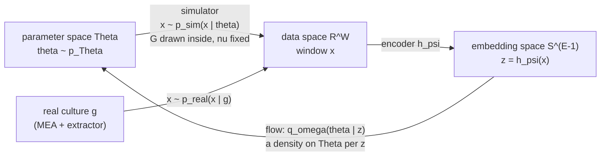

# E1 -- The problem: from MEA recordings to posteriors over mechanism

**Document E1 of the joint documentation set; the first chapter of Set E.**
The objects of the joint DSN + NPE stack, the spaces they live in and the
maps between them; the standing aim; the two data domains and what crosses
between them; why the stack is amortised. Index and status: `00_INDEX.md`;
notation: `E0_READERS_GUIDE_NOTATION.md`.
**Date:** 2026-10-04 (v1). **Applies to:** the repository
`Simulation-Based-Inference` at `834eb41` (`hpc/joint/`, D-037, and the DSN
configuration of the r2 encoder under `hpc/dsn/`), and the project documents
and PDFs named in S6.

| date | change |
|---|---|
| 2026-10-04 | v1. Written from `SBI_PIPELINE.md` (S1-S13), `EXTRACTOR_USAGE.md` v8.12 (S4, S5.1, S6.1, S6.4), `HPC_PATHS.md` (S3b, S4, S4a), deck `02_SEC_A_pipeline_today.md`, the plan `JOINT_DSN_NPE_PLAN_v0_6.md` (repository, v0.6.5: abstract, S1, S2.1, S2.2, S2.5, S2.6, S2.7, S4.0) and E0 v1.7; the project PDFs *The frontier of simulation-based inference*, *Simulation-Based Inference: A Practical Guide* and *Detecting Model Misspecification in Amortized Bayesian Inference* read in full; PubMed and bioRxiv searched (S6). Every `[RAN]` number is printed by `tools/e1_numbers.py` (two identical runs), which reads the r2 encoder's configuration from `834eb41` with `git show`. No new symbol: E0 v1.8 annotates convention 2 (the kernel axes are linear whatever their span), the rows of $p_{\rm sim}$ (its extension to the realised graph and its $x$-marginal) and $x$ (Hz per electrode on the cohort) and the glossary's "Two data domains", adds five glossary entries, and moves the "First used in" column to E1 for the 22 rows E1 uses first. |

**Abstract.** The project wants, for each recorded culture, a posterior
over the parameters of a mechanistic network model, and the pipeline it
has today returns, for every recorded window, a posterior that is
essentially the prior. The question this chapter answers is what exactly
is being inferred, from what, through which maps, and where in that chain
the gap can sit. **Covered:** the cohort and the observable -- a pooled
instantaneous-firing-rate window $x$ -- with its nesting of windows in
subregions in cultures (S3.2); the parameter vector $\theta$, its
inference coordinates and prior, and the two kinds of randomness the
simulator draws besides $\theta$, the realised graph $\mathcal{G}$ and the
observation nuisance $\nu$, with the likelihood written as the marginal
over them (S3.3); the three spaces, the three maps (simulator, encoder,
flow) and the provenance status of each object (S3.4); the standing aim,
patient-specific and label-free (S3.5); the two data domains, the shift
between them, and what the activity floor does and does not change (S3.6);
why the stack is amortised and where the earlier truncation route sits
(S3.7); and the three readings of the gap placed on the three maps (S3.8).
**Deliberately excluded:** how a flow is built and trained (E2); the
encoder, the metric losses and the label argument (E3); the joint
objective and the arms as an ablation (E4); the replicate statistic (E5);
the bench (E6); the diagnostics and the decision rule (E7); the search
(E8); what has run (E9); the biophysics of the simulator and raw-data
spike detection (pointers only). Nothing here is a new result: the
chapter fixes objects, and every number is tagged.

---

## 1. Notation and symbols

A subset of E0's master table (same symbol, same type, same units; the units
of $x$ are specialised to the cohort), in order of first use. E1 declares no
new symbol. E0 v1.8 carries a dated note, written this turn, on the rows
of $p_{\rm sim}$ (S3.3, S3.4) and $x$ (S3.2) and on convention 2 (S3.3).

| Symbol | Name / Meaning | Type & domain | Units | First used in |
|---|---|---|---|---|
| $G$ | number of real cultures (wells) in the cohort | $\mathbb{N}$; 35 on the cohort | -- | S3.1 |
| $d_\theta$ | parameter-space dimension | $\mathbb{N}$; 26 on the DUP15HD bank | -- | S3.1 |
| $\theta$ | the inference parameters of one row, in inference coordinates | $\theta \in \Theta \subset \mathbb{R}^{d_\theta}$ | mixed: $\ln$ of a natural unit on the log axes, linear on the others | S3.1 |
| $\Theta$ | the prior box in inference coordinates | $\Theta = \prod_{k} [a_k, b_k]$ | -- | S3.1 |
| $r_{\rm eff}$ | participation-ratio effective rank of an embedding cloud | $[1, E]$ | -- | S3.1 |
| $E$ | embedding dimension (`embedding_size`) | $\mathbb{N}$; 10 for the r2 encoder | -- | S3.1 |
| $\mathrm{p}_{\rm grp}$ | group-aware permutation p-value of the misspecification gate | $(0, 1]$ | -- | S3.1 |
| $\varepsilon$ | per-window truncation mass of TSNPE, named in E1 and E7 only | $(0, 0.5)$ | -- | S3.1 |
| $n_e$ | electrodes pooled per subregion | $\mathbb{N}$; 9 | -- | S3.2 |
| $x$ | one IFR window: the pooled instantaneous firing rate of one subregion over $T_{\rm win}$ | $x \in \mathbb{R}^{W}_{\ge 0}$ on the cohort | Hz per electrode (a per-electrode mean, extractor eq. (3)) | S3.2 |
| $\sigma_{\rm sm}$ | Gaussian smoothing width of the IFR (`gaussian_window`) | $\mathbb{R}_{>0}$ | s | S3.2 |
| $\Delta t$ | IFR bin width (`w_size`) | $\mathbb{R}_{>0}$ | s | S3.2 |
| $W$ | window length in samples, $W = \mathrm{round}(T_{\rm win} f_s)$ | $\mathbb{N}$ | samples | S3.2 |
| $T_{\rm win}$ | window duration | $\mathbb{R}_{>0}$ | s | S3.2 |
| $f_s$ | IFR sampling rate, $f_s = 1 / \Delta t$ | $\mathbb{R}_{>0}$ | Hz | S3.2 |
| $n_{\rm win}$ | windows per culture after windowing | $\mathbb{N}$; 54 on the cohort | -- | S3.2 |
| $g, g'$ | two wells (cultures); $x_g$ the windows of culture $g$ taken together | indices into the real bank | -- | S3.2 |
| $G_{\rm don}$ | number of distinct donors behind the $G$ cultures | $\mathbb{N}$; unknown (plan D12) | -- | S3.2 |
| $N_{\rm pair}$ | same-donor well pairs available | $\mathbb{N}$; unknown (plan D12) | pairs | S3.2 |
| $c$ | phenotype (class) label of a culture | $c \in \{0, \dots, C - 1\}$ | -- | S3.2 |
| $C$ | number of classes; never a covariance | $\mathbb{N}$; 2 on the cohort | -- | S3.2 |
| $\theta^{\rm ns}$ | the neuron/synapse block of $\theta$ (23 axes on the cohort); descriptive only | subvector of $\theta$ | mixed | S3.3 |
| $\theta^{\rm topo}$ | the Weibull connectivity-kernel axes (`p0_conn`, `d0_conn`, `beta_conn`) | subvector of $\theta$, $\mathbb{R}^3$ | the natural unit of each axis; all three axes linear (S3.3) | S3.3 |
| $k$ | axis index of the parameter vector; $\theta^{(k)}$ the $k$-th component | $k \in \{1, \dots, d_\theta\}$ | -- | S3.3 |
| $a_k, b_k$ | lower and upper bound of the box on axis $k$, in inference coordinates | $a_k < b_k$ reals | as axis $k$ | S3.3 |
| $a_k^{\rm nat}, b_k^{\rm nat}$ | the same bounds in natural units; on a log axis $a_k = \ln a_k^{\rm nat}$ | $0 < a_k^{\rm nat} < b_k^{\rm nat}$ on log axes | physical | S3.3 |
| $p_\Theta$ | the prior density, uniform on $\Theta$ in inference coordinates | density on $\Theta$ | (param units)$^{-d_\theta}$ | S3.3 |
| $\mathcal{G}$ | a realised connectivity graph drawn from the kernel at fixed $\theta^{\rm topo}$; a latent inside the likelihood, not a parameter | adjacency matrix | -- | S3.3 |
| $p_{\rm sim}$ | the simulator's law: joint $p_{\rm sim}(\theta, x) = p_\Theta(\theta)\, p_{\rm sim}(x \mid \theta)$, its conditionals and marginals named by their arguments -- the likelihood $p_{\rm sim}(x \mid \theta)$, the latent's law $p_{\rm sim}(\mathcal{G} \mid \theta^{\rm topo})$ (eq. (E1.2)), the prior predictive $p_{\rm sim}(x)$ and the true posterior $p_{\rm sim}(\theta \mid x)$ (eq. (E1.3)) | density on $\Theta \times \mathbb{R}^{W}$ and its conditionals | -- | S3.3 |
| $\nu$ | observation-level nuisance (gain, baseline, threshold shift, electrode dropout, drift); acts on the observation map, outside $\Theta$ | $\nu \in \mathcal{N}$ | mixed | S3.3 |
| $\mathcal{N}$ | the nuisance space | a set | -- | S3.3 |
| $\theta^*$ | the true parameter of one well; $\theta^*_g$ that of culture $g$; derivation-only on real data | $\theta^* \in \Theta$ | mixed | S3.3 |
| $h_\psi$ | the encoder (DSN backbone), $h_\psi : \mathbb{R}^{W} \to S^{E-1}$ | map; weights $\psi$ | -- | S3.4 |
| $\psi$ | encoder weights | $\psi \in \mathbb{R}^{n_\psi}$ | -- | S3.4 |
| $z$ | the embedding of a window, $z = h_\psi(x)$, L2-normalised | $z \in S^{E-1} \subset \mathbb{R}^{E}$ | dimensionless | S3.4 |
| $S^{E-1}$ | the unit sphere in $\mathbb{R}^{E}$ | $\{z \in \mathbb{R}^{E} : z^\top z = 1\}$ | -- | S3.4 |
| $q_\omega$ | the conditional flow, written $q_\omega(\theta \mid z)$: a density on $\Theta$ for each fixed $z$ | conditional density; weights $\omega$ | (param units)$^{-d_\theta}$ | S3.4 |
| $\omega$ | flow weights | $\omega \in \mathbb{R}^{n_\omega}$ | -- | S3.4 |
| $n_\psi, n_\omega$ | number of encoder and flow weights | $\mathbb{N}$ | -- | S3.4 |
| $p_{\rm real}$ | the law of real windows, $p_{\rm real}(x)$, and of their labels, $p_{\rm real}(x, c)$; $p_{\rm real}(x \mid g)$ the law of culture $g$'s windows; unknown, sampled by the cohort | density on $\mathbb{R}^{W}$ | -- | S3.4 |
| $\mathcal{L}^{\rm sim}_{\rm NPE}$ | expected NLL of $\theta$ given $h_\psi(x)$ under $p_{\rm sim}$, plan eq. (1a); analytic level | $\mathbb{R}$ | nats/row | S3.6 |
| $\mathcal{L}^{\rm real}_{\rm DSN}$ | expectation of $\ell_{\rm DSN}$ over real class-labelled windows | $\mathbb{R}_{\ge 0}$ | -- | S3.6 |
| $\ell_{\rm DSN}$ | the composite metric loss of one batch | $\mathbb{R}_{\ge 0}$ | -- | S3.6 |
| $\mathcal{L}^{\rm real}_{\rm rep}$ | the replicate-consistency loss on same-donor pairs, plan eq. (3) | $\mathbb{R}_{\ge 0}$ | dimensionless | S3.6 |
| $\mathcal{L}$ | the joint objective of plan eq. (1), $\mathcal{L}(\psi, \omega)$ | $\mathbb{R}$ | nats/row plus dimensionless terms | S3.6 |
| $\lambda_{\rm dsn}, \lambda_{\rm rep}$ | weights of the DSN and replicate terms in $\mathcal{L}$ | $\mathbb{R}_{\ge 0}$ | -- | S3.6 |
| $\pi$ | simulation-gap severity of the bench's pseudo-real arm | $[0, 1]$; 0 = no gap | -- | S3.6 |
| $\phi$ | the bench generator's latent factor vector; on the bench $\theta := \phi$ | $\phi \in (0, 1)^{d_\theta}$ | dimensionless | S3.6 |
| $\mathcal{S}, \mathcal{R}$ | the bench's simulated and pseudo-real arms | labels | -- | S3.6 |

### 1.1 Conventions

- E0 S1.1 applies in full: conditional quantities are written conditionally
  every time (convention 1); every density carries a subscript (convention
  3); the analytic and computed levels carry different symbols (convention
  4); one culture is one well (convention 6); $\psi, \omega, \phi, \nu$ are
  four objects (convention 7).
- **Levels in this chapter (R8).** Every density in E1 is on the analytic
  level: $p_\Theta$, $p_{\rm sim}$, $p_{\rm real}$ and $q_\omega$ are laws.
  The computed objects of E1 are counts and fractions read off finite sets
  -- 1890 windows, 29,616 rows, the kept fraction 0.3434, $r_{\rm eff}$,
  $\mathrm{p}_{\rm grp}$ -- and each is said to *estimate* or *be read from*
  a law where it is used, never to be one.
- **Equations.** The plan's are cited as "plan eq. (n)", the pipeline
  document's as "pipeline eq. (n)", `EXTRACTOR_USAGE.md`'s as "extractor eq.
  (n)" (E0 convention 10); E1's own displayed equations are (E1.1) to
  (E1.5).
- **Axis index from 1** (E0); the code's axis lists count from 0.
- **Tags** as fixed by the plan (E0 convention 12); `[STATED]` carries the
  decision number where one exists.
- ASCII only, LF only; math in `$...$`; the TSNPE truncation box of pipeline
  eq. (9) is named in words (E0 convention 8).

---

## 2. Glossary

Ordered by first appearance in this chapter, because each term builds on the
ones before it. *Everyday meaning differs* is flagged where it does.

- **DUP15HD** -- the project's name for the real MEA cohort and the
  simulated campaigns `[STATED]` (`EXTRACTOR_USAGE.md` v8.4). S3.1.
- **Posterior (per window / per culture)** -- the conditional law of
  $\theta$ given one window $x$, or given all windows $x_g$ of a culture.
  The pipeline computes the first; the standing aim asks for the second.
  S3.1, S3.5.
- **Misspecification gate (the gate)** -- the kernel two-sample test
  (squared MMD) between the simulated and the real arm in embedding space,
  with cultures, not windows, as the exchangeable units of the permutation
  (pipeline S8). S3.1, S3.6.
- **HPR (highest-probability region)** -- the smallest region holding
  posterior mass $1 - \varepsilon$; its width as a fraction of the prior's,
  as pipeline S11 reports it, is the "prior-like" measure of S3.1. S3.1.
- **MEA (multi-electrode array)** -- the recording device: a grid of
  electrodes under a cultured network; here 48 x 48 sites sampled at
  10110.09 Hz `[KB]`. S3.2.
- **IFR window** -- a pooled instantaneous-firing-rate trace over one
  subregion of $n_e$ electrodes, of duration $T_{\rm win}$ and length $W$
  samples: the observable $x$. S3.2.
- **Culture / well / subregion / window** -- one culture is one well
  (biological replicate); a well contributes nine spatially disjoint
  subregions, each cut in time into windows. S3.2.
- **Nesting** -- batch, donor, culture, subregion, window (plan S2.6):
  windows of one subregion share everything; subregions of one well share
  the nuisance and differ in the realised graph. S3.2.
- **Simulator** -- the mechanistic network model plus the virtual MEA that
  turns $\theta$ (with $\mathcal{G}$ drawn inside, $\nu$ fixed) into a
  window $x$; it defines $p_{\rm sim}(x \mid \theta)$, which is sampled and
  never evaluated. S3.3.
- **Implicit model / likelihood-free (simulation-based) inference** -- a
  model whose likelihood can be sampled but not evaluated, and inference
  that needs only the samples. *Everyday meaning differs*: the likelihood is
  not absent -- the methods typically estimate it, which is why the
  Frontier review calls the term "a bit of a misnomer" and prefers
  "simulation-based inference" (Frontier, p.1). S3.3.
- **Inference coordinates** -- the coordinates $\theta$ is stored in: $\ln$
  of the natural value on the log axes, linear on the others, by eq. (E1.1).
  *Everyday meaning differs*: a "parameter value" in natural units is not
  the coordinate the prior, the boxes and the distances use. S3.3.
- **Prior box $\Theta$** -- the axis-aligned box on which $p_\Theta$ is
  uniform, in inference coordinates. S3.3.
- **Latent (realisation) $\mathcal{G}$** -- randomness drawn inside the
  simulator that is not a parameter: here the connectivity graph a kernel
  produces. *Everyday meaning differs*: in the SBI literature "latent" often
  means the simulator's whole internal state, written $z$ there (S3.9).
  S3.3.
- **Nuisance $\nu$** -- what the measurement does to the observation (gain,
  baseline, threshold, dropout, drift), outside $\Theta$. S3.3.
- **Embedding / summary $z$** -- the point on $S^{E-1}$ the encoder maps a
  window to. S3.4.
- **Flow $q_\omega$** -- a conditional density on $\Theta$ indexed by an
  embedding; E2 builds it. S3.4.
- **Provenance status** -- whether the pipeline holds a value for an object:
  analytic, configured, measured, computed, derivation-only, or not verified
  (S3.4). S3.4.
- **Standing aim (IDEA-001)** -- patient-specific inference free of
  diagnostic bias: the label is never a training input, each culture gets
  its own posterior, any grouping is an output (plan abstract). S3.5.
- **Label-free** -- the class label $c$ is not a training input. *Everyday
  meaning differs*: in machine-learning usage $\theta$ is the "label" of a
  simulated row; "label-free" here never means $\theta$-free. S3.5.
- **Two data domains** -- simulated windows, which carry $\theta$, and real
  windows, which carry at most a label $c$ and a culture (and a donor, once
  D12 is settled). S3.6.
- **Prior predictive** -- the law of simulated windows when
  $\theta \sim p_\Theta$, $p_{\rm sim}(x)$; the law the NPE term is trained
  under (eq. (E1.4)). S3.6.
- **Covariate shift** -- a training law and a deployment law that share the
  conditional law of the target given the input and differ in the law of the
  input (Freeman et al. 2017, S6). S3.6.
- **Simulation gap / misspecification** -- the simulator, with its prior, is
  not the process that generated the observed data; in SBI the definition
  that matters is about the prior predictive against the data law, not only
  about the likelihood (Schmitt et al., p.6). S3.6.
- **Closed-world assumption** -- training under $p_{\rm sim}(x)$ as if it
  were the law the network will be queried under (Schmitt et al., p.6).
  S3.6.
- **Activity floor (MFR filter)** -- simulated and real windows are kept
  only if their mean firing rate is at least 0.1 Hz per electrode (pipeline
  S6). S3.6.
- **Amortised inference** -- one trained network answers for any observation
  without re-training. Two senses are live here (S3.7): computational (no
  per-window fit) and statistical (the training does not depend on the
  observed data). *Everyday meaning differs*: nothing is paid off; the cost
  is moved up front. S3.7.
- **Sequential inference / TSNPE** -- inference in rounds, drawing $\theta$
  from a proposal other than the prior; TSNPE (truncated sequential NPE)
  restricts the prior to a region built from per-window HPRs. The pipeline's
  earlier route; not part of the joint stack. S3.7.

---

## 3. Main body

### 3.1 The discrepancy this set is about

This section establishes the problem statement: what the current pipeline
was expected to return, what it measurably returns, and the three readings
of the gap that the rest of the chapter gives an address to.

One would expect the following. The cohort holds $G = 35$ cultures, recorded
for 1200 s each and cut into 1890 windows `[KB]` (`HPC_PATHS.md` S3b;
pipeline S5). The simulator has $d_\theta = 26$ inference axes, and the
simulated bank keeps 29,616 windows with their $\theta$ after the activity
floor `[KB]` (pipeline S3, S6). A posterior estimator trained on that bank
and applied to each real window should return, for each window, a density
over $\Theta$ narrower than the prior along the directions a recording
informs, and different between cultures whose mechanisms differ.

What the current pipeline returns differs on every count measured so far
`[KB]` (pipeline S4, S8, S11; deck 02 A.8). The real windows' embeddings
under the r2 encoder have participation-ratio rank $r_{\rm eff} = 1.000$ of
$E = 10$ (the simulated arm's: 1.017), so the real arm lies essentially on a
line in embedding space. The misspecification gate rejects the simulator
against the cohort at its permutation floor in every space and every
condition, $\mathrm{p}_{\rm grp} = 0.001996$ -- the value is $1/501$ to the
printed precision, consistent with 500 permutations under pipeline S8's
floor of one over the permutation count plus one `[RAN]` B4 (the permutation
count itself is not read here). And every per-window posterior is close to
the prior: at truncation mass $\varepsilon = 0.05$ over the 1890 windows,
the median single-window HPR width is 0.9788 of the prior's.

That pipeline is arm `A0` of the plan: the encoder fitted on the real cohort
with the class label, frozen, and the flow then fitted on simulated windows
embedded by it (plan S2.1, deck 02 A.4) `[KB]`. The gap between the expected
and the measured is the problem, and `SBI_PIPELINE.md` O1 names three
readings of it, none yet discriminated `[KB]`: (a) the estimator is limited
-- 29,616 pairs for 26 axes, convergence never recorded; (b) the information
is limited -- the collapsed embedding passes on about one effective
coordinate; (c) the real windows lie off the simulated manifold while the
simulated ones do not. The three readings accuse three different objects --
the flow, the encoder, the simulator -- and they can only be told apart once
each object, the space it lives in and the map it implements are fixed
precisely. That is this chapter's job; S3.8 returns to the three readings
with their addresses filled in.

### 3.2 The recording and the observable $x$

This section establishes what one row of real data is: the cohort, the
observable $x$ and how windows nest in subregions, cultures and donors.

Before any of the three readings can be located, the object the pipeline
conditions on has to be fixed, and on the real side that object is a window.

**The cohort.** The cohort is 35 wells (`ptrain_*`), one culture per well,
in two class folders: `DATA_C`, 17 wells over three batch folders (5, 6 and
6), and `DATA_P`, 18 wells, 6 in each of three `[KB]` (`HPC_PATHS.md` S3b:
the cohort manifest of record, read from the user's paste and matched to its
digest -- data inspected, not metadata). Each well was recorded on a 48 x 48
electrode grid at a raw rate of 10110.09 Hz for 1200 s, which is 12,132,108
raw samples per electrode, the manifest's `n_samples_raw` `[KB]`, `[RAN]`
B1. Spikes are detected per electrode upstream of this pipeline; detection
is out of scope here, as in pipeline S1.

**The observable.** Each well contributes nine spatially disjoint subregions
of $n_e = 9$ electrodes (pipeline convention (iv)) `[KB]`. The detected
spikes of one subregion become one pooled instantaneous-firing-rate (IFR)
trace, extractor eqs. (1)-(3), restated on one line:

$$x \;=\; \Big[\frac{1}{n_e} \max\Big(0,\ \text{Gaussian of width } \sigma_{\rm sm} \ast \text{(spike count of the } n_e \text{ electrodes in bins of width } \Delta t)\Big)\Big]_{W \text{ consecutive bins}} \tag{extractor 1-3}$$

The division by $n_e$ makes the trace a per-electrode mean, not a sum
(extractor S4.1 and trap S6.1, where a sidecar recording the sum is wrong by
exactly the factor $n_e$) `[KB]`; that is why $x$ is non-negative and
carries Hz per electrode on the cohort. The constants are $\Delta t = 0.01$
s, $\sigma_{\rm sm} = 0.02$ s, $n_e = 9$ and $W = 18000$, agreeing across
five independent sources (pipeline eq. (2a)) `[KB]`; the r2 encoder's
configuration at `834eb41` carries the same cohort block
`[REPO hpc/dsn/hpc/Config/refit_mea_joint_full_r2_l0_t82.json:285-292]`.
From them `[RAN]` B1: $f_s = 1/\Delta t = 100$ Hz, the smoothing width is
$\sigma_{\rm sm}/\Delta t = 2$ bins, and
$W = \mathrm{round}(T_{\rm win} f_s) = \mathrm{round}(180 \times 100) = 18000$
samples.

**Windows, subregions, cultures.** A window is $T_{\rm win} = 180$ s of one
subregion's trace; the r2 configuration windows at a stride of 180 s
`[REPO refit_mea_joint_full_r2_l0_t82.json:41-42]`. A 1200 s trace holds six
back-to-back windows from $t = 0$ with 120 s left over `[RAN]` B1, which is
consistent with the real export's $n_{\rm win} = 54$ windows per culture,
$9 \times 6$, and with $35 \times 54 = 1890$ windows in all `[KB]` (pipeline
S5), `[RAN]` B1. The real arm is therefore 315 subregion traces,
$35 \times 9$ (the manifest's `n_units`) `[KB]`, `[RAN]` B1. A well's nine
subregions pool $9 \times 9 = 81$ of its 2304 grid sites, 3.52 % `[RAN]` B1:
the observable is a sample of the grid, not the grid.

**Nesting and donors.** The cohort nests as batch, donor, culture (well),
subregion, window (plan S2.6, Lever 2) `[KB]`: windows of one subregion
share everything; subregions of one well share every nuisance factor and
differ in the local graph realisation of S3.3 (plan S2.6, S2.7). How many
donors stand behind the 35 wells, and which wells share one, is not known:
$G_{\rm don}$ and $N_{\rm pair}$ are open (plan D12; deck 02 A.10) `[KB]`.
S3.5 shows why that one unknown gates a whole arm.

**The label.** Each culture carries one class label
$c \in \{0, \dots, C - 1\}$ with $C = 2$ (plan S1) `[KB]`. Its meaning
carries a caveat that the set does not resolve. The r2 export's condition
strings `0` and `1` have an unestablished mapping to control and
pathological (pipeline convention (iii), O4) `[KB]`. The DSN configuration
of the r2 encoder at `834eb41` keys class `0` to the three `DATA_C` folders
under the name `control` and class `1` to the three `DATA_P` folders under
`pathological` `[REPO refit_mea_joint_full_r2_l0_t82.json:264-283]`, `[RAN]`
B5. Whether the export's `0` is the configuration's `0` is not verified here
(S5).

### 3.3 The mechanism $\theta$, and what the simulator draws besides it

This section establishes the other side of a row: the parameter vector, its
coordinates and prior, and the two kinds of randomness the simulator draws
besides $\theta$, with the likelihood written as the marginal over them.

A real window has no $\theta$ attached; the simulator is what attaches one,
by producing windows from chosen $\theta$, and so the simulated window must
be the same kind of object as the real one of S3.2.

**The simulator.** An astrocyte-neuron phenomenological network (repository
`Astro-Neuron-Network`, driver `HPC_main_sweep.py`) produces spike trains; a
virtual-MEA stage (`process_campaign.py`) places a square grid of
electrodes, `n_side` per side -- default 3, so $n_e = 9$ -- at the device's
pitch of 60 um with an electrode side of 25 um, and detects spikes at
10110.09 Hz (detection parameter `k` 5.0, band 300-3000 Hz, refractory 2 ms)
`[KB]` (`HPC_PATHS.md` S4; D-021, D-024). A 3 x 3 grid at that pitch reaches
52.4 % of the simulated culture `[KB]` (extractor S4.1, quoting the MEA
analysis reference), so a simulated window, like a real one, is a
nine-electrode view of part of a network. Both arms build the IFR with one
function (deck 02 A.9; extractor v8) `[KB]`, and simulated traces alone
carry a burn-in trim, because a simulation starts from initial conditions
while a recording is at steady state (pipeline S3) `[KB]`.

**The parameter vector.** The simulator's registry has 36 natural axes; 3
are frozen; `conn_prob` is excluded as causally inert under
`conn_rule=weibull`; the three Weibull kernel axes `p0_conn`, `d0_conn`,
`beta_conn` enter from the topology loop. The inference vector is
$d_\theta = 26$: the 23 swept neuron/synapse axes $\theta^{\rm ns}$ and the
3 kernel axes $\theta^{\rm topo}$ `[KB]` (pipeline S3; `HPC_PATHS.md` S4a,
23 `active_indices`), $23 + 3 = 26$ `[RAN]` B2. The partition is descriptive
only (plan S1).

**Inference coordinates.** For each axis $k \in \{1, \dots, d_\theta\}$,

$$\theta^{(k)} \text{ is } \ln \text{ of the natural value} \iff a_k^{\rm nat} > 0,\ \ b_k^{\rm nat} \ge 10\, a_k^{\rm nat}\ \ \text{and axis } k \text{ is not a kernel axis;} \quad \text{linear otherwise.} \tag{E1.1}$$

On a log axis the box is $a_k = \ln a_k^{\rm nat}$,
$b_k = \ln b_k^{\rm nat}$. The first two conditions are pipeline convention
(i) `[KB]`; the third is the exception of extractor trap S6.4: the kernel
axes are drawn uniformly on natural bounds, and `p0_conn` has bounds
$[0.1, 1.0]$, exactly one decade (`[RAN]` B2:
$\log_{10}(1.0/0.1) = 1.000000$), so the rule without the exception would
store $\ln$ of it against a linear prior box `[KB]`. On the DUP15HD bank
(E1.1) gives 17 log axes and 9 linear ones `[KB]` (pipeline S3); with the 3
kernel axes linear, the neuron/synapse block is 17 log and 6 linear `[RAN]`
B2. E0's convention 2 stated the rule without the exception; v1.8 annotates
it.

**The prior.** Pipeline eq. (1), in this set's symbols:

$$p_\Theta(\theta) \;=\; \prod_{k=1}^{d_\theta} \frac{\mathbb{1}[a_k \le \theta^{(k)} \le b_k]}{b_k - a_k}, \qquad \theta \in \mathbb{R}^{d_\theta}, \tag{pipeline 1}$$

uniform on the box in inference coordinates, so a retained prior mass is a
retained volume fraction (pipeline convention (ii)) `[KB]`. Uniform in $\ln$
coordinates is log-uniform in natural units `[textbook, from memory]`; the
Practical Guide's remark that a uniform prior "implicitly defines an
informative choice of scale" `[KB-PDF p.6]` is answered here by (E1.1),
which chooses the scale axis by axis. The numerical bounds come from the
simulator's registry, which is not in this repository and was not read for
this chapter.

**The realised graph $\mathcal{G}$.** Under `conn_rule=weibull` the three
kernel axes set a connection probability that decays with distance as a
stretched exponential -- amplitude, length scale and exponent (plan S2.5c)
`[KB]`. The kernel is a distribution over connections, a property of the
preparation; a graph $\mathcal{G}$ drawn from it at fixed
$\theta^{\rm topo}$ is a realisation, a latent inside the likelihood and not
a parameter (plan S1, S2.5c) `[KB]`. The simulator's likelihood is therefore
a marginal, for each fixed $\theta \in \Theta$:

$$p_{\rm sim}(x \mid \theta) \;=\; \sum_{\mathcal{G}} p_{\rm sim}(x \mid \theta, \mathcal{G})\; p_{\rm sim}(\mathcal{G} \mid \theta^{\rm topo}), \tag{E1.2}$$

where $p_{\rm sim}(x \mid \theta, \mathcal{G})$ is itself a marginal over
the simulation's remaining randomness (the network's stochastic inputs, the
detection noise) at the bank's fixed virtual-MEA configuration. This is the
Frontier review's eq. [1], "an integral over all possible trajectories
through the latent space (i.e., all possible execution traces of the
simulator)" `[KB-PDF p.2]`, and Schmitt et al.'s eq. (2), the likelihood as
the marginal "over all possible values of the nuisance parameters"
`[KB-PDF p.5]`, with the latent split into a named part, $\mathcal{G}$, and
the rest. No pipeline ever evaluates (E1.2); it is only sampled. Whether the
topology loop draws anything besides the graph once per directory (neuron
positions, for instance) was not read: such draws would sit with
$\mathcal{G}$ in the sum.

How the bank samples (E1.2) matters. The three kernel axes are drawn once
per topology directory and the 23 neuron/synapse axes are swept per
iteration inside it; the campaign of record spans 383 distinct topology
draws (plan S2.1; pipeline S3; `HPC_PATHS.md` S4a) `[KB]`. If the sweep
draws $\theta^{\rm ns}$ i.i.d. from the box -- which the uniform prior of
pipeline eq. (1) presupposes -- every row is marginally a draw from
$p_{\rm sim}(\theta, x)$ `[reasoning]`; but rows of one directory share
$(\theta^{\rm topo}, \mathcal{G})$, so along the kernel axes the bank holds
383 independent draws, not 29,616, and the flow cannot separate what a
kernel does from what one graph did (plan S2.5c, decision D17) `[KB]`. E5
and E6 carry the consequence.

**The nuisance $\nu$.** Gain, baseline offset, detection-threshold shift,
electrode dropout and slow drift act on the observation map, after the
dynamics and outside $\Theta$ (plan S1, S4.0) `[KB]`. In the DUP15HD bank
the virtual MEA appears to have run at one configuration: the one detection
file of the campaign of record read by the cluster probe carries the
defaults, while the July jobs that wrote the bank's detections left no logs,
so their flags are not on record (`HPC_PATHS.md` S4, S7.2) `[KB]`. Every
detection file carries its own configuration, so a file-by-file check is
possible; it has not been made. As far as read, then, the bank's
$p_{\rm sim}(x \mid \theta)$ is the likelihood at one fixed $\nu$ (status:
configured), not a marginal over $\nu$; the re-extraction of Stage C passes
the four geometry and rate flags explicitly (`HPC_PATHS.md` S4g) `[KB]`. The
plan's Lever 3 varies it on purpose to measure the nuisance floor (plan
S2.6), and the bench draws it with a donor, well and batch nesting (E6). On
the cohort, $\nu$ is whatever the recordings did: it is never observed.

**Why three names and not one.** Schmitt et al. split a generative model
into parameters "whose role ... we explicitly understand and model" and
noise that "takes care of nuisance effects that we only treat
statistically", and add that "the distinction ... is not entirely clear-cut,
but depends on our modeling goals" `[KB-PDF p.5]`. The set's three-way split
is such a modelling decision, stated so it can be disputed: $\theta$ is what
a culture's mechanism is and what two wells of one donor share;
$\mathcal{G}$ is what differs between subregions and wells of one mechanism;
$\nu$ is what the measurement does. The replicate term (E5) and the
transversality test (E7) rest on exactly this split.

### 3.4 The spaces, the maps, and what the pipeline holds a value for

This section establishes where each object lives, the three maps that
connect the three spaces, and which objects the pipeline actually holds a
number for.

With $x$ fixed on the data side and $\theta$ on the parameter side, what
remains is the pair of networks that carries a window back to a density over
$\theta$.

| | parameter space $\Theta \subset \mathbb{R}^{d_\theta}$ | data space $\mathbb{R}^{W}$ | embedding space $S^{E-1} \subset \mathbb{R}^{E}$ |
|---|---|---|---|
| a point is | a parameter vector $\theta$ | a window $x$ | an embedding $z$ |
| objects here | the box $\Theta$; the prior $p_\Theta$; the true posterior $p_{\rm sim}(\theta \mid x)$ and its approximation $q_\omega(\theta \mid z)$, both densities on $\Theta$ | the simulated bank; the real cohort; $p_{\rm sim}(x)$ and $p_{\rm real}(x)$, both laws on $\mathbb{R}^{W}$ | the embedded windows of both arms, whose cloud's rank is $r_{\rm eff}$; the gate's two samples |
| a distance in use | none in E1 (E5 introduces one) | none used | the sphere's cosine distance (E3); the gate's kernel |

connected by three maps. The **simulator** $\theta \mapsto x$ is stochastic,
$x \sim p_{\rm sim}(x \mid \theta)$, with $\mathcal{G}$ drawn inside and
$\nu$ fixed in the bank. The **encoder**
$h_\psi : \mathbb{R}^{W} \to S^{E-1}$ is deterministic for each fixed
$\psi$. The **flow** is not a map between these spaces:
$q_\omega(\theta \mid z)$ is a conditional density on $\Theta$, one density
for each fixed $z \in S^{E-1}$. A property of a map -- injectivity of the
simulator's mean behaviour, sufficiency of the encoder -- is never a
property of a space (E0 S3.4).



ASCII fallback:

```
            simulator: x ~ p_sim(x | theta)      encoder h_psi
 Theta  ------------------------------------>  R^W  ------------>  S^(E-1)
   ^       (G drawn inside, nu fixed)          ^                     |
   |                                           |                     |
   |       real culture g: x ~ p_real(x | g) --+                     |
   |                                                                 |
   +------------- flow: q_omega(theta | z), a density on Theta ------+
```

**The reported object.** For each fixed window $x$, the pipeline reports
$q_\omega(\theta \mid h_\psi(x))$, an approximation to the true posterior of
the simulator,

$$p_{\rm sim}(\theta \mid x) \;=\; \frac{p_{\rm sim}(x \mid \theta)\, p_\Theta(\theta)}{p_{\rm sim}(x)}, \qquad p_{\rm sim}(x) \;=\; \int_{\Theta} p_{\rm sim}(x \mid \theta)\, p_\Theta(\theta)\, \mathrm{d}\theta, \tag{E1.3}$$

Bayes' rule with the prior predictive $p_{\rm sim}(x)$ as the normaliser
`[textbook, from memory]`; E2 states it in the form NPE uses. Two hypotheses
travel with "approximation". First, the flow sees $x$ only through $z$, so
at best
$q_\omega(\theta \mid h_\psi(x)) = p_{\rm sim}(\theta \mid h_\psi(x))$, the
posterior given the summary, which equals $p_{\rm sim}(\theta \mid x)$ only
if $z$ is sufficient for $\theta$ -- the Practical Guide's "a summary
statistic S should retain as much information about the parameters $\theta$
as possible, so that the posterior derived from the summary statistics
approximates the true posterior" `[KB-PDF p.8]`; E3 owns sufficiency.
Second, when $x$ is a real window, $p_{\rm sim}(\theta \mid x)$ is the
posterior the simulator assigns to it; it is the culture's posterior over
mechanism only if the simulator is well specified for that culture (S3.6).

**Who holds a value for what** (statuses read from the KB documents named in
S3.2-S3.3; not verified against the simulator's code; simulated rows / real
rows where the two differ):

| object | lives in | status |
|---|---|---|
| $\theta$ of a row | $\Theta$ | configured, drawn by the sweep / derivation-only: $\theta^*_g$ is never observed |
| $p_\Theta$ | density on $\Theta$ | analytic |
| $\mathcal{G}$ | latent of (E1.2) | drawn inside a simulation; not among the bank's columns (the files list spikes, parameters and kernel axes, `HPC_PATHS.md` S4a; whether the graph is stored elsewhere: not verified) / derivation-only |
| $\nu$ | $\mathcal{N}$ | configured, one virtual-MEA configuration as far as read / derivation-only |
| $x$ | $\mathbb{R}^{W}$ | computed from simulated detections / computed from a recording's detected spikes |
| $c$ | $\{0, \dots, C - 1\}$ | absent (on the bench, present for two control arms) / measured: recorded with the well's class folder |
| $p_{\rm sim}(x \mid \theta)$, $p_{\rm sim}(\theta \mid x)$, $p_{\rm sim}(x)$ | the laws of (E1.2), (E1.3) | derivation-only: sampled, never evaluated |
| $p_{\rm real}$ | law on $\mathbb{R}^{W}$ | derivation-only: sampled by the cohort |
| $\psi$, $\omega$ | $\mathbb{R}^{n_\psi}$, $\mathbb{R}^{n_\omega}$ | measured: fitted in a training run |
| $z$ | $S^{E-1}$ | computed |
| $q_\omega(\theta \mid z)$ | density on $\Theta$ per $z$ | computed: evaluated and sampled |

The row that earns the column is the target's. The object E1 asks for,
$p_{\rm sim}(\theta \mid x)$, is never evaluated anywhere in the pipeline:
every statement in the set about "the posterior of a window" is a statement
about $q_\omega$, and about the target only through the two hypotheses
above.

### 3.5 The standing aim: patient-specific and label-free

This section establishes what the stack is for -- one posterior per culture,
with the label kept out of training -- and what that asks of the objects of
S3.4.

The reported object of S3.4 is per window; the aim is stated per culture,
and it constrains what may train the encoder.

The plan states the aim explicitly (IDEA-001, plan abstract) `[KB]`: the
pipeline should be "patient-specific and free of diagnostic bias". The
diagnosis is "a coarse quantisation of a continuous mechanistic state"; "two
patients under one label may differ mechanistically as much as two patients
across labels"; "the label is not to be used as a training input at all.
Each culture gets its own posterior over mechanism, and any grouping of
patients is an output of that, discovered in parameter space, never an
assumption fed in." Its methodological force: if the encoder is trained on
the label, "patients cluster by diagnosis in parameter space" is circular;
removing the label from training turns it into a held-out evaluation
variable and the statement into a measurement. Arms `A2` and `A0` stay in
the study as the comparators that test whether removing it costs anything
(plan abstract) `[KB]`.

**The per-culture object.** Regardless of how good each per-window posterior
is, if the standing aim is the target, then the object is the posterior of
$\theta$ given all windows of a culture, $p_{\rm sim}(\theta \mid x_g)$ for
each fixed $x_g$ -- in the plan's words "the correct object is" the
posterior of a culture's parameter given "all windows of culture $g$" (plan
S2.7) `[KB]`, which the plan writes with a bare $p$ that this set reserves
for a dimension (E0 convention 3). Composing it from per-window posteriors
by the factorised-NPE rule needs the windows to be conditionally independent
given $\theta$, and they are not: windows of one subregion share their
realised graph $\mathcal{G}$, so the naive composition overstates, and the
plan requires the correction to be validated on the bench before it is used
on real data (plan S2.7) `[KB]`. E7 owns the composition; E1 only fixes that
the aim asks for a culture-level object and that (E1.2) is the reason the
shortcut fails.

**What may train the encoder.** Real recordings carry no $\theta$, so the
question is by what channel real data may constrain $\psi$ at all (plan
S2.5) `[KB]`: nothing (arm `A1`, the encoder fitted to simulator output
only); the phenotype (arm `A2`, the status quo made joint, which the aim
keeps as a comparator only); or the replicate structure (arm `A5`): the
$\theta$ of a culture is unknown, but two wells of one donor must share it,
which is a trainable constraint with no ground truth and no label (plan eq.
(3), E5). "Label-free" therefore means $c$-free: $\theta$ is the regression
target of every NPE term, and the replicate structure is a second, $c$-free
supervision. The replicate channel needs the donor of each well, and on the
cohort that is plan D12, open (S3.2): until it is settled, arm `A5` can be
exercised on the bench, where donors exist by construction (E6), and not on
the cohort.

### 3.6 The two data domains, and what crosses between them

This section establishes the two laws the stack is fed by, the shift between
them, where that shift enters each arm, and what the activity floor does and
does not change.

The aim of S3.5 names what the stack must deliver on real windows; every
term that trains it is fed by one of two domains, and only one of them
carries $\theta$.

| domain | one row is | carries | lacks | law |
|---|---|---|---|---|
| simulated | a window with the $\theta$ that made it; 29,616 rows after the floor in the r2 export `[KB]` | $\theta$ | $c$ (except two bench control arms), cultures, donors | $p_{\rm sim}(\theta, x)$, restricted by the activity floor (eq. (E1.5)) |
| real | a window with its culture and its label; 1890 rows `[KB]` | $c$, the culture (and the donor, once D12 is settled) | $\theta$ | $p_{\rm real}(x, c)$ |

The plan's objective feeds each term from the domain that carries its label
(plan S2.2) `[KB]`:

$$\mathcal{L}(\psi, \omega) \;=\; \mathcal{L}^{\rm sim}_{\rm NPE}(\psi, \omega) \;+\; \lambda_{\rm dsn}\, \mathcal{L}^{\rm real}_{\rm DSN}(\psi) \;+\; \lambda_{\rm rep}\, \mathcal{L}^{\rm real}_{\rm rep}(\psi, \omega), \tag{plan 1}$$

with $\mathcal{L}^{\rm sim}_{\rm NPE}(\psi, \omega)$ the expectation of
$-\log q_\omega(\theta \mid h_\psi(x))$ over $(\theta, x)$ drawn from
$p_{\rm sim}(\theta, x)$, and $\mathcal{L}^{\rm real}_{\rm DSN}(\psi)$ the
expectation of $\ell_{\rm DSN}(h_\psi(x), c)$ over $(x, c)$ drawn from
$p_{\rm real}(x, c)$ (plan eq. (1a)). E4 develops the objective; here only
its first term's expectation matters. Writing that expectation as an outer
integral over windows and an inner one over parameters -- the law of total
expectation `[textbook, from memory]` --

$$\mathcal{L}^{\rm sim}_{\rm NPE}(\psi, \omega) \;=\; \int p_{\rm sim}(x) \Big[ \int_{\Theta} p_{\rm sim}(\theta \mid x)\, \big(-\log q_\omega(\theta \mid h_\psi(x))\big)\, \mathrm{d}\theta \Big]\, \mathrm{d}x \quad \text{(outer integral over } \mathbb{R}^{W}\text{)}, \tag{E1.4}$$

so the posterior-fitting term weights every window by the prior predictive
$p_{\rm sim}(x)$, while the networks are queried, after training, at windows
drawn from $p_{\rm real}(x)$. Schmitt et al. name the step that makes
simulation-based training possible -- replacing the data law in the outer
expectation by the model-implied one -- and the assumption it carries: "we
have tacitly assumed a closed-world setting in which sampling from the prior
predictive distribution ... is equivalent to sampling from the true data
distribution", which "makes NPE susceptible to posterior errors in the open
world" `[KB-PDF p.6]` (the elided symbol is their model-implied law, this
set's $p_{\rm sim}(x)$). According to PubMed, Jang et al. state the same
assumption for amortised SBI in general: such methods "rely on the
assumption that the simulator is well-specified, i.e., that the observed
data are generated from the same model used for simulation"
`[PubMed full text]` ([DOI](https://doi.org/10.1371/journal.pcbi.1014364)).

**Covariate shift, strictly.** According to PubMed, Freeman, Izbicki and Lee
define covariate shift, for conditional density estimation, as a training
and a deployment population whose conditional densities of the target given
the input match "even if the marginal distributions differ", and show that
it still matters: "the estimation of" the conditional "depends on the
marginal distribution, so an estimator that performs well with respect to"
the training marginal "may not perform well with respect to" the deployment
marginal `[PubMed full text]` ([DOI](https://doi.org/10.1093/mnras/stx764)).
The shift enters the stack in two places, and only one of them is covariate
shift in that strict sense.

- **Inside arm `A0`, before deployment.** The encoder is fitted by
  $\ell_{\rm DSN}$ under $p_{\rm real}(x, c)$, frozen, and then used inside
  $\mathcal{L}^{\rm sim}_{\rm NPE}$ under $p_{\rm sim}(x)$: the flow never
  sees a real window during training (plan S2.1, deck 02 A.4) `[KB]`. The
  law of the input changes from $p_{\rm real}(x)$ to $p_{\rm sim}(x)$ -- the
  covariate-shift part, which is what the plan calls "ordinary covariate
  shift" and Stage 3b decomposes. But the task changes too: the encoder was
  fitted to separate $c$ and is used to carry $\theta$, and a change of
  target is not covariate shift; E3's label argument is about that second
  change. The plan's phrase holds for the first change only.
- **In every arm, at deployment.** The NPE term is trained under
  $p_{\rm sim}(x)$ and queried at $x \sim p_{\rm real}(x)$. Conversely to
  the first case the target is unchanged, so whether this is covariate shift
  depends on the simulator. If it is well specified for culture $g$ in the
  likelihood-centred sense -- some $\theta^*_g \in \Theta$ with
  $p_{\rm sim}(x \mid \theta^*_g) = p_{\rm real}(x \mid g)$, Schmitt et
  al.'s eq. (8) `[KB-PDF p.6]` -- then real windows are simulator draws at
  the cohort's $\theta^*$, the conditional $p_{\rm sim}(\theta \mid x)$ is
  the right object, and the shift is in the input law only: covariate shift,
  whose risk is that $q_\omega$ was trained thinly where the real windows
  sit (Freeman et al.; Schmitt et al.'s "only populates a narrow subspace",
  p.6). If it is not, real windows fall where $p_{\rm sim}(x)$ puts little
  or no mass, the output is not what the network learned to produce, and
  "posteriors from misspecified models may erroneously look legitimate"
  `[KB-PDF p.4]` -- a simulation gap, not a covariate shift. The fixed $\nu$
  of S3.3 is one concrete source of the second case: a real recording whose
  gain or threshold differs from the bank's one configuration is off the
  simulator's support whatever its mechanism, which is Lever 1's "anything
  the simulator cannot produce cannot be attributed to $\theta$" (plan S2.6)
  `[KB]`.

The gate of S3.1 tests the two laws against each other in the r2 encoder's
embedding space and rejects; at $r_{\rm eff} \approx 1$ a pass would be weak
evidence while a rejection stays decisive (pipeline S4) `[KB]`. It does not
say which of the two cases holds. A neuroscience instance of the second case
is on record: according to PubMed, Bernaerts et al. report that neural
posterior estimation "failed for our biophysical model and dataset due to a
small but systematic mismatch between the data and the model"
`[PubMed full text]` ([DOI](https://doi.org/10.1016/j.patter.2025.101323)),
read in full in P7's turn (P7 S6). The bench imitates the shift with one
knob: two arms $\mathcal{S}$ and $\mathcal{R}$ drawn from one generator with
$\theta := \phi$, the second perturbed with severity $\pi$; at $\pi = 0$ the
arms differ only in which label is available (plan S4.0) `[KB]`; E6 builds
it.

**What the activity floor changes, and what it does not.** Both arms keep a
window only if its mean firing rate is at least 0.1 Hz per electrode: the
simulated arm keeps 29,616 of 86,251 rows, the real arm all 1890 `[KB]`
(pipeline S6). Write "pass" for that event, a deterministic function of $x$.
For each fixed $x$ that passes,

$$p_{\rm sim}(\theta \mid x, \text{pass}) \;=\; p_{\rm sim}(\theta \mid x), \qquad p_{\rm sim}(\theta \mid \text{pass}) \;=\; \frac{p_\Theta(\theta)\, \Pr(\text{pass} \mid \theta)}{\Pr(\text{pass})}, \tag{E1.5}$$

the first because $\Pr(\text{pass} \mid x, \theta) = 1$ for a passing
window, the second by Bayes' rule `[textbook, from memory]`. So filtering on
$x$ leaves the target of (E1.3) unchanged at every window that passes --
every real window does -- and changes two things: the training law's
$x$-marginal, which is (E1.4)'s weight, and its $\theta$-marginal, which is
no longer $p_\Theta$. The pipeline's own phrase, that $q_\omega$ "targets
the filtered prior" (pipeline S13), is true of that $\theta$-marginal and
not of the conditional. $\Pr(\text{pass})$ is estimated by the kept fraction
$29{,}616 / 86{,}251 = 0.3434$ `[RAN]` B3 -- a computed-level number from
rows clustered by topology directory (S3.3), not the law's value; the
dropped 65.7 % is the pipeline's "direct, encoder-independent statement of
prior misallocation" (pipeline S6) `[KB]`. Which $\theta$-marginal the prior
floor of the diagnostics should use is E7's question (S5).

### 3.7 Amortised, not sequential

This section establishes why the stack trains one network for every window,
in which of two senses it is amortised, and where the earlier truncation
route sits.

The two domains of S3.6 meet in one trained network; whether that network is
fitted once for all windows or refitted per window is the last design choice
the problem itself fixes.

An amortised method, "after an initial phase of simulation and training, ...
can perform inference for any observation", which "can be beneficial when
inference is performed for many observations"; a sequential method performs
"inference across several rounds and draw[s] parameter sets from a
distribution that is different from the prior", and is recommended when
inference is for "one, or few, observations" (Practical Guide, p.31)
`[KB-PDF p.31]`. The price of the second is named on p.34: "the trained
network becomes specialized for one specific observation", and diagnostics
"become computationally prohibitive" `[KB-PDF p.34]`. The Frontier review
frames the same choice as a trade-off "between active learning, which
tailors the efficiency to a particular observed dataset, and amortization,
which benefits from surrogates that are agnostic about the observed data"
`[KB-PDF p.7]`, and notes that a surrogate network "implicitly marginalizes
over all other (latent) variables in the simulator" `[KB-PDF p.5]` -- which
is how a flow trained on bank rows learns the marginal (E1.2) without ever
writing it. According to PubMed, Jang et al. give the contrast case:
"because ABC is not amortized, the inference procedure must be repeated for
each new observed dataset" `[PubMed full text]`
([DOI](https://doi.org/10.1371/journal.pcbi.1014364)).

The cohort is the many-observation case: 1890 windows over 35 cultures, each
with its own posterior (S3.5), and the calibration diagnostics of E7 need
one posterior per held-out simulated row, a process that "critically
benefits from amortized inference" (Practical Guide, p.14) `[KB-PDF p.14]`.
So the stack trains $(\psi, \omega)$ once and runs one forward pass per
window.

**Two senses of amortised (R6).** Computationally, every arm is amortised:
no arm refits per window. Statistically -- in the Frontier's sense of a
surrogate "agnostic about the observed data" -- only arm `A1` is: `A0` and
`A2` fit the encoder on the cohort's labelled windows, and `A5` on its
replicate pairs, so the trained networks depend on the very windows they are
later applied to. That dependence is what pipeline O5 calls circularity for
the witness and the truncation region `[KB]`, and it is why the splits keep
a culture's windows together, so that whole cultures are held out (plan S1,
convention (iv); E4, E7).

**Where TSNPE sits.** The pipeline's earlier route was truncated sequential
NPE: draw from each real window's posterior, keep the per-window HPR at mass
$1 - \varepsilon$, take the axis-wise envelope over the cohort's windows as
a box, and retrain under the prior truncated to it (pipeline S11, eqs.
(8)-(10)) `[KB]`. Because pipeline eq. (10) holds for each fixed $x$ and
every $\theta$ in the region, plain maximum-likelihood training stays valid
under the truncated prior `[KB]`; and because the region is an envelope over
all windows, the retrained network stays amortised over every window whose
posterior mass lies inside it -- the cohort's, by construction, not an
arbitrary new recording's `[reasoning]`. On r2 the route saturated: 26 of 26
axes at the bounds, median single-window width 0.9788 of the prior, envelope
0.9856, and dropping all 52 envelope-setting windows changes the envelope by
nothing (pipeline S11) `[KB]`. A truncation built from prior-like per-window
posteriors inherits the gap of S3.1 rather than resolving it; the joint
stack does not use it (E0 glossary).

### 3.8 Where the discrepancy can live: three readings, three maps

This section establishes the chapter's result: each reading of S3.1 is a
claim about one map of S3.4, and each part of the joint stack is aimed at
one of them.

With the spaces, the maps, the aim and the two domains fixed, the three
readings of `SBI_PIPELINE.md` O1 can be restated as claims about objects.

- **(a) Estimator-limited: the flow.** $q_\omega(\theta \mid z)$ falls short
  of $p_{\rm sim}(\theta \mid z)$ even on simulated windows, because 29,616
  rows, clustered into 383 kernel draws along three axes (S3.3), are too few
  for 26 axes, or because training did not converge. Its discriminators need
  no real data: contraction and the information spectrum on held-out
  simulated windows, a learning curve in bank size, and a shuffled-pair
  control (pipeline O1) `[KB]`. E2 builds the flow, E7 the diagnostics, E8
  the search over its knobs.
- **(b) Information-limited: the encoder.** $z = h_\psi(x)$ is far from
  sufficient, so even a perfect flow returns a $p_{\rm sim}(\theta \mid z)$
  close to the training law's $\theta$-marginal ($p_\Theta$, or its filtered
  version of eq. (E1.5)). The measured $r_{\rm eff} = 1.000$ on the real arm
  is this reading's evidence (S3.1). Under `A0` the encoder was never
  trained to carry $\theta$ (S3.6, first bullet); the joint arms let the NPE
  likelihood train $\psi$ (plan S2.2), and E3 shows why a label loss caps
  what $z$ can carry.
- **(c) Off-manifold at real windows: the simulator.** On simulated windows
  the posterior may be informative while real windows sit where
  $p_{\rm sim}(x)$ has little mass -- the second case of S3.6, with the
  fixed $\nu$ as one named source. The gate's rejection is consistent with
  it without proving it. The bench measures the effect of a known gap $\pi$
  (E6), the replicate term and the nuisance floor separate $\nu$ from
  $\theta$ on real data (E5, E7).

The readings are not exclusive, and the r2 numbers are consistent with all
three at once: a collapsed encoder (b) caps what any flow can return at what
about one effective coordinate carries (pipeline S4), whatever (a) and (c)
are -- which is why the joint stack's first question is what should train
the encoder (plan abstract, S2.2).

So the discrepancy has three addresses, one per map of S3.4: the flow, the
encoder, the simulator. E2 opens the first.

### 3.9 Common confusions

Words that carry two senses in this chapter (R6), each with the sense the
set uses.

- **"Posterior."** Per window, $p_{\rm sim}(\theta \mid x)$, or per culture,
  $p_{\rm sim}(\theta \mid x_g)$ (S3.5); and the target versus its
  approximation $q_\omega(\theta \mid h_\psi(x))$, which is the only one
  computed (S3.4). A "prior-like posterior" in S3.1 is a statement about
  $q_\omega$.
- **"Prior."** The box law $p_\Theta$; the $\theta$-marginal of the
  activity-filtered bank, $p_{\rm sim}(\theta \mid \text{pass})$ (eq.
  (E1.5)); and the flow's `BoxUniform(0, 1)` prior, which is $\Theta$ only
  when the bank stores $\theta$ normalised to the unit cube (E0 glossary; P0
  S5).
- **"Latent" and $z$.** The Frontier review writes $z$ for the simulator's
  latent variables, and Schmitt et al. write $\xi$ for its noise `[KB-PDF]`;
  in this set $z$ is the embedding (S3.4) and $\xi$ the within-class
  residual of E3. The simulator's latent here is $\mathcal{G}$ plus unnamed
  internal randomness (eq. (E1.2)).
- **"Nuisance."** This set's $\nu$ (observation-level, outside $\Theta$);
  the realised graph $\mathcal{G}$ (inside the likelihood, also not a
  parameter); and the literature's "nuisance parameters", which are
  parameters of no interest (Frontier, p.2) -- three different things.
- **"Well."** A culture here (E0 convention 6); a realisation, that is a
  subregion, in the plan's Stage 6 (D6-4). E6 is where the two meet.
- **"Label."** The class $c$; in machine-learning usage also the regression
  target $\theta$ of a simulated row. "Label-free" means $c$-free (S3.5).
- **"Amortised."** Computational (no refit per window) versus statistical
  (the training does not depend on the observed data) (S3.7).
- **"Covariate shift."** Strictly, a shared conditional and a changed input
  law (Freeman et al.); loosely, any train/test difference. Only the input
  change under `A0` and the well-specified deployment case are the strict
  kind (S3.6).
- **"Domain."** A data domain (simulated or real, S3.6) versus the domain of
  a map ($\mathbb{R}^{W}$ for $h_\psi$, S3.4).
- **"Nine."** Nine electrodes per subregion and nine subregions per well
  (deck 02 A.7): 81 electrodes per well, not 9.

### 3.10 Check yourself

1. How many windows does one culture contribute, and where does $W = 18000$
   come from?
2. Place each of these in its space, or say why it has none: the prior box;
   one real window; the embedding cloud whose rank is $r_{\rm eff}$;
   $q_\omega$; the gate's statistic.
3. Why is $\mathcal{G}$ not an axis of $\theta$, and what does the bank's
   one graph per topology draw cost?
4. Does filtering the simulated bank by mean firing rate change the
   posterior the flow should learn for a real window? What does it change?
5. Under arm `A0`, is the encoder's problem covariate shift?
6. Is the stack amortised under arm `A5`?

<details>
<summary>Answers (folded)</summary>

1. Nine subregions times six back-to-back 180 s windows of a 1200 s trace:
   $n_{\rm win} = 54$, and $35 \times 54 = 1890$ in the cohort.
   $W = \mathrm{round}(T_{\rm win} f_s)$ with $f_s = 1/\Delta t = 100$ Hz:
   $180 \times 100 = 18000$ (S3.2, `[RAN]` B1).
2. The prior box lies in $\Theta$; a real window in $\mathbb{R}^{W}$; the
   embedding cloud on $S^{E-1}$. $q_\omega$ is in no single space: it is a
   density on $\Theta$ for each fixed point of $S^{E-1}$, not a map between
   them. The gate's statistic is a number computed from two samples of
   embeddings, on $S^{E-1}$ and, in the pipeline, also before the
   normalisation (S3.4; pipeline S8).
3. The kernel axes describe a distribution over connections, which two wells
   of one donor plausibly share; a graph is one draw from it, which they do
   not share, so it is a latent marginalised in (E1.2). With one graph per
   topology directory, the bank holds 383 kernel draws, each seen through
   one graph, so the flow cannot separate the kernel's effect from one
   graph's (S3.3, plan S2.5c, D17).
4. No: for every window that passes the floor -- every real window does --
   $p_{\rm sim}(\theta \mid x, \text{pass}) = p_{\rm sim}(\theta \mid x)$.
   It changes the training law's $x$-marginal (where the flow is trained
   densely) and its $\theta$-marginal, which is no longer $p_\Theta$ (eq.
   (E1.5)).
5. Partly. The input law changes from $p_{\rm real}(x)$ to $p_{\rm sim}(x)$,
   which is the covariate-shift part; the target also changes, from $c$ to
   $\theta$, which is not covariate shift (S3.6).
6. Computationally yes, one forward pass per window; statistically no,
   because the replicate term trains on the cohort's own pairs, so the
   networks are not agnostic of the windows they are applied to (S3.7).

</details>

---

## 4. Summary of results

- The observable is one IFR window of one nine-electrode subregion, a
  per-electrode mean in Hz per electrode, $W = 18000$ samples at $f_s = 100$
  Hz; the cohort is 35 cultures, 315 subregion traces, $n_{\rm win} = 54$
  windows per culture and 1890 in all (S3.2, extractor eqs. (1)-(3), `[RAN]`
  B1).
- Inference coordinates: eq. (E1.1), the log rule with the kernel-axis
  exception; 17 log and 9 linear axes, the neuron/synapse block 17 log and 6
  linear (S3.3, `[RAN]` B2). The prior is pipeline eq. (1).
- The likelihood is a marginal over the realised graph, eq. (E1.2), at one
  fixed $\nu$ in the bank as far as read; the bank samples it with 383
  kernel draws, one graph each (S3.3).
- Three spaces ($\Theta$, $\mathbb{R}^{W}$, $S^{E-1}$), three maps
  (simulator, encoder, flow -- the last a conditional density, not a map);
  the reported object $q_\omega(\theta \mid h_\psi(x))$ approximates eq.
  (E1.3) under two hypotheses (sufficiency of $z$; a well-specified
  simulator), and the target itself is derivation-only (S3.4).
- The standing aim asks for one posterior per culture with $c$ kept out of
  training; the composition from windows fails naively because windows share
  $\mathcal{G}$; the label-free real-data channel (`A5`) waits on the donor
  structure, plan D12 (S3.5).
- The NPE term weights windows by the prior predictive, eq. (E1.4);
  deployment queries $p_{\rm real}(x)$; covariate shift in the strict sense
  covers `A0`'s input change and the well-specified deployment case only
  (S3.6).
- The activity floor leaves the posterior unchanged at every passing window
  and changes the training law's $x$- and $\theta$-marginals, eq. (E1.5);
  the bank keeps 0.3434 of its rows (S3.6, `[RAN]` B3).
- The stack is amortised computationally in every arm and statistically in
  `A1` only; TSNPE stayed amortised over the cohort and saturated on r2
  (S3.7).
- The three readings of the gap -- estimator, information, off-manifold --
  are claims about the flow, the encoder and the simulator respectively
  (S3.8).

## 5. Open points, caveats, assumptions

- **The label mapping.** The r2 export's condition strings have an
  unestablished mapping (pipeline O4); the DSN configuration at `834eb41`
  maps `0` to `DATA_C`/control `[REPO]`. Whether the two `0`s are the same
  needs the export's `specs_real.json`, which was not read. Under the
  standing aim the label is an evaluation variable, so the mapping matters
  for reading results, not for training `A1` or `A5`.
- **Donors (plan D12).** $G_{\rm don}$ and $N_{\rm pair}$ are unknown on the
  cohort; arm `A5` and every replicate statistic on real data wait on them.
- **The bank's clustering (D17).** One graph per kernel draw; the
  realisation floor and the bench check J13b of plan S2.5c are what would
  measure its effect.
- **$\nu$ in the bank.** "One configuration" rests on one detection file of
  the campaign of record; the July jobs that wrote the bank's detections
  left no logs (S3.3). Every file carries its configuration, so the check is
  a scan away; it has not been run.
- **Sweep i.i.d. draws.** That each bank row is marginally a draw from
  $p_{\rm sim}(\theta, x)$ assumes the sweep draws $\theta^{\rm ns}$ i.i.d.
  from the box; the sweep's code was not read for this chapter.
- **Per-directory draws.** Whether the topology loop draws more than the
  graph once per directory was not read (S3.3).
- **The prior's bounds.** The registry's natural-unit bounds are outside
  this repository and were not read; E1 quotes only the two the KB states
  (`p0_conn` [0.1, 1.0]; `conn_prob` [0.1, 0.6], excluded under weibull).
- **The filtered prior.** Eq. (E1.5) shows the training law's
  $\theta$-marginal is not $p_\Theta$; which marginal the prior floor of E7
  should use is that chapter's question.
- **The unit cube.** The flow's `BoxUniform(0, 1)` equals $\Theta$ only for
  a bank stored normalised; for a real bank in inference coordinates this is
  the open contract question of P0 S5.
- **The bank is being rebuilt.** Every simulated-arm number here is the r2
  export's (`SBI_export_r2`); the joint stack will train on the re-extracted
  campaigns (Stage C, C8; D-033, D-059..D-061), whose counts E9 carries.
- **The windowing of the real export.** Six back-to-back windows per
  subregion is arithmetic on the r2 configuration's stride and the
  manifest's recording length, consistent with the export's 54 per culture;
  the export's own windowing code was not read.
- **Assumed:** the extractor's IFR equations are the ones the r2 export used
  on both arms (deck 02 A.9 states one function since the 2026-09-19
  migration; the r2 export predates it and relied on preprocessing parity,
  pipeline S3, S5).

## 6. References / further reading

**Project knowledge base `[KB]`.** `SBI_PIPELINE.md`: S1 conventions (i) log
rule, (ii) mass equals volume, (iii) label strings, (iv) culture and
subregions; S3 (simulator, 36 axes, 26 = 17 + 9, the prior eq. (1), 383
topology draws); S4 ($r_{\rm eff}$ 1.000 / 1.017, a pass weak, a rejection
decisive); S5 (both arms, 86,251 rows, 315 files, 1890 windows, eq. (2a));
S6 (the floor, 29,616 rows, 34.3 %, prior misallocation); S8 (the gate,
$\mathrm{p}_{\rm grp} = 0.001996$ at the permutation floor); S11 (TSNPE,
eqs. (8)-(10), 0.9788, 0.9856, 52 windows); S13 (O1, O4, O5, "targets the
filtered prior"). `EXTRACTOR_USAGE.md` v8.12: S4.1 (eqs. (1)-(3), the
per-electrode mean, 60 um pitch, 52.4 % coverage quoted from the MEA
analysis reference), S5.1 (the parameter census, `conn_prob` 0.1/0.6), S6.1,
S6.4 (kernel axes linear; `p0_conn` [0.1, 1.0]); changelog v8.4 (DUP15HD).
`HPC_PATHS.md`: S3b (the cohort manifest of record: 35 wells, 17 and 18 by
class and batch, 48 x 48, 10110.09 Hz, 1200 s, 12,132,108 samples, 315
units), S4 (the virtual MEA and its defaults; probe P6), S4a (topology
directories, 23 `active_indices`, the files' contents, the launch record).
`claude/deck_pack/02_SEC_A_pipeline_today.md` A.4, A.7, A.8, A.9, A.10.
`claude/SBI_decisions_and_ideas_log.md` (D-021, D-024, D-033, D-059..D-061,
the plan's D12 and D17 as cited there). E0 v1.7 (conventions, S3.3, S3.4);
P0 S5; P7 S6 (the Bernaerts et al. reading).

**Repository `[REPO 834eb41]`.** `hpc/joint/JOINT_DSN_NPE_PLAN_v0_6.md`
(v0.6.5): abstract (lines 28-41, IDEA-001), S1, S2.1 (lines 140-193), S2.2
(eqs. (1), (1a)), S2.5 (eq. (3)), S2.5c (lines 582-637), S2.6, S2.7, S4.0.
`hpc/dsn/hpc/Config/refit_mea_joint_full_r2_l0_t82.json`: lines 41-42
(`window_s`, `train_stride_s` 180.0), 97 (`embedding_size` 10), 264-283
(`cohort.class_roots`, `class_names`), 285-292 (`n_subsets` 9,
`electrodes_per_subset` 9, `fs_raw`, `grid_width` 48, `w_size` 0.01,
`gaussian_window` 0.02).

**Project PDFs `[KB-PDF]`, full text.** Cranmer K, Brehmer J, Louppe G. *The
frontier of simulation-based inference.* PNAS 2020;117:30055-30062 (page
numbers of the PDF, p.1 = 30055): p.1 (implicit models; "likelihood-free
inference ... a bit of a misnomer"; the simulator with latent variables,
continued on p.2), p.2 (eq. [1], the likelihood as an integral over
execution traces; nuisance parameters), p.5 (a surrogate "implicitly
marginalizes over all other (latent) variables"), p.7 (active learning
versus amortisation). Deistler M, Boelts J, et al. *Simulation-Based
Inference: A Practical Guide* (arXiv 2508.12939v1; a preprint, not
peer-reviewed, held in full in the project): p.6 (the uniform prior's
scale), p.8 (summary statistics and sufficiency; embedding networks trained
end to end), p.14 (calibration benefits from amortisation), p.31 (amortised
or sequential), p.34 (loss of amortisation, diagnostic limits). Schmitt M,
Burkner P-C, Kothe U, Radev ST. *Detecting model misspecification in
amortized Bayesian inference with neural networks: an extended
investigation* (arXiv 2406.03154v2; the extended version of a conference
paper in *Pattern Recognition*, Springer 2024, per its own reference list):
p.2 (simulation gap), p.4 (posteriors from misspecified models may look
legitimate), p.5 (the generative model, $\theta$ versus noise, eq. (2)), p.6
(the closed-world assumption, eqs. (5)-(8), the narrow-subspace case). No
number of any of the three is used.

**Peer-reviewed literature.** According to PubMed, read in full text from
PubMed Central:

- Freeman PE, Izbicki R, Lee AB. *A unified framework for constructing,
  tuning and assessing photometric redshift density estimates in a selection
  bias setting.* Mon Not R Astron Soc 2017;468:4556-4565. PMID 28607526,
  PMC5460670, [DOI](https://doi.org/10.1093/mnras/stx764). The definition of
  covariate shift for conditional density estimation and why it still
  matters (S2, S8 there); the displayed equations did not survive the PMC
  text extraction, so only the prose is quoted. No number used.
- Jang G, Candan KS, Chowell G. *A comparative study of simulation-based
  inference methods for epidemic models with identifiability
  considerations.* PLoS Comput Biol 2026;22:e1014364. PMID 42228739,
  PMC13252848, [DOI](https://doi.org/10.1371/journal.pcbi.1014364). ABC not
  amortised; amortised SBI assumes a well-specified simulator. No number
  used.
- Bernaerts Y, Deistler M, Goncalves PJ, et al. *Combined
  statistical-biophysical modeling links ion channel genes to physiology of
  cortical neuron types.* Patterns 2025. PMID 41142913, PMC12546760,
  [DOI](https://doi.org/10.1016/j.patter.2025.101323); read in full in P7's
  turn (P7 S6). No number used.

Abstract only, not used for any claim: Pinotti F, et al. *Simulation-based
inference of epidemiological and phylodynamic models via neural posterior
estimation.* Proc Biol Sci 2026 (PMID 42642063,
[DOI](https://doi.org/10.1098/rspb.2026.1059); no PMC copy). Three MEA
method reviews returned by the MEA query (PMIDs 37071831, 31073942,
29863054) have no PMC copy and are not used.

**Searches run `[RAN]`, 2026-10-04.**

| source | query | result |
|---|---|---|
| PubMed | amortized neural posterior estimation simulation-based inference sequential | 1 record: PMID 42228739, PMC13252848, read in full and used |
| PubMed | covariate shift domain adaptation simulation-based inference | 0 records |
| PubMed | "covariate shift" importance weighting | 10 records; PMC5460670 read in full and used; PMC10188769, PMC12627296, PMC4883139 not opened (transport of prediction models, triage, psychology); six without a PMC copy |
| PubMed | simulation-based inference model misspecification simulation gap neural posterior | 0 records (as in P7's turn) |
| PubMed | neural posterior estimation mechanistic model neural dynamics amortized | 1 record: PMID 42642063, abstract only, not used |
| PubMed | simulation-based inference multi-electrode array neuronal culture network bursts | 0 records |
| PubMed | simulation-based inference neural posterior estimation network model spiking parameters cultures | 0 records |
| PubMed | microelectrode array neuronal cultures network bursts spike detection review | 3 records, none with a PMC copy; not used |
| PubMed | multielectrode array spontaneous network bursts cultured cortical neurons synchronized bursting | 28 records; the PMID-to-PMC conversion of the first page was refused by the connector's rate limit on four attempts, so no full text was opened and none is used; the chapter's MEA statements rest on the KB |
| bioRxiv | neuroscience, 2026-09-01 to 2026-10-03, first page of 30 records (the connector has no keyword search) | none on SBI, amortisation, domain shift or MEA banks; no bioRxiv or medRxiv preprint is cited, so the published-version lookup had nothing to check |
| bioRxiv | bioinformatics, last 30 days, first page of 30 records | none on topic |
| data repositories | -- | the dataset claims of E1 concern the project's own cohort and simulated bank, read from the KB's records (the manifest of record, data inspected, `HPC_PATHS.md` S3b; the export counts, pipeline S5-S6); no public repository holds them, and no data-repository connector (Synapse, DANDI, NeuroMorpho.Org, EBRAINS, ModelDB, Allen Brain Map) is among this session's tools; none queried |
| KB PDFs | `amortiz`, `sequential`, `misspecif`, `summary statist`, `embedding net`, `i.i.d`, `prior predictive`, `implicit` in the Frontier and Practical Guide texts; the Schmitt et al. text read in full | as cited above, with pages |

**Textbook, from memory** (tagged where used): Bayes' rule (eq. (E1.3), eq.
(E1.5)); the law of total expectation (eq. (E1.4)); uniform in $\ln$
coordinates is log-uniform in natural units.

---

### Pre-send check (Precision model)

R1 types: every symbol of S1 has its type and domain; $q_\omega$ is a
conditional density on $\Theta$, not a map (S3.4); $x$ is in Hz per
electrode on the cohort; the kept fraction 0.3434 is a number estimating a
probability. R2 hypotheses: "every row is marginally a draw from
$p_{\rm sim}$" carries the i.i.d.-sweep assumption; "one configuration of
$\nu$" carries "as far as read"; the reported object approximates (E1.3)
under sufficiency of $z$ and a well-specified simulator; "covariate shift"
is restricted to the cases that satisfy its definition; TSNPE's amortisation
is "over the cohort, by construction". R3 transplants: the plan's "ordinary
covariate shift" is checked against the definition and kept for the input
change only; the pipeline's "targets the filtered prior" is checked against
(E1.5) and kept for the $\theta$-marginal only; Schmitt et al.'s
closed-world step is applied to the NPE term, the one whose outer
expectation it rewrites. R4 names: the Frontier's $z$ and Schmitt's $\xi$
are not this set's (S3.9); the extractor's $C[k]$ and its bin index are not
used, the IFR is restated in words; the TSNPE box is named in words. R5
maps: three spaces, one column each, every object placed, the flow named as
a conditional density indexed by the third space; the composition
simulator-encoder-flow drawn once with an ASCII fallback. R6 senses:
posterior, prior, latent, nuisance, well, label, amortised, covariate shift,
domain, nine (S3.9). R7 borrowed phrasing: each quotation carries its
condition (Freeman et al.'s shared conditional, Schmitt et al.'s closed
world, the Practical Guide's "many observations", the Frontier's "agnostic
about the observed data"). R8 levels: all densities are analytic; counts and
fractions are named as read from finite sets, the kept fraction as an
estimate of $\Pr(\text{pass})$ from clustered rows; the true posterior and
its approximation are kept apart, the first derivation-only. Fixes made
while writing: the log rule gained its kernel-axis exception (and E0's
convention 2 its note); "covariate shift" was narrowed to the two cases that
meet its definition; "the filtered prior" was narrowed to the
$\theta$-marginal.
