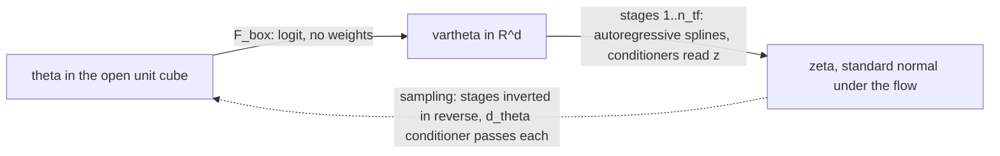

# E2 -- Neural posterior estimation and normalising flows: Bayes without a likelihood, what the loss measures, and how the flow is built

**Document E2 of the joint documentation set; the second chapter of Set E.**
How a network trained only on simulated pairs returns a posterior density,
what the number its loss prints measures, and how the conditional
normalising flow that carries the density is built and constrained to the
prior box. Index and status: `00_INDEX.md`; notation:
`E0_READERS_GUIDE_NOTATION.md`; the flow's knobs as parameters:
`P4_FLOW_AXES.md`. **Date:** 2026-10-04 (v1). **Applies to:** the repository
`Simulation-Based-Inference` at `834eb41` (`hpc/joint/`, D-037), the `sbi`
0.27.0 and `zuko` 1.6.0 wheels the stack is built against (P4), and the
project documents and PDFs named in S6.

| date | change |
|---|---|
| 2026-10-05 | v1.1. One dated correction from E3, nothing else changed: S3.8's forward reference to the label ceiling now carries its conditions (an embedding with at most $C$ values on the scored simulated rows; a loss whose expected value is zero exactly there only under `joint_sep`), and "is that collapse's signature" is marked [corrected 2026-10-05]: $r_{\rm eff} = 1.000$ is consistent with a two-point collapse of the real windows without identifying it. Evidence: E3 S3.4-S3.8, eqs. (E3.3), (E3.6); `tools/e3_numbers.py` B2-B4 `[RAN 2026-10-05]`. |
| 2026-10-04 | v1. Written from P4 S3.2 and S3.4 (the flow as built, cited and not repeated), E1 (eqs. (E1.2), (E1.5), S3.6-S3.8), the plan `JOINT_DSN_NPE_PLAN_v0_6.md` (repository, v0.6.5: S2.2, S2.3 (P8), S5.2, eq. (1a)), `stage2/joint_model.py:34, 130-132, 219`, `stage3/joint_diagnostics.py:63-83`, `stage3/run_joint_arms.py:530-558`, `stage1/latent_sbi_simulator.py:1-12, 128-219`, `stage1/latent_gap.py:9-24`, `stage1/build_latent_bank.py:52-160` (read for a row filter: none), `stage1/bench_burst_provider.py:82-97`, `hpc/dsn/latent_burst_generator.py:460-527`, `hpc/npe_tune_score.py:1-110` and `hpc/npe_tune.py:296-341, 434-461` (mapping only, D-037); the `sbi` 0.27.0 wheel (`inference/__init__.py:15-23, 50-58`, `inference/trainers/npe/npe_base.py:493-526`, `inference/trainers/npe/npe_c.py:39, 129-202, 327-385`, `inference/posteriors/direct_posterior.py:25-39`); the project PDFs of the normalising-flows review, the Practical Guide, BayesFlow, APT, Goncalves et al., sbi reloaded and flow-matching posterior estimation, at the pages cited; PubMed and bioRxiv searched (S6). Every `[RAN]` number is printed by the new torch-free `tools/e2_numbers.py` (two identical runs). New symbols $p_{\rm ev}$ and $\Delta$ (E0 v1.9, convention 14); E0 rows of $p_\Theta$, $H$, $L_0$ and $\hat\Delta$ annotated. One code finding, F-ba (owner E6): the bench's class centres are not a regular simplex for $C \ge 3$, met while computing the bench prior's entropy (S3.3); P7 S3.2 (b) corrected accordingly. S5 relates the standalone tuner's box floor to the plan's P8 (a mapping observation, D-037). |

**Abstract.** The simulator of E1 cannot evaluate its own likelihood, yet
the stack trains its posterior estimator by maximising a likelihood and
scores it by a held-out negative log-likelihood. The question this chapter
answers is how both can be true, what that score measures, and how the
estimator -- a conditional normalising flow -- is built so that it is a
density on the prior box at all. **Covered:** the two factorisations of the
simulator's joint law, the decomposition of the expected negative
log-likelihood into the posterior's entropy and the flow's Kullback-Leibler
error, its minimiser, and what an encoder in front of the flow changes
(S3.2, eqs. (E2.1)-(E2.4)); the gain identity, which says what $L$, $L_0$
and $\hat\Delta$ estimate and when $\hat\Delta$ is a lower bound on the
information the embedding carries, with the numbers on the bench and on the
activity-filtered DUP15HD bank (S3.3, eqs. (E2.5)-(E2.6)); the change of
variables, composition and the triangular map that makes flows universal
(S3.4); autoregressive transforms, coupling layers and the
rational-quadratic spline, and what zuko's NSF is among them (S3.5, eq.
(E2.7)); the box map, leakage and standardisation (S3.6); what `sbi` 0.27.0
and `zuko` 1.6.0 provide and what the stack writes itself, with flow
matching as the alternative in one paragraph (S3.7); and address (a) of E1
S3.8 restated as one term of the gain identity (S3.8). **Deliberately
excluded:** the flow's knobs, ranges and failure modes as parameters (P4,
cited); the encoder's architecture, the metric losses and the label ceiling
(E3); the joint objective, the arms and the training loop (E4); the
statistics of the diagnostics and the decision rule (E7); the bench
generator (E6); sequential and truncated methods beyond their placement (E1
S3.7). No number here is a result of a training run: nothing in `hpc/joint/`
has run on the cluster.

---

## 1. Notation and symbols

A subset of E0's master table, in order of first use, plus the two symbols
E2 adds (marked *new*; E0 v1.9 declares them under convention 14). E0 v1.9
also carries a dated note, written this turn, on the rows of $p_\Theta$ (the
bench prior is not uniform, S3.3), $H$ (differential entropy, S3.2), $L_0$
(its computed form, S3.3) and $\hat\Delta$ (when it bounds information,
S3.3).

| Symbol | Name / Meaning | Type & domain | Units | First used in |
|---|---|---|---|---|
| $\theta$ | the inference parameters of one row, in inference coordinates (E0); on every bench bank they lie on the unit cube, and a real bank does only if it is stored normalised (E1 S5) | $\theta \in \Theta \subset \mathbb{R}^{d_\theta}$ | mixed (E0); dimensionless on the unit cube | S3.1 |
| $\Theta$ | the prior box in inference coordinates, axis-aligned; the flow's prior is the unit cube $(0, 1)^{d_\theta}$, which is $\Theta$ on every bench bank and on a real bank only if it is stored normalised (E1 S5) | subset of $\mathbb{R}^{d_\theta}$ | -- | S3.1 |
| $d_\theta$ | parameter-space dimension | $\mathbb{N}$; 26 on the DUP15HD bank, 10 on the bench | -- | S3.4 |
| $x$ | one window (simulated, or real in S3.8) | $x \in \mathbb{R}^{W}$ | Hz per electrode on the cohort (E0) | S3.1 |
| $W$ | samples per window | $\mathbb{N}$ | samples | S3.2 |
| $p_\Theta$ | the prior density; uniform on $\Theta$ for the DUP15HD bank, the class mixture of plan eq. (7) on the bench | density on $\Theta$ | (param units)$^{-d_\theta}$; dimensionless on the unit cube | S3.1 |
| $p_{\rm sim}$ | the simulator's joint law, $p_{\rm sim}(\theta, x) = p_\Theta(\theta)\, p_{\rm sim}(x \mid \theta)$; conditionals and marginals named by their arguments | law on $\Theta \times \mathbb{R}^{W}$ | -- | S3.1 |
| $z$ | the embedding of a window, $z = h_\psi(x)$ | $z \in S^{E-1}$ | dimensionless | S3.1 |
| $h_\psi$ | the encoder, $h_\psi : \mathbb{R}^{W} \to S^{E-1}$ | map; weights $\psi$ | -- | S3.1 |
| $\psi$ | the encoder's weights | $\mathbb{R}^{n_\psi}$ | -- | S3.1 |
| $E$ | embedding dimension | $\mathbb{N}$ | -- | S3.2 |
| $S^{E-1}$ | the unit sphere of $\mathbb{R}^{E}$, where embeddings live | manifold | -- | S3.2 |
| $n_\psi$ | number of encoder weights | $\mathbb{N}$ | -- | S1 |
| $q_\omega$ | the conditional flow, $q_\omega(\theta \mid z)$: a density on $\Theta$ for each fixed $z$ | conditional density; weights $\omega$ | as $p_\Theta$ | S3.1 |
| $\omega$ | the flow's weights | $\mathbb{R}^{n_\omega}$ | -- | S3.1 |
| $n_\omega$ | number of flow weights | $\mathbb{N}$ | -- | S1 |
| $L$ | held-out NLL: the mean of $\ell_i$ over a split (computed level) | $\mathbb{R}$ | nats/row | S3.1 |
| $L_0$ | the prior floor; as computed, the mean of $-\log p_\Theta(\theta_i)$ over the rows scored (computed level; S3.3) | $\mathbb{R}$ | nats/row | S3.1 |
| $\mathcal{L}^{\rm sim}_{\rm NPE}$ | the NPE objective of plan eq. (1a), $\mathcal{L}^{\rm sim}_{\rm NPE}(\psi, \omega)$: the expected $-\log q_\omega(\theta \mid h_\psi(x))$ under $p_{\rm sim}$ (analytic level) | $\mathbb{R}$ | nats/row | S3.2 |
| $H$ | differential entropy and conditional differential entropy under the law named in the subscript, as in $H_{p_{\rm sim}}[\theta]$ and $H_{p_{\rm sim}}[\theta \mid z]$ | $\mathbb{R}$; can be negative | nats | S3.2 |
| $I$ | mutual information under the law named in the subscript, as in $I_{p_{\rm sim}}(\theta; z)$ | $\mathbb{R}_{\ge 0}$ | nats | S3.2 |
| $\ell_i$ | per-row NLL, $\ell_i = -\log q_\omega(\theta_i \mid z_i)$ (computed level, one row) | $\mathbb{R}$ | nats | S3.1 |
| $i$ | row index | index | -- | S3.1 |
| $B_{\rm sim}, \mathcal{B}_{\rm sim}$ | rows per step of the simulated stream, and one such batch | $\mathbb{N}$; index set | rows | S3.2 |
| $p_{\rm ev}$ | *new.* The joint law of $(\theta, z)$ on the rows a score is computed on -- a held-out simulated split, the bench's pseudo-real arm, an activity-filtered bank -- with $z = h_\psi(x)$ at the fitted $\psi$; marginals and conditionals named by their arguments | law on $\Theta \times S^{E-1}$ | -- | S3.3 |
| $\Delta$ | *new.* The population information gain, $\mathbb{E}_{p_{\rm ev}}[-\log p_\Theta(\theta)] - \mathbb{E}_{p_{\rm ev}}[-\log q_\omega(\theta \mid z)]$ (analytic level); $\hat\Delta$ estimates it; not $\Delta_{gg'}$ | $\mathbb{R}$ | nats/row | S3.3 |
| $\hat\Delta$ | the information gain as computed, $\hat\Delta = L_0 - L$ | $\mathbb{R}$ | nats/row | S3.3 |
| $\delta_{\min}$ | the gain of the shuffled-pairs control, gate G1's "learned nothing" floor | $\mathbb{R}$ | nats/row | S3.3 |
| $\pi$ | simulation-gap severity of the pseudo-real bench arm | $[0, 1]$ | -- | S3.3 |
| $C$ | number of classes | $\mathbb{N}$; 3 at the bank job's default, 2 on the cohort | -- | S3.3 |
| $\tau_{\rm ov}$ | within-class spread of the bench's label axes | $\mathbb{R}_{>0}$; 0.10 at the bank job's default | dimensionless | S3.3 |
| $\mathcal{F}_\omega$ | the flow's whole transform in zuko's direction, data to base, $\mathcal{F}_\omega(\cdot \mid z) : \Theta \to \mathbb{R}^{d_\theta}$ for each fixed $z$ | map; weights $\omega$ | -- | S3.4 |
| $\zeta$ | the base variable, $\zeta = \mathcal{F}_\omega(\theta \mid z)$ | $\zeta \in \mathbb{R}^{d_\theta}$ | dimensionless | S3.4 |
| $p_\zeta$ | the base density, standard normal on $\mathbb{R}^{d_\theta}$ | density on $\mathbb{R}^{d_\theta}$ | -- | S3.4 |
| $\mathcal{F}_{\rm box}$ | the box-to-unconstrained map, $\mathcal{F}_{\rm box} : \Theta \to \mathbb{R}^{d_\theta}$, the coordinatewise logit on the unit cube; no weights | map | -- | S3.4 |
| $\mathcal{F}^{(r)}_\omega$ | the $r$-th stacked autoregressive transform, $\mathbb{R}^{d_\theta} \to \mathbb{R}^{d_\theta}$ for each fixed $z$ | map | -- | S3.4 |
| $r$ | stage index of the stacked transforms | $r \in \{1, \dots, n_{\rm tf}\}$ | -- | S3.4 |
| $n_{\rm tf}$ | number of stacked transforms (`num_transforms`) | $\mathbb{N}$ | -- | S3.4 |
| $k$ | axis index, from 1 | $k \in \{1, \dots, d_\theta\}$ | -- | S3.4 |
| $v$ | the input of a stacked transform | $v \in \mathbb{R}^{d_\theta}$ | dimensionless | S3.5 |
| $\mathcal{C}^{(r)}_\omega$ | the masked conditioner of stage $r$, $\mathbb{R}^{d_\theta + E} \to \mathbb{R}^{d_\theta \times n_\varphi}$ | map | -- | S3.5 |
| $\varphi$ | spline parameters; $\varphi^{(r)}_k$ those of axis $k$ at stage $r$ | $\mathbb{R}^{n_\varphi}$ per axis | -- | S3.5 |
| $n_\varphi$ | spline parameters per axis, $3 K_{\rm bins} - 1$ | $\mathbb{N}$ | -- | S3.5 |
| $K_{\rm bins}$ | spline bins (`num_bins`) | $\mathbb{N}$ | -- | S3.5 |
| $S_{\rm rqs}$ | zuko's monotone rational-quadratic spline, $S_{\rm rqs}(\cdot\,; \varphi) : \mathbb{R} \to \mathbb{R}$ | strictly increasing map | -- | S3.5 |
| $B_{\rm rqs}$ | the spline's half-width; identity outside $[-B_{\rm rqs}, B_{\rm rqs}]$ | $\mathbb{R}_{>0}$; 5 | dimensionless | S3.5 |
| $\delta_{\rm rqs}$ | the soft-clip floor of bin widths, heights and slopes | $\mathbb{R}_{>0}$; $10^{-3}$ | -- | S3.5 |
| $n_{\rm hid}$ | conditioner hidden width (`hidden_features`) | $\mathbb{N}$ | -- | S3.5 |
| $\vartheta$ | the unconstrained parameter, $\vartheta = \mathcal{F}_{\rm box}(\theta)$ | $\vartheta \in \mathbb{R}^{d_\theta}$ | dimensionless | S3.6 |
| $p_{\rm real}$ | the law of real windows | density on $\mathbb{R}^{W}$ | -- | S3.8 |
| $r_{\rm eff}$ | participation-ratio effective rank of an embedding cloud | $[1, E]$ | -- | S3.8 |

### 1.1 Conventions

- E0 S1.1 applies in full: conditional quantities are written conditionally
  every time; every density carries a subscript naming its law, and its
  arguments name the marginal or conditional; the analytic and computed
  levels carry different symbols (convention 4); $\psi$, $\omega$, $\phi$,
  $\nu$ are four objects.
- **Levels in this chapter (R8).** Analytic: the laws $p_\Theta$,
  $p_{\rm sim}$, $p_{\rm ev}$, $q_\omega$, and every quantity defined as an
  expectation under one of them -- $\mathcal{L}^{\rm sim}_{\rm NPE}$, $H$,
  $I$, $\mathrm{KL}$, $\Delta$. Computed: $\ell_i$ (one row), $L$, $L_0$ and
  $\hat\Delta$ (means over the rows of a split), and the batch mean of P4
  eq. (P4.8). A computed quantity *estimates* an analytic one, and the move
  is named where it is made.
- **Entropy is differential entropy (R6).** Under a law such as
  $p_{\rm ev}$,
  $H_{p_{\rm ev}}[\theta] = \mathbb{E}_{p_{\rm ev}}[-\log p_{\rm ev}(\theta)]$,
  and $H_{p_{\rm ev}}[\theta \mid z]$ is the expectation over $z$ of the
  differential entropy of $p_{\rm ev}(\theta \mid z)$. Unlike the entropy of
  a discrete variable it can be negative, and on the unit cube it is at most
  0, with equality only for the uniform density `[textbook, from memory]`.
- **Expectation subscripts name the law**, as in E0's row of $L_0$; when the
  expectation is over $z$ alone the sentence says so.
- **Directions.** zuko's $\mathcal{F}_\omega$ maps $\theta$ to the base; the
  normalising-flows review's map T goes from the base to the data, so T is
  $\mathcal{F}_\omega^{-1}$ for each fixed $z$; T is named in plain text
  only and is not a symbol of the set (R4).
- **Equations.** The plan's are "plan eq. (n)"; P4's "(P4.n)"; E1's
  "(E1.n)"; the project PDFs' by name: "the review's eq. (n)" (Papamakarios
  et al.), "BayesFlow eq. (n)", "APT eq. (n)", "FMPE eq. (n)". E2's own are
  (E2.1) to (E2.7). Restated equations keep their source's number in the
  tag.
- Logarithms are natural; information is in nats, a score in nats per row.
  ASCII only, LF only.

---

## 2. Glossary

Ordered by first appearance in this chapter, because the later terms are
built from the earlier ones. *Everyday meaning differs* is flagged where it
does.

- **Likelihood (two senses)** -- the simulator's
  $p_{\rm sim}(x \mid \theta)$, which no code evaluates (E1 eq. (E1.2)); and
  the flow's density of $\theta$ given $z$, $q_\omega(\theta \mid z)$, which
  training maximises. *Everyday meaning differs*: "likelihood-free" names
  the absence of the first, not of the second. S3.1.
- **Neural posterior estimation (NPE)** -- fitting a conditional density
  estimator of $\theta$ given the data (here given $z$) by maximum
  likelihood on simulated pairs; the Practical Guide uses the term as an
  umbrella over generative models of the posterior (p.9). S3.1.
- **Held-out NLL, prior floor, information gain** -- $L$, $L_0$,
  $\hat\Delta = L_0 - L$, computed on rows not used for training; E7 owns
  their statistics. S3.1, S3.3.
- **Kullback-Leibler divergence, forward direction** -- the expected
  logarithm of the ratio of a target density to an approximating one, taken
  under the target; non-negative, and zero only when the two agree almost
  everywhere. "Forward" when the target is in the first slot, as in NPE's
  $\mathrm{KL}\big(p_{\rm sim}(\theta \mid z) \,\|\, q_\omega(\theta \mid z)\big)$.
  S3.2.
- **Mass-covering** -- the behaviour forward KL induces: missing target mass
  costs far more than adding mass where the target has little, so an
  approximation that cannot be exact errs wide. Not the same as conservative
  (S3.9). S3.2.
- **Sufficient statistic (Bayesian sense)** -- a function of the data, here
  the encoder $h_\psi$, with
  $p_{\rm sim}(\theta \mid x) = p_{\rm sim}(\theta \mid h_\psi(x))$ for
  $p_{\rm sim}$-almost every $x$. S3.2.
- **Variational lower bound on mutual information** --
  $I_{p_{\rm sim}}(\theta; z) \ge H_{p_{\rm sim}}[\theta] - \mathbb{E}_{p_{\rm sim}}[-\log q_\omega(\theta \mid z)]$,
  for any conditional density in the place of $q_\omega$; the deck pack
  names it after Barber and Agakov ([KB] deck 04 C.5). S3.2.
- **Proposal posterior** -- what maximum likelihood targets when $\theta$ is
  drawn from a proposal instead of the prior: the posterior reweighted by
  proposal over prior (APT eq. (1)). S3.2.
- **Activity floor (MFR filter)** -- the pipeline's rule keeping a simulated
  row only if its window's mean firing rate is at least 0.1 Hz per
  electrode, an event of $x$ (E1 S3.6). S3.2.
- **Shuffled-pairs control** -- the same flow trained with the pairing of
  $\theta$ and $z$ destroyed; its gain is $\delta_{\min}$ (E7). S3.3.
- **Normalising flow** -- a density defined as a standard base density
  pushed through a learned bijection, evaluated by the change of variables;
  *everyday meaning differs*: "normalising" refers to the inverse direction
  turning data into a normal sample (the review, p.4), not to normalisation
  layers or z-scoring. S3.4.
- **Change of variables** -- the identity that the density of a bijective
  image is the density of the preimage times the absolute Jacobian
  determinant of the inverse map. S3.4.
- **Triangular (Rosenblatt) map** -- the map sending each coordinate to its
  conditional cumulative distribution given the coordinates before it; it
  turns any well-behaved density into the uniform on the unit cube, with a
  triangular Jacobian (the review, pp.5, 10). S3.4.
- **Autoregressive transform (transformer, conditioner)** -- a bijection
  that bends each coordinate with a monotone one-dimensional map (the
  transformer) whose parameters are computed from the preceding coordinates
  (the conditioner). S3.5.
- **Masked conditioner** -- one feed-forward network whose weight matrices
  are multiplied by fixed binary masks so that output $k$ depends only on
  the coordinates before $k$ (MADE's construction; the review, p.18). S3.5.
- **Coupling layer** -- a transform that passes one block of coordinates
  unchanged and bends the other block with parameters computed from the
  first; equally cheap in both directions. S3.5.
- **Rational-quadratic spline transformer** -- a monotone piecewise function
  whose pieces are ratios of quadratics, analytically invertible; the
  transformer of zuko's NSF (Durkan et al. 2019, not in the knowledge base).
  S3.5.
- **Neural spline flow (NSF, zuko)** -- in zuko 1.6.0, a stack of masked
  autoregressive transforms with rational-quadratic spline transformers (P4
  S3.2). S3.5.
- **Leakage** -- probability mass an estimator places outside the prior's
  support. S3.6.
- **Box transform (unconstrained transform)** -- sbi's
  `transform_to_unconstrained`: the coordinatewise logit of the box,
  prepended to the flow. S3.6.
- **Standardising transform (z-scoring)** -- sbi's per-feature affine map
  fitted to an example batch; not used by the joint stack (P4 S3.4). S3.6.
- **APT / NPE_C** -- automatic posterior transformation, the sequential NPE
  loss that corrects for proposals; `sbi` 0.27.0's `NPE` is its trainer.
  S3.7.
- **Flow matching (FMPE)** -- a continuous-time flow whose velocity field is
  regressed on sample-conditional targets instead of trained by maximum
  likelihood. S3.7.

---

## 3. Main body

### 3.1 The discrepancy: no likelihood is evaluated, yet a likelihood is maximised

This section establishes the chapter's problem statement: the stack
maximises a likelihood without ever evaluating the simulator's, and it ranks
its estimators by a number whose meaning is not the one its form suggests.

E1 S3.8 left three addresses for the gap of E1 S3.1 -- the flow, the
encoder, the simulator -- and this chapter opens the first, starting from
what the flow is trained on.

One would expect a posterior to need a likelihood. Bayes' rule, (E1.3),
multiplies the prior $p_\Theta(\theta)$ by $p_{\rm sim}(x \mid \theta)$, and
for this simulator that factor is a sum over realised connection graphs of
the probability of a window given the graph, (E1.2): the bank samples it
with 383 kernel draws, one graph each, and nothing in the repository
evaluates it `[KB]` (E1 S3.3). Yet the NPE term of the joint objective is a
negative log-likelihood, $\ell_i = -\log q_\omega(\theta_i \mid z_i)$
averaged over a batch (P4 eqs. (P4.7)-(P4.8)), and what training returns is
a density $q_\omega(\theta \mid z)$ that can be evaluated at any $\theta$
for any embedding $z = h_\psi(x)$. The resolution is in the word: the
likelihood maximised is the flow's, of $\theta$ given $z$, and the simulator
only has to be sampled. The Practical Guide states the recipe -- sample
$\theta$ from the prior, run the simulator, and train on the resulting
pairs, which are draws from the joint law -- and adds: "Crucially, this
training process uses only simulated data" (p.4) `[KB-PDF p.4]`. S3.2 shows
why the minimiser of that loss is the posterior.

The discrepancy has a second half, about the number. On the unit cube, where
the stack's flow works (S3.6), the prior itself scores $L_0 = 0$ exactly, a
flow that beats the prior scores $L < 0$, and an untrained flow starts near
$+14.66$ nats/row at the DUP15HD bank's 26 axes (P4 eq. (P4.10)). The
Practical Guide recommends the validation loss as the selection score
because "this loss upper bounds the Kullback-Leibler divergence between the
true and approximate posterior" (p.32) `[KB-PDF p.32]`; on this cube the
inequality runs the other way (S3.3). So a held-out $L$ below zero says that
the flow has learned something, but not how close it is to the posterior,
nor whether what it learned came from $z$. The thread of the chapter runs
from "no likelihood" (S3.2), through "what the loss measures" (S3.3), to
"how the density is built" (S3.4-S3.7), and back to address (a) (S3.8).

### 3.2 Bayes without a likelihood: the expected NLL and its minimiser

This section establishes eqs. (E2.1)-(E2.4): the joint law read in two
orders, the decomposition of the expected negative log-likelihood into the
posterior's entropy plus the flow's KL error, its minimiser, and what an
encoder in front of the flow adds.

S3.1 named the loss; what makes its minimiser the posterior is a fact about
the joint law, not about the flow.

**The mechanism.** Regardless of how the simulator produces a window, if
pairs are made by drawing $\theta$ from the prior and then $x$ from the
simulator, then the same pairs are draws of $x$ from its marginal followed
by $\theta$ from the posterior at that $x$: one joint law, read in the other
order. A flow that assigns high density to the drawn $\theta$, averaged over
pairs, is therefore scored against posterior draws at every window, and the
best it can do is to be the posterior. Nothing in that argument evaluates
the likelihood; the order of the reading is the whole trick.

**The two factorisations.** For every $(\theta, x)$,

$$p_{\rm sim}(\theta, x) = p_\Theta(\theta)\, p_{\rm sim}(x \mid \theta) = p_{\rm sim}(x)\, p_{\rm sim}(\theta \mid x), \tag{E2.1}$$

the product rule `[textbook, from memory]`. The first factorisation is the
sampler; the second is what the loss sees. Flow-matching posterior
estimation states the move as "using Bayes' theorem to simplify the
expectation value" from the posterior order to the sampling order (FMPE p.4)
`[KB-PDF p.4]`, and BayesFlow eqs. (4)-(7) make it in the same direction
(p.4) `[KB-PDF p.4]`. The objective is plan eq. (1a), whose NPE half reads,
with $(\theta, x)$ drawn from $p_{\rm sim}$ (the plan writes the subscript
as the draw),

$$\mathcal{L}^{\rm sim}_{\rm NPE}(\psi, \omega) = \mathbb{E}_{p_{\rm sim}}\big[-\log q_\omega\big(\theta \mid h_\psi(x)\big)\big]. \tag{plan 1a}$$

**The decomposition.** Fix $\psi$. The encoder carries the law of
$(\theta, x)$ on $\Theta \times \mathbb{R}^{W}$ to a law of $(\theta, z)$ on
$\Theta \times S^{E-1}$, written $p_{\rm sim}(\theta, z)$ with marginal
$p_{\rm sim}(z)$ and conditional $p_{\rm sim}(\theta \mid z)$ (R5: the map
is $h_\psi$, the second space its codomain). Adding and subtracting
$\log p_{\rm sim}(\theta \mid z)$ inside the expectation gives, for each
fixed $\psi$ and every $\omega$,

$$\mathcal{L}^{\rm sim}_{\rm NPE}(\psi, \omega) = H_{p_{\rm sim}}[\theta \mid z] + \mathbb{E}_{p_{\rm sim}}\Big[\mathrm{KL}\big(p_{\rm sim}(\theta \mid z) \,\big\|\, q_\omega(\theta \mid z)\big)\Big], \tag{E2.2}$$

the expectation in the second term over $z$ under $p_{\rm sim}$
`[reasoning]`; it is the conditional form of the review's eq. (13), forward
KL as maximum likelihood (p.6) `[KB-PDF p.6]`, and it is checked on a
closed-form toy in `[RAN]` B1. It holds when the entropy is finite; if
$q_\omega(\cdot \mid z)$ vanishes on a set where $p_{\rm sim}(\cdot \mid z)$
has mass, for a set of $z$ of positive probability, the KL term and the loss
are infinite.

**The minimiser.** The first term of (E2.2) does not depend on $\omega$, and
the second is non-negative and zero only when the two densities agree almost
everywhere (Gibbs' inequality, `[textbook, from memory]`). So, for each
fixed $\psi$ and for any conditional density in the place of $q_\omega$,

$$\mathbb{E}_{p_{\rm sim}}\big[-\log q_\omega(\theta \mid z)\big] \;\ge\; H_{p_{\rm sim}}[\theta \mid z], \qquad \text{with equality if and only if } q_\omega(\theta \mid z) = p_{\rm sim}(\theta \mid z) \text{ for } p_{\rm sim}\text{-almost every } z: \tag{E2.3}$$

the posterior given $z$ is the minimiser, and the posterior's conditional
entropy the minimum.

The sources say the same with their hypotheses, which travel with the
statement (R7). APT gives the two: a sufficiently expressive network and
density family, and a number of simulations going to infinity (APT S2.2,
p.2) `[KB-PDF p.2]`. BayesFlow's Proposition 1 assumes the network reaches
the global minimum of the loss, "under perfect convergence" (p.4)
`[KB-PDF p.4]`. According to PubMed, Fan and White state that a density
estimator trained on pairs simulated from the prior is a direct estimator of
the posterior, citing the original proof by Papamakarios and Murray
`[PubMed full text]` ([DOI](https://doi.org/10.1007/s11222-026-10896-8)).
Three consequences follow, each with its own hypothesis.

1. **When the family cannot reach the posterior**, the minimiser over
   $\omega$ is the member closest in expected forward KL, and forward KL is
   mass-covering: FMPE says NPE "directly minimizes the forward KL
   divergence ... and thereby provides probability-mass covering results"
   (p.5) `[KB-PDF p.5]`. Fan and White observe a single-round NPE posterior
   that is "well-centred but more dispersed" than their reference and read
   the objective as "a mass-covering divergence, penalising the estimator
   more for missing probability mass where the target posterior has support
   than for assigning some extra mass around it" `[PubMed full text]`.
   Mass-covering is not conservativeness: FMPE adds that it "does not
   necessarily imply conservative posteriors" (p.7) `[KB-PDF p.7]`, which is
   why calibration is checked separately (E7).
2. **Only simulated windows are constrained.** The expectation in (E2.2)
   weighs each $z$ by $p_{\rm sim}(z)$; where $p_{\rm sim}(z) = 0$ nothing
   in the loss constrains $q_\omega(\cdot \mid z)$ -- the closed-world
   condition of E1 S3.6. The minimiser statement (E2.3) is a statement about
   simulated embeddings.
3. **A filter on $x$ keeps the target; a proposal changes it.** Training on
   the activity-filtered bank replaces $p_{\rm sim}$ by its restriction to
   passing windows, and by (E1.5)
   $p_{\rm sim}(\theta \mid x, \text{pass}) = p_{\rm sim}(\theta \mid x)$ at
   every passing $x$, so the minimiser at passing windows is the posterior
   itself. Drawing $\theta$ from a proposal instead of $p_\Theta$ is
   different: maximum likelihood then targets the posterior reweighted by
   the ratio of proposal to prior, the proposal posterior of APT eq. (1),
   which "would be the correct posterior if [the proposal] were the prior"
   (p.2) `[KB-PDF p.2]`; Fan and White restate it `[PubMed full text]`. Both
   change which $\theta$ the bank holds, and they are different objects: the
   filter conditions on an event of the window, the proposal changes the
   $\theta$-law before the simulator runs (R3). Goncalves et al. trained
   their pyloric-network posterior only on simulations whose summary
   features were well defined (p.25) `[KB-PDF p.25]`, a filter of the first
   kind.

**What the encoder adds.** For each fixed $\psi$, conditioning on less
cannot lower entropy:

$$H_{p_{\rm sim}}[\theta \mid h_\psi(x)] \;\ge\; H_{p_{\rm sim}}[\theta \mid x], \qquad \text{so} \qquad \mathcal{L}^{\rm sim}_{\rm NPE}(\psi, \omega) \;\ge\; H_{p_{\rm sim}}[\theta] - I_{p_{\rm sim}}\big(\theta; h_\psi(x)\big) \;\ge\; H_{p_{\rm sim}}[\theta] - I_{p_{\rm sim}}(\theta; x), \tag{E2.4}$$

with equality in the first inequality, and so in the last, if and only if
$h_\psi$ is sufficient for $\theta$ in the Bayesian sense, and equality in
the middle step if and only if $q_\omega$ is the posterior given $z$
(`[textbook, from memory]` for the data-processing step; `[reasoning]` for
the rest, from (E2.2)-(E2.3) and
$I_{p_{\rm sim}}(\theta; z) = H_{p_{\rm sim}}[\theta] - H_{p_{\rm sim}}[\theta \mid z]$).
The middle bound is the variational lower bound on mutual information, read
backwards: minimising the NPE loss over $\psi$ maximises a lower bound on
the information the embedding carries about $\theta$ ([KB] deck 04 C.5,
which states the minimum over both networks as
$H[\theta] - \max_\psi I(\theta; h_\psi(x))$ -- true when the flow family
contains the posterior for every $\psi$). BayesFlow trains its summary
network on the same expectation (BayesFlow eq. (16), p.4), states the
requirement as matching mutual information with a sufficient statistic (eq.
(18), Proposition 2, p.5), and notes that whenever the KL divergence is
driven to a minimum the summary network's output "is a maximally informative
statistic" (p.5) `[KB-PDF p.5]`. That is why the joint arms let the NPE
gradient reach $\psi$ (plan S2.2) `[REPO]`; how far it can go, and what a
label loss does to it, is E3's subject.

**The levels.** $\mathcal{L}^{\rm sim}_{\rm NPE}$ is analytic. The step's
NPE term, the mean of $\ell_i$ over a batch $\mathcal{B}_{\rm sim}$ of
$B_{\rm sim}$ rows (P4 eq. (P4.8)), is one realisation of an estimate of the
bank's empirical mean, unbiased over batches drawn uniformly from the bank,
and the bank's empirical mean is one realisation of an estimate of
$\mathcal{L}^{\rm sim}_{\rm NPE}$: training minimises the empirical version,
which can be overfitted. BayesFlow notes that with simulations made on
demand "overfitting in the classical sense is nearly impossible", and that
stored, reused simulations are the alternative when simulation is expensive
(p.6) `[KB-PDF p.6]`. The stack is the second case -- a stored bank of
29,616 rows on DUP15HD `[KB]` (pipeline S6), finite shards on the bench --
hence a held-out $L$, early stopping on it (P5) and the learning curve of E1
S3.8 (a). BayesFlow lists three sources of error in a trained pair: the
Monte Carlo error of finite simulations, a summary network that misses
information, and an invertible network that does not transform the posterior
exactly (p.5) `[KB-PDF p.5]`; the last two are addresses (b) and (a) of E1
S3.8, and S3.8 places them in one identity.

### 3.3 What the loss value measures: the gain identity

This section establishes eqs. (E2.5)-(E2.6): what $L$, $L_0$ and
$\hat\Delta$ estimate, when $\hat\Delta$ is a lower bound on the information
$z$ carries about $\theta$, and what it measures otherwise -- with the
numbers on the bench and on the DUP15HD bank.

S3.2 fixed what the loss is minimised by; this section asks what its value
says, because every arm of E4 and every trial of E8 is ranked by it.

**The mechanism.** Regardless of the flow, a score computed as the
log-density the flow gives the held-out $\theta$ minus the log-density the
prior gives them, averaged over rows, rewards two things at once: knowing
which $\theta$ go with which $z$ -- information -- and knowing which
$\theta$ the rows hold at all -- their marginal. If the prior density used
for the floor is the law the held-out $\theta$ were actually drawn from, the
second reward is zero and the score can only under-report the information.
Conversely, if the held-out $\theta$ follow a different law -- a filtered
bank scored against a box -- a flow that ignores $z$ entirely still scores
above zero.

**The identity.** Let $p_{\rm ev}$ be the joint law of $(\theta, z)$ on the
rows a score is computed on, with $z = h_\psi(x)$ at the fitted $\psi$. The
computed scores estimate expectations under it: $L$, the mean of $\ell_i$
over those rows, estimates
$\mathbb{E}_{p_{\rm ev}}[-\log q_\omega(\theta \mid z)]$; $L_0$ as the code
computes it -- the mean of $-\log p_\Theta(\theta_i)$ over the same rows
(`mc_prior_floor`, `joint_diagnostics.py:63-78`) `[REPO]` -- estimates
$\mathbb{E}_{p_{\rm ev}}[-\log p_\Theta(\theta)]$; and
$\hat\Delta = L_0 - L$ estimates their difference, the population gain
$\Delta$. Expanding both expectations as entropy plus KL, as in (E2.2) with
$p_{\rm ev}$ in place of $p_{\rm sim}$, and using
$H_{p_{\rm ev}}[\theta] - H_{p_{\rm ev}}[\theta \mid z] = I_{p_{\rm ev}}(\theta; z)$,
gives, for each fixed $(\psi, \omega)$,

$$\Delta \;=\; I_{p_{\rm ev}}(\theta; z) \;+\; \mathrm{KL}\big(p_{\rm ev}(\theta) \,\big\|\, p_\Theta\big) \;-\; \mathbb{E}_{p_{\rm ev}}\Big[\mathrm{KL}\big(p_{\rm ev}(\theta \mid z) \,\big\|\, q_\omega(\theta \mid z)\big)\Big], \tag{E2.5}$$

the last expectation over $z$ under $p_{\rm ev}$ `[reasoning]`, checked in
both cases below on a closed-form toy `[RAN]` B1. Twin cases, mirrored:

- **If the rows' $\theta$-marginal is the prior**,
  $p_{\rm ev}(\theta) = p_\Theta$, the middle term vanishes and
  $\Delta = I_{p_{\rm ev}}(\theta; z) - \mathbb{E}[\mathrm{KL}] \le I_{p_{\rm ev}}(\theta; z)$:
  the gain is a lower bound on the information, short of it by the flow's
  average posterior error.
- **If the rows' $\theta$-marginal differs from the prior**, the middle term
  is positive and a flow that ignores $z$ and returns $p_{\rm ev}(\theta)$
  scores $\Delta = \mathrm{KL}(p_{\rm ev}(\theta) \,\|\, p_\Theta) > 0$ with
  no information used: the gain is no longer a bound on the information.

In the toy -- $\theta$ standard normal, $z$ equal to $\theta$ plus noise of
standard deviation 0.5, a deliberately wrong Gaussian flow -- the
information is 0.8047 nats, the flow's expected KL 0.1411 and the gain
0.6636 when the floor is the true marginal; scored against a normal
reference of standard deviation 2 instead, the same flow gains 0.9818, the
extra 0.3181 being exactly the marginal's KL, which a flow that ignores $z$
also collects `[RAN]` B1.

**On the bench the identity is in its first case.** The runner computes
$L_0$ with the bench's own prior density on the held-out $\theta$ themselves
-- `mc_prior_floor(lambda t: prior_log_prob(spec, t.numpy()), theta_rp)` on
the simulated report split (`run_joint_arms.py:539`) and the same on the
pseudo-real arm (`:557`) `[REPO]` -- so that, in the docstring's words,
"`information_gain` is a paired difference" (`joint_diagnostics.py:68-69`)
`[REPO]`. Those $\theta$ are prior draws: the bank builder applies no row
filter (`build_latent_bank.py`, read for one), and the simulation gap shifts
the physical ranges of the free axes, never the recorded coordinate --
"Shifting the range keeps every recorded coordinate inside the box while
moving the physics" (`latent_gap.py:21-22`) `[REPO]`. So on both arms
$p_{\rm ev}(\theta) = p_\Theta$ and $\hat\Delta$ estimates
$I - \mathbb{E}[\mathrm{KL}]$ under that arm's law, a lower bound on the
information, with two hypotheses. The rows scored must be independent of the
training rows: P7 F-aw shows that two bench arms built at one seed share
every draw, so that at $\pi = 0$ and the bank job's defaults the pseudo-real
score falls on copies of training rows in 68.75 % of its rows (P7 S3.3.2)
`[RAN]` there, and on such rows $L$ is optimistic. And the paired mean
carries Monte Carlo and clustering error (E7).

The bench prior is not uniform, which is why the runner needs that Monte
Carlo floor: "The bench prior is a MIXTURE (eq. 7), so the analytic box
floor does not apply" (`joint_diagnostics.py:66-67`) `[REPO]`. At the bank
job's defaults -- the `bench` provider's ten axes, seven of them label axes,
$C = 3$ classes, $\tau_{\rm ov} = 0.10$
(`build_latent_bank.py:67-68, 112-124`; `bench_burst_provider.py:82-97`)
`[REPO]` -- its differential entropy is $-5.19$ nats, by Monte Carlo over
two million prior draws and by its decomposition into $\ln C$ plus the
components' closed-form entropies minus a class-overlap term of 0.0006 nats
`[RAN]` B4. So the runner's $L_0$ on a prior-faithful bench split is near
$-5.19$ nats/row; a box floor ($L_0 = 0$ on the unit cube) would have handed
a flow that ignores $z$ a gain of 5.19 nats/row; and an identity-initialised
flow (P4 eq. (P4.10)) scores 0.54 nats/row in expectation on the bench
prior, 5.73 nats above that entropy `[RAN]` B4 -- before any gain shows, the
flow has to learn the prior's class structure. (Building the bench prior met
finding F-ba, S5.)

**On the DUP15HD bank the floor is exact and the marginal is not the
prior.** With $p_\Theta$ uniform on a box, $-\log p_\Theta(\theta)$ is the
same for every $\theta$ in it, the log of the box's volume, so $L_0$ is
exact whatever the rows: 0 on the unit cube `[RAN]` B3, and the sum of the
logs of the box's widths in inference coordinates, as the standalone tuner
computes it (`npe_tune_score.py:73-105`) `[REPO]` -- no estimation error
enters it either way. Which of the two the joint stack would see on this
bank is the open contract question of P0 S5 (E1 S5); nothing below depends
on it, since a KL divergence is unchanged when both densities are carried
through the same bijection `[textbook, from memory]`. But the
activity-filtered bank's $\theta$-marginal is
$p_{\rm sim}(\theta \mid \text{pass})$, not $p_\Theta$ (E1 eq. (E1.5)), and
the second case applies. Its middle term follows from (E1.5): for a filter
that is an event of $x$ with $\Pr(\text{pass}) > 0$,

$$\mathrm{KL}\big(p_{\rm sim}(\theta \mid \text{pass}) \,\big\|\, p_\Theta\big) \;=\; \mathbb{E}_{p_{\rm sim}}\big[\log \Pr(\text{pass} \mid \theta) \mid \text{pass}\big] - \log \Pr(\text{pass}) \;\le\; -\log \Pr(\text{pass}), \tag{E2.6}$$

with equality if and only if $\Pr(\text{pass} \mid \theta) = 1$ for
$p_{\rm sim}(\theta \mid \text{pass})$-almost every $\theta$ `[reasoning]`.
With $\Pr(\text{pass})$ estimated by the kept fraction 29,616 of 86,251
`[KB]` (pipeline S6), a flow that ignores $z$ can show up to 1.069 nats/row
of gain against the box on the filtered DUP15HD bank, all of it from the
marginal `[RAN]` B3. A toy shows the mechanism with every term exact:
$\theta$ uniform on the unit interval, $z$ a coin with bias $\theta$, and
only the rows with $z = 1$ kept; the kept marginal has density $2\theta$,
and a flow that learns it gains $\ln 2 - 1/2 = 0.193$ nats/row over the box,
under the bound $\ln 2$, while $z$ is the same on every kept row and so
carries no information `[RAN]` B2. No score of the joint stack is computed
this way -- its runner builds the prior from the bank sidecar's
`latent_spec` (`run_joint_arms.py:389-390`) `[REPO]`, a field of the Stage 1
bench banks (P7 S3.2 (e)) -- but the standalone NPE tuner, outside D-037's
scope, scores real banks against the box floor, and its docstring states
that $\hat\Delta$ "is a lower bound on the mutual information between
parameters and embedding" (`npe_tune_score.py:36-37`) `[REPO]`; by
(E2.5)-(E2.6) that holds there only after the marginal term is removed (S5).
The control that accounts for it is the shuffled-pairs control: a flow
trained on pairs whose $z$ has been shuffled can learn $p_{\rm ev}(\theta)$
but nothing about the pairing, so its gain $\delta_{\min}$ collects the
marginal term and no information `[reasoning]`; E7 owns the control and its
statistics.

**The Practical Guide's sentence, with its condition (R7).** The guide
writes that the NPE validation loss "upper bounds the Kullback-Leibler
divergence between the true and approximate posterior" (p.32, citing
Lueckmann et al. 2021, not in the knowledge base) `[KB-PDF p.32]`. By (E2.2)
the loss minus the expected KL is $H_{p_{\rm sim}}[\theta \mid z]$, so the
sentence holds when that entropy is non-negative -- for a discrete $\theta$,
say. For a continuous $\theta$ on the unit cube -- every bench bank -- every
differential entropy is at most zero (S1.1), so there the loss lies *below*
the expected KL: in the unit-interval toy, the exact posterior scores
$-0.193$ nats/row while its KL is zero `[RAN]` B2. What survives in general
is weaker and enough for selection: at fixed $\psi$ and on a fixed
evaluation law the entropy term is the same for every flow, so the loss
ranks flows by their expected KL. Across arms that change $\psi$ the entropy
term moves too, by (E2.4) -- which is S3.8's point.

```
held-out rows ~ p_ev(theta, z)

 L_0 - L  estimates  Delta = I_{p_ev}(theta; z)            information z carries   (address b)
                            + KL(p_ev(theta) || p_Theta)    marginal vs floor's prior (0 on the bench;
                                                              <= 1.069 on the filtered DUP15HD bank)
                            - E KL(p_ev(theta|z) || q)      the flow's error          (address a)
```

### 3.4 A density you can both evaluate and sample: the change of variables

This section establishes the identity that makes a flow a density, P4 eq.
(P4.1), its composition, the cost of its two operations, and the
construction that makes flows universal and autoregressive.

S3.2-S3.3 treated $q_\omega$ as any conditional density; the stack's is a
normalising flow, and this section and the next two build it, starting from
the identity that makes a flow a density.

**The mechanism.** Regardless of how complicated the map, if a bijection
carries $\theta$ to a point of a standard normal and keeps account of how
much it stretches volume around $\theta$, then the density of $\theta$ is
the normal density at the image times that stretch. Conversely, running the
bijection backwards on normal draws produces draws from exactly that
density. A flow is a density that can be evaluated and sampled for the same
reason.

**The identity.** For each fixed $z$, with
$\mathcal{F}_\omega(\cdot \mid z)$ a bijection from $\Theta$ onto
$\mathbb{R}^{d_\theta}$ that is differentiable with a differentiable
inverse,

$$q_\omega(\theta \mid z) = p_\zeta\big(\mathcal{F}_\omega(\theta \mid z)\big)\,\Big\lvert \det \frac{\partial \mathcal{F}_\omega(\theta \mid z)}{\partial \theta} \Big\rvert, \qquad \zeta = \mathcal{F}_\omega(\theta \mid z), \tag{P4.1}$$

the review's eq. (3), written there with the inverse of its map T in the
place of $\mathcal{F}_\omega$ (p.3) `[KB-PDF p.3]`; the absolute determinant
is the local volume ratio, and probability mass is conserved through the map
(p.3) `[KB-PDF p.3]`. Bijections compose: the inverse of a composition is
the reversed composition of inverses and its log-determinant is the sum of
the stages' (the review's eqs. (5), (6), (28), pp.3, 10)
`[KB-PDF pp.3, 10]`, which is how the stack's flow is a chain, P4 eq.
(P4.2): the box map $\mathcal{F}_{\rm box}$ first, then $n_{\rm tf}$ stacked
transforms $\mathcal{F}^{(r)}_\omega$.

**Two operations, two costs.** The review separates them: sampling needs the
map from base to data, density evaluation needs the map from data to base
and its Jacobian determinant (p.4) `[KB-PDF p.4]`. In zuko's direction
$\mathcal{F}_\omega$ is the data-to-base map, so a log-density is one
forward evaluation of the chain, and a draw is the chain inverted, stage by
stage in reverse, P4 eq. (P4.11). A general Jacobian determinant costs a
number of operations cubic in the dimension, and flows are designed so that
it is linear (p.12) `[KB-PDF p.12]`; S3.5 shows how.

**Why flows can represent the posterior, and why they are autoregressive.**
The review proves universality constructively (S2.2, pp.4-5)
`[KB-PDF pp.4-5]`: for a density positive everywhere on
$\mathbb{R}^{d_\theta}$ whose conditional cumulative distributions are
differentiable, the map that sends each coordinate to its conditional
cumulative distribution given the coordinates before it is a bijection onto
the open unit cube; its Jacobian is triangular, its diagonal entries are the
conditional densities, so its determinant is the density itself and the
image is uniform (the review's eqs. (7)-(11)); any base satisfying the same
conditions reaches the uniform the same way (eq. (12)). The review places
these triangular maps, studied by Rosenblatt (1952), in the
optimal-transport literature (p.10) `[KB-PDF p.10]`. Two conditions travel
with the statement (R2). Positivity on the whole space: the posterior on the
box satisfies it after the box map sends $\Theta$ onto
$\mathbb{R}^{d_\theta}$ (S3.6), provided the posterior density is positive
on the open box `[reasoning]`. And the statement is about representation
only -- "just a statement of representational power and makes no guarantees
about the flow's behavior in practice" (p.13) `[KB-PDF p.13]`. The
construction is autoregressive -- coordinate $k$ is transformed as a
function of the coordinates before it -- which is why the next section's
transforms are.



ASCII fallback: P4 S3.2 draws the same chain, with the pass counts of both
directions.

### 3.5 Building the bijection: autoregressive transforms, coupling layers, splines

This section establishes eq. (E2.7), the log-determinant of one stage, and
places zuko's NSF among the review's families: autoregressive rather than
coupling, with a rational-quadratic spline as the one-dimensional map.

The triangular map of S3.4 is the ideal; a flow approximates it by a few
parametrised triangular stages, and the design choices are how each
coordinate is bent and what the bending may look at.

**The mechanism (twin cases).** In an autoregressive stage, each coordinate
is bent by a monotone curve whose shape is read off all the coordinates
before it: the density needs one pass, because every shape is computed at
once from the input, and sampling needs one pass per coordinate, because
each shape needs the coordinates already sampled. Conversely, in a coupling
stage, the coordinates are split into two blocks, the first passes unchanged
and the second is bent by curves read off the first: density and sampling
both need one pass, at the price of a stage that cannot represent every
triangular map.

**Transformer and conditioner.** The review writes an autoregressive
transform as a strictly monotone transformer applied to each coordinate with
parameters computed by a conditioner from the preceding coordinates (eq.
(29), p.12); it is invertible by recursion for any conditioner (eq. (30)),
its Jacobian is triangular (eq. (31)) and its log-determinant is the sum of
the transformers' log-derivatives, computable in linear time (eq. (32),
p.13) `[KB-PDF pp.12-13]`. In the stack's symbols, stage $r$ is zuko's
`MaskedAutoregressiveTransform` with the rational-quadratic spline as
transformer, P4 eq. (P4.4): on its input $v$ and the context $z$, the
conditioner $\mathcal{C}^{(r)}_\omega$ returns the spline parameters
$\varphi^{(r)}_k$ of every axis $k$ in one pass, and for each fixed $z$

$$\log \Big\lvert \det \frac{\partial \mathcal{F}^{(r)}_\omega(v \mid z)}{\partial v} \Big\rvert = \sum_{k=1}^{d_\theta} \log \frac{\partial S_{\rm rqs}\big(v^{(k)}; \varphi^{(r)}_k\big)}{\partial v^{(k)}}, \qquad \varphi^{(r)}_k \text{ a function of } z \text{ and of the } v^{(k')} \text{ that precede } k \text{ in stage } r\text{'s order}, \tag{E2.7}$$

the review's eq. (32) in P4's notation (P4 S3.2) `[KB-PDF p.13]`. The order
is ascending in odd stages and descending in even ones (P4 S3.2), so over
two stages every axis is transformed as a function of every other.

**Masked conditioners and the cost of inversion.** One feed-forward network
outputs every axis's parameters in one pass when its weight matrices are
masked so that output $k$ sees only the coordinates before $k$ -- the degree
construction of Germain et al. -- which keeps evaluation parallel and the
flow universal given a large enough conditioner and a flexible enough
transformer (p.18) `[KB-PDF p.18]`. The price is inversion: the parameters
of coordinate $k$ can be computed only after coordinates 1 to $k - 1$ are
known, so inversion calls the conditioner once per coordinate (eq. (40)) and
is "about D times more expensive" than evaluation, D being the review's
dimension (pp.18-19) `[KB-PDF pp.18-19]`. In the stack the conditioner is
zuko's `MaskedMLP` (P4 eq. (P4.5)); a batch of log-densities costs
$n_{\rm tf}$ conditioner passes and a batch of draws $d_\theta n_{\rm tf}$:
3 against 78 at the runner's defaults, 12 against 312 at the space's upper
bound (P4 eq. (P4.11)) `[RAN]` there.

**Coupling layers, the symmetric alternative.** A coupling layer fixes the
conditioner's output for a first block of coordinates and makes the rest a
function of that block only (the review's eqs. (42)-(44), pp.19-20); its
Jacobian is lower triangular with an identity block (eq. (45)), and both
directions cost one pass. One coupling layer is not universal; compositions
with permutations between layers are flexible in practice, and "It is an
open problem whether it's possible to obtain a universal approximator by
composing strictly fewer than O(D) coupling layers" (p.21) `[KB-PDF p.21]`.
BayesFlow's invertible network is of this kind: affine coupling blocks with
fixed permutations before each block (BayesFlow eqs. (19)-(22), p.5)
`[KB-PDF p.5]`. The stack has no coupling layer; its alternating orders play
the role the permutations play for coupling flows, by reasoning -- no source
on the two-order alternation was found (P4 S5).

**The spline transformer.** A spline transformer is a monotone piecewise
function on an interval, each piece easy to invert, the identity outside; it
is as fast to invert as to evaluate, the right piece is found by binary
search in a number of steps logarithmic in the number of pieces, and it
becomes arbitrarily flexible as pieces are added; the families explored
range from linear and quadratic to rational-quadratic splines (pp.16-17)
`[KB-PDF pp.16-17]`. zuko's $S_{\rm rqs}$ is the rational-quadratic one, on
$[-B_{\rm rqs}, B_{\rm rqs}] = [-5, 5]$ with $K_{\rm bins}$ bins and
$n_\varphi = 3 K_{\rm bins} - 1$ parameters per axis, soft-clipped with
$\delta_{\rm rqs} = 10^{-3}$ so that no two bins of one spline differ in
width or height by more than a factor $10^{3}$ and the interior slopes stay
in $[10^{-3}, 10^{3}]$, linear with slope 1 outside the interval, and
exactly the identity when its parameters are zero (P4 eq. (P4.6), `[RAN]`
there); the conditioner's hidden width is $n_{\rm hid}$ (P4 eq. (P4.5)). The
rational-quadratic form is Durkan et al.'s (2019), not in the knowledge base
(P4 S6).

**What zuko's NSF is, then.** A masked autoregressive flow -- not a coupling
flow -- whose transformer is the rational-quadratic spline (P4 S3.2). That
matters for one borrowed sentence. FMPE's comparison table lists NPE as
needing a single network pass for sampling (FMPE Table 1, p.3)
`[KB-PDF p.3]`; that is true of coupling-type flows, and false for this one,
whose sampling needs $d_\theta$ conditioner passes per stage (R3, R7). Why
autoregressive here `[reasoning]`: training evaluates a log-density for
every simulated row of every step, one pass per stage, while draws are
needed by the replicate term (1024 per step, P3 S3.2) and the diagnostics,
and their sequential cost is paid in passes batched over all draws at once
(P4 S3.2).

### 3.6 Matching the support: the box map, leakage and standardisation

This section establishes how the stack makes its flow a density on the prior
box: the logit map and the density bookkeeping it adds, why standardisation
is a different kind of map, and why the stack standardises nothing.

A flow built from S3.4-S3.5 is a density on all of $\mathbb{R}^{d_\theta}$;
the stack's flow takes $\theta$ in the open unit cube -- its prior is
`BoxUniform(0, 1)`, which is $\Theta$ on every bench bank (E1 S5) -- and
this section is about the map that reconciles the two.

**The mechanism (twin cases).** An affine standardisation shifts and
rescales each axis: it changes the numbers the flow works with, not the set
of densities it can express, and every one of them still puts some mass
outside the box. Conversely, the logit stretches the open interval onto the
whole line: every density the flow can then express has support exactly the
box, and every draw lands strictly inside it.

**Leakage.** A flow on $\mathbb{R}^{d_\theta}$ trained on rows inside a box
may place mass outside it. sbi's own posterior class says so: "for bounded
priors, the neural network can have leakage: it puts non-zero mass in
regions where the prior is zero", and it corrects the log-probability and
rejects draws outside the prior's bounds (`direct_posterior.py:29-38`, `sbi`
0.27.0) `[REPO sbi wheel]`. APT observed that "conditional MAFs trained with
APT can leak increasingly large amounts of mass outside the prior support",
and proposed the remedy the stack uses: "For simple box-shaped prior
supports, one can also apply a pointwise (scaled) logistic transformation to
the MAF outputs to enforce prior bounds" (APT A.3, p.14) `[KB-PDF p.14]`.
Goncalves et al. did the same by hand: "Bounded parameters were transformed
with a log-, or logit-transform, to yield unconstrained parameters", and
transformed the posteriors back in closed form (p.21) `[KB-PDF p.21]`.

**The box map as built.** `z_score_theta = "transform_to_unconstrained"`
with `BoxUniform(0, 1)` passed as the prior prepends
$\mathcal{F}_{\rm box}$, the coordinatewise logit,
$\vartheta = \mathcal{F}_{\rm box}(\theta)$, whose log-determinant depends
on $\theta$ alone, P4 eq. (P4.3). Under the uniform prior each
$\vartheta^{(k)}$ is standard logistic, and the box Jacobian is the
uniform's own density change, which makes P4's anchor exact: $L_0 = 0$ on
the unit cube, and an identity-initialised flow starts at
$0.5639\, d_\theta = 14.66$ nats/row at $d_\theta = 26$ (P4 eq. (P4.10);
recomputed `[RAN]` B5). The box term is part of $\ell_i$ (P4 eq. (P4.7)): it
averages $-2$ nats per axis under the uniform, $-52$ at $d_\theta = 26$
`[RAN]` B5, so the same flow's loss printed in $\vartheta$ coordinates and
in box coordinates differs by tens of nats; $L$, $L_0$ and $\hat\Delta$ are
in box coordinates (P4 S3.2). The logit cannot take a boundary point, which
is why the bench draws its label axes from a truncated rather than a clipped
normal: "Clipping puts point masses on the box boundary, and
`z_score_theta = "transform_to_unconstrained"` maps a boundary point to +/-
infinity" (`latent_sbi_simulator.py:6-8`) `[REPO]`.

**Standardisation.** sbi's `"independent"` option inserts a per-feature
affine map fitted to the example batch (P4 S3.4). As a change of coordinates
of $\theta$, an affine map has a constant Jacobian: it shifts every $\ell_i$
by one constant and leaves the minimiser of (E2.2) unchanged, so its role is
numerical -- inputs of order one -- not statistical `[reasoning]`. The joint
stack standardises nothing. Its `z_score_theta` choice is the logit, under
an option name that says "z-score" though it standardises nothing (P4 S3.4,
R6). Its `z_score_x = "none"` leaves the condition as the bank stores it,
because the condition is the raw window entering the backbone inside the
estimator, and a standardising layer there would change the encoder's input
and the checkpoint's keys (P4 S3.4; plan D6, open on paper, F-af). The
standalone NPE stack standardises its stored embedding instead, a different
object (P4 S3.5).

### 3.7 What sbi and zuko provide, and what the stack writes itself

This section establishes the division of labour between the libraries and
the stack, shows that the stack's loss and sbi's first-round loss are the
same call, and places flow matching as the alternative the stack does not
use.

With the density, the loss and the coordinates fixed, the remaining question
is which parts come from the libraries and which the stack writes.

**What sbi offers.** sbi provides "high-level interfaces ... as well as
low-level interfaces for experienced users and SBI researchers (giving full
control over simulations, the training loop, and the sampling procedure)"
(sbi reloaded, p.2), NPE, NLE and NRE in amortised and sequential modes,
density estimators from nflows and zuko, flow matching among them, and "a
preconfigured training loop with established default values, but sbi also
allows full access over the training loop when desired" (p.3)
`[KB-PDF pp.2-3]` (arXiv 2411.17337v2; a preprint, not peer-reviewed as the
PDF shows).

**What the stack takes.** Two names: `posterior_nn`, the density-estimator
builder (`joint_model.py:34`, applied at `:219`), and `BoxUniform`
(`run_joint_arms.py:385`; `run_stage3c.py:338`) `[REPO]`; nothing from
`sbi.inference` is imported anywhere in `hpc/joint/` (`git grep` at
`834eb41`) `[REPO]`. From the builder it takes the zuko NSF with the box map
prepended (P4 S3.2), and from the estimator two operations: `loss`, which
the stack's `npe_loss` calls (`joint_model.py:130-132`), and the sampler (P4
eq. (P4.11)). The loop, the three streams, the optimiser and the scores are
the stack's own (E4, E7): sbi's loop cannot take the DSN and replicate terms
([KB] deck 03 B.4; plan S2.2).

**What it does not take, and why nothing is lost.** In `sbi` 0.27.0, `NPE`
is `NPE_C` (`inference/__init__.py:22`), with `SNPE`, `SNPE_C` and `APT`
kept as aliases of it (`:36-38`, `:56`) `[REPO sbi wheel]`. Its loss in the
first round is `self._neural_net.loss(theta, x)` -- "Use posterior log prob
(without proposal correction) for first round" (`npe_base.py:513-519`)
`[REPO sbi wheel]` -- the same call as the stack's `npe_loss`. The
correction it applies in later rounds is APT's: the flow's density times the
ratio of proposal to prior, renormalised (APT eq. (2), p.3) `[KB-PDF p.3]`,
which is the flow's own density when the proposal is the prior, the ratio
and the normaliser both being one `[reasoning]`. A single round on prior
draws therefore targets what the stack targets. `DirectPosterior`'s leakage
correction is not needed either: after the logit no mass lies outside the
box (S3.6).

**Flow matching, the alternative.** Flow-matching posterior estimation
replaces the discrete flow by a continuous one whose velocity field is a
network, trained not by maximum likelihood but by regressing that field on
simple sample-conditional target fields (FMPE eqs. (4), (7), pp.4-5), with
training data generated, as in NPE, "by sampling $\theta$ from the prior,
and then simulating data $x$ corresponding to $\theta$" (p.5)
`[KB-PDF p.5]`; the density is obtained by integrating an ODE and the
divergence of the field along it (eq. (3), p.4) `[KB-PDF p.4]`. Its
estimates are mass-covering under regularity assumptions that are "not
guaranteed to hold in practice when [the field] is parametrized by a neural
net" (Theorem 1, p.6) `[KB-PDF p.6]`, and both sampling and density need
many network passes, "typically requiring hundreds of network forward
passes" (p.9; Table 1, p.3) `[KB-PDF pp.3, 9]` (Dax, Wildberger et al.,
NeurIPS 2023). The Practical Guide's summary is the same trade: high
flexibility, but "it is typically more computationally expensive to draw
samples from the posterior and to evaluate its density" (p.10)
`[KB-PDF p.10]`. `sbi` 0.27.0 exports flow-matching and score-based trainers
(`inference/__init__.py:17`) `[REPO sbi wheel]`. The stack does not use them
`[reasoning]`: every step needs an exact log-density for every simulated row
(P4 eq. (P4.7)) and reparameterised draws for the replicate term (P3), and
the discrete flow gives both at a fixed number of passes.

### 3.8 Back to address (a): what "estimator-limited" means, and what the loss cannot separate

This section establishes the chapter's result: address (a) of E1 S3.8 is the
KL term of eq. (E2.5), and a held-out loss reports it only added to an
information term the flow does not control.

The chapter opened on the flow as the first of E1's three addresses; with
the loss decomposed and the flow built, the address can be written as a
term.

On simulated windows, read through (E2.5) in its first case, the three
readings of E1 S3.8 become three objects. Address (a), the estimator, is the
flow's expected error
$\mathbb{E}_{p_{\rm ev}}[\mathrm{KL}(p_{\rm ev}(\theta \mid z) \,\|\, q_\omega(\theta \mid z))]$,
the slack between the gain and the information. Address (b), the
information, is $I_{p_{\rm ev}}(\theta; z)$, set by $\psi$ through (E2.4)
and capped by $I_{p_{\rm ev}}(\theta; x)$. Address (c), the simulator, is a
statement about $p_{\rm real}$ against $p_{\rm sim}$, which no score on
simulated rows can see (E1 S3.6).

At fixed $\psi$ -- the frozen encoder of arms `A0` and `A0s` (E4) -- two
flows scored on the same split differ in $L$ by their KL terms alone, since
the entropy term is common to both: those comparisons measure the estimator.
Across arms that train $\psi$, $L$ moves with both terms, and $\hat\Delta$
ranks the arms by $I - \mathbb{E}[\mathrm{KL}]$ without saying which part
moved. The discriminators E1 S3.8 (a) lists aim at different pieces
`[reasoning]`: a learning curve in bank size at BayesFlow's first error
source, the finite bank; the shuffled control at the marginal term of the
second case of (E2.5); contraction and the information spectrum at the
posterior's geometry rather than at the loss (E7). And no flow repairs (b):
E3 shows that at the global minimum of the DSN loss the embedding carries at
most $\ln C$ nats about $\theta$ -- 0.693 at $C = 2$ -- whatever the
encoder's size `[KB]` (deck 04 C.2), so by (E2.5) the bench-style gain of an
arm whose encoder sits there is capped at $\ln C$ whatever the flow; the
measured real-arm $r_{\rm eff} = 1.000$ of the r2 encoder (E1 S3.1) is that
collapse's signature (deck 04 C.3). [corrected 2026-10-05, E3 S3.4-S3.8:
the cap holds for an embedding with at most $C$ values on the scored
simulated rows, E3 eq. (E3.6), and the DSN loss's expected value is zero
exactly at such a code only under `joint_sep`, E3 eq. (E3.3); a collapse of
the real windows bounds nothing about the simulated ones by itself; and
$r_{\rm eff} = 1.000$ is consistent with a two-point collapse of the real
windows without identifying it -- it measures dimension, and on the sphere
a printed 1.000 also allows a short arc (E3 S3.7).]

So the flow's address is the KL term of eq. (E2.5): the loss reports it only
added to an information term the flow does not control, and E3 opens that
term.

### 3.9 Common confusions

Words and statements that carry two senses in this chapter (R6), each with
the sense the set uses.

- **"Likelihood."** The simulator's $p_{\rm sim}(x \mid \theta)$, never
  evaluated, versus the flow's $q_\omega(\theta \mid z)$, maximised (S3.1).
  "Likelihood-free" refers to the first.
- **"Entropy."** For a continuous $\theta$ the differential entropy, which
  can be negative and is at most 0 on the unit cube; intuitions from
  discrete entropy ($H \ge 0$) do not transfer (S1.1, S3.3).
- **"The loss bounds the KL."** It equals the expected KL plus the
  posterior's entropy given $z$ (E2.2); it is an upper bound only where that
  entropy is non-negative, and on the unit cube it is a lower bound (S3.3).
- **"Information gain."** $\hat\Delta$, computed, versus $\Delta$, its
  expectation (R8); and a lower bound on $I$ versus not: only when the rows'
  $\theta$-marginal is the floor's prior (E2.5).
- **"Prior floor."** E0's analytic $L_0$, the prior's entropy, versus the
  code's $L_0$, a mean of $-\log p_\Theta$ over the rows scored, which
  equals the first only for prior-faithful rows -- and is exactly 0 on the
  unit cube for any rows (S3.3).
- **"Posterior."** $p_{\rm sim}(\theta \mid x)$, the target given the
  window; $p_{\rm sim}(\theta \mid z)$, the target given the embedding,
  which is what NPE can reach (E2.3); and $q_\omega(\theta \mid z)$, the
  approximation, the only one computed (E2.4).
- **"Filtered bank" versus "proposal."** A filter on $x$ keeps the posterior
  at every kept window; a proposal changes the target to the proposal
  posterior (S3.2, consequence 3).
- **"Mass-covering" versus "conservative."** Forward KL penalises missing
  mass, so imperfect flows err wide; that is not a coverage guarantee (FMPE
  p.7; S3.2).
- **The flow's direction.** zuko's $\mathcal{F}_\omega$ goes from $\theta$
  to the base; the review's T goes from the base to the data (S1.1).
  "Forward pass" therefore means density evaluation in zuko and sampling in
  the review.
- **"Single pass for sampling."** True of coupling flows (FMPE Table 1);
  false for the stack's masked autoregressive flow, which needs $d_\theta$
  passes per stage (S3.5).
- **"Normalising."** The flow's name refers to the base-ward direction;
  z-scoring is standardisation; and sbi's
  `z_score_theta = "transform_to_unconstrained"` is a logit that
  standardises nothing (S3.6).
- **"NPE."** The method (any conditional density estimator trained by
  maximum likelihood on simulated pairs) versus sbi's class `NPE`, which is
  the APT trainer `NPE_C` (S3.7).

### 3.10 Check yourself

1. A colleague says NPE cannot work for this simulator because its
   likelihood sums over connection graphs that nobody can enumerate. What is
   wrong with the objection?
2. On the activity-filtered DUP15HD bank, stored on the unit cube, an arm
   reports a held-out $L$ of $-0.8$ nats/row against the box floor. Does
   that show that $z$ carries information about $\theta$? What would?
3. Why does a flow built with `transform_to_unconstrained` never put mass
   outside the box, while a flow on standardised coordinates can?
4. At the runner's defaults, how many conditioner passes does a batch of
   log-densities cost, and a batch of draws? Which property of the flow sets
   the difference, and would a coupling flow change it?
5. Suppose the bank's $\theta$ had been drawn from a proposal narrower than
   the prior. What would the NPE loss's minimiser be, and how does that
   differ from what the activity floor does?
6. The runner prints `delta_hat (sim)` of 1.2 nats/row on a default bench
   bank built with a different seed for each arm. Is that a lower bound on
   $I(\theta; z)$? What would the same flow have printed against a box
   floor?

<details>
<summary>Answers (folded)</summary>

1. NPE never evaluates $p_{\rm sim}(x \mid \theta)$. It needs pairs drawn
   from the joint law, which the simulator produces by sampling; the joint
   law read in the other order, (E2.1), makes the minimiser of the expected
   NLL the posterior given $z$, (E2.3). The sum over graphs is done
   implicitly, by sampling one graph per draw (E1 S3.3; S3.1-S3.2).
2. No. The box floor is 0 on the unit cube, so the gain is 0.8, and on a
   filtered bank (E2.5) is in its second case: up to 1.069 nats/row of gain
   can come from the filtered $\theta$-marginal alone, by (E2.6) `[RAN]` B3,
   with no information from $z$. The evidence for information is a gain
   clearly above the shuffled-pairs control $\delta_{\min}$ on the same
   rows, because the control can collect the marginal term and nothing from
   the pairing (S3.3; E7 owns the test).
3. The logit maps the open cube onto $\mathbb{R}^{d_\theta}$, so the inverse
   chain sends every base draw strictly inside the box and every density the
   flow expresses has support exactly the box. An affine standardisation
   maps $\mathbb{R}^{d_\theta}$ onto itself, so the base's tails map outside
   the box: leakage (S3.6; APT A.3).
4. Three for log-densities and 78 for draws, $n_{\rm tf} = 3$ and
   $d_\theta n_{\rm tf} = 78$ at $d_\theta = 26$ (P4 eq. (P4.11)). The flow
   is masked autoregressive: evaluation computes every axis's spline from
   the input at once, inversion needs the axes before $k$ to compute axis
   $k$'s spline. A coupling flow would cost one pass per stage in both
   directions, at the price of less expressive stages (S3.5).
5. The proposal posterior: the posterior times the ratio of proposal to
   prior, renormalised (APT eq. (1)). The activity floor conditions on an
   event of $x$ and leaves $p_{\rm sim}(\theta \mid x)$ unchanged at every
   passing window, (E1.5); only the training law's marginals change (S3.2,
   consequence 3).
6. Yes, up to Monte Carlo error: the runner's floor is the bench mixture
   prior evaluated on the held-out $\theta$, which are prior draws, so
   (E2.5) is in its first case, and with distinct seeds the scored rows are
   not copies of training rows (P7 F-aw). Against a box floor, $L_0$ would
   be 0 instead of about $-5.19$, so the same flow would have printed about
   $1.2 + 5.19 = 6.39$ nats/row, the extra 5.19 being the bench prior's KL
   from the uniform `[RAN]` B4 (S3.3).

</details>

---

## 4. Summary of results

- The simulator's joint law has two factorisations, (E2.1); NPE samples with
  the first and is scored by the second, so no likelihood is evaluated
  (S3.1-S3.2).
- The expected NLL is the posterior's conditional entropy given $z$ plus the
  flow's expected forward KL, (E2.2); its minimiser over all conditional
  densities is $p_{\rm sim}(\theta \mid z)$ for almost every simulated $z$,
  (E2.3), and a flow reaches it under realisability, infinite simulations
  and a global optimum; when the family cannot reach it, the fit is
  mass-covering, not necessarily conservative (S3.2, `[RAN]` B1).
- An encoder in front of the flow can only raise the attainable minimum, and
  the NPE loss over $\psi$ maximises a variational lower bound on
  $I(\theta; h_\psi(x))$, (E2.4) (S3.2).
- A filter on $x$ keeps the posterior at every kept window; a proposal turns
  the target into the proposal posterior (S3.2).
- The gain identity, (E2.5):
  $\Delta = I + \mathrm{KL}(p_{\rm ev}(\theta) \,\|\, p_\Theta) - \mathbb{E}[\mathrm{KL}]$;
  $\hat\Delta$ is a lower bound on the information only when the rows'
  $\theta$-marginal is the floor's prior. The bench runner is in that case,
  given distinct seeds for the two arms (S3.3, `[RAN]` B1).
- The bench prior's differential entropy is $-5.19$ nats at the bank job's
  defaults; a box floor would add 5.19 nats/row of spurious gain; an
  identity-initialised flow starts at 0.54 nats/row (S3.3, `[RAN]` B4).
- On the activity-filtered DUP15HD bank against the box, the marginal term
  is at most $-\ln \Pr(\text{pass}) = 1.069$ nats/row, (E2.6) (S3.3, `[RAN]`
  B2, B3).
- On the unit cube the loss lies below the expected KL; it ranks flows by
  their KL at fixed $\psi$ and fixed evaluation law (S3.3, `[RAN]` B2).
- A flow is a density by the change of variables, (P4.1); triangular maps
  make flows universal in representation only (S3.4).
- One stage's log-determinant is a sum of spline log-slopes, (E2.7); zuko's
  NSF is masked autoregressive with rational-quadratic splines, one pass per
  stage for densities and $d_\theta$ per stage for draws (S3.5).
- The logit box map gives support exactly the box and adds a
  $\theta$-dependent term to every $\ell_i$; standardisation is a
  constant-Jacobian change the stack does not use (S3.6, `[RAN]` B5).
- The stack takes the builder and the estimator from sbi and writes the
  loop; sbi's first-round `NPE` loss is the same call; flow matching trades
  exact cheap densities for flexibility (S3.7).
- Address (a) of E1 S3.8 is the KL term of (E2.5); the held-out loss reports
  it only together with the information term set by $\psi$ (S3.8).

## 5. Open points, caveats, assumptions

- **Realisability is not established** for 26-dimensional posteriors at any
  flow size the space allows; universality is a statement about
  representation in the limit (S3.4). Whether the stack's flows reach the
  posterior is what the KL term measures, and it is not measured by the loss
  alone (S3.8).
- **(E2.6) is an upper bound.** The marginal term on the r2 bank is
  $-\ln \Pr(\text{pass})$ minus the slack
  $-\mathbb{E}_{p_{\rm sim}}[\log \Pr(\text{pass} \mid \theta) \mid \text{pass}]$,
  which needs $\Pr(\text{pass} \mid \theta)$; the unfiltered 86,251 rows
  carry $\theta$ and the windows the firing rate is computed from `[KB]`
  (pipeline S5-S6), so a classifier of passing on $\theta$ could estimate it
  `[reasoning]`. Not decided, not run. The kept fraction itself estimates
  $\Pr(\text{pass})$ from clustered rows (E1 S5).
- **The lower-bound reading of the bench gain needs independent scored
  rows** (P7 F-aw: build arm R with a different seed) and carries Monte
  Carlo and clustering error (E7).
- **The bench prior's entropy is quoted at the bank job's defaults**; banks
  built with other $C$, $\tau_{\rm ov}$ or label axes have other floors,
  which the runner's Monte Carlo estimate follows automatically.
- **F-ba (found in this chapter's reading; owner E6).** `simplex_centres`
  (`latent_sbi_simulator.py:128-155`), used by the `bench` and `reference`
  providers, does not place the class centres on a regular simplex for
  $C \ge 3$, although its docstring says it mirrors the DSN generator's
  regular simplex: at $C = 3$ on seven label axes the centred centres'
  pairwise cosines are $-0.803$, $-0.434$, $-0.189$ instead of $-0.5$ each,
  and the centres are 10.65, 8.05 and 6.97 $\tau_{\rm ov}$ apart; the DSN's
  `_class_center_vectors` (`hpc/dsn/latent_burst_generator.py:460-527`),
  used by the `dsn` provider, gives $-0.5$ each `[RAN]` B4. The cause, by
  reading the code: the construction starts from the $C - 1$ unit coordinate
  vectors of $\mathbb{R}^{C-1}$ and the origin, whose mutual distances are
  $\sqrt{2}$ and 1, and then only translates and rescales them, which keeps
  those unequal ratios. Consequences for the DSN loss's equiangular target
  on the bench are not assessed here (E3, E6). P7 S3.2 (b), which repeated
  the docstring, is corrected.
- **The standalone tuner's floor** (outside D-037): `npe_tune_score.py`
  scores real banks against the box and states $\hat\Delta \le I$
  unconditionally (S3.3); on a filtered bank the bound needs the marginal
  term of (E2.5). Recorded as a mapping observation, not a finding of the
  joint stack. It bears on the plan's P8 (S2.3, line 305), measured by "one
  `evaluate` run, existing bank"; for arm A0 the plan's S5.2 names "the
  existing `npe_tune.py` on frozen $z$" (lines 1121-1122) `[REPO]`, whose
  `evaluate` command (`npe_tune.py:296`) scores against that floor. With the
  marginal term bounded only by 1.069 nats/row on the r2 bank, P8's
  falsifier, "materially above 0.693", can be met while the label ceiling it
  tests holds `[reasoning]`. The tuner's shuffled-pairs control, which its
  `baseline` command queues (`npe_tune.py:335-341, 434-461`) `[REPO]`,
  collects that term `[reasoning]`; whether P8 is read net of it is the
  plan's decision, not taken here.
- **Not read, so not used for any claim:** Durkan et al. 2019 (the
  rational-quadratic spline), Lueckmann et al. 2021 (the Practical Guide's
  source for "upper bounds"), Barber and Agakov's paper on the variational
  bound, Rosenblatt 1952 -- none is in the knowledge base or in PubMed
  Central; each is cited only as named by a source that was read.
- **Flow matching** is placed, not evaluated, on this stack (S3.7).
- **Sources' status.** The Practical Guide (arXiv 2508.12939v1) and sbi
  reloaded (arXiv 2411.17337v2) are preprints as held in the project; the
  review (JMLR 2021), BayesFlow (IEEE TNNLS 2022), APT (ICML 2019),
  Goncalves et al. (eLife 2020) and FMPE (NeurIPS 2023) are peer-reviewed.
  Fan and White's displayed equations did not survive the PubMed Central
  extraction; only their prose is used.

## 6. References / further reading

**Project knowledge base `[KB]`.** `SBI_PIPELINE.md` S3 (the simulator, 383
kernel draws), S6 (the activity floor, 86,251 and 29,616 rows);
`claude/deck_pack/03_SEC_B_joint_objective.md` B.4 (why an explicit loop);
`claude/deck_pack/04_SEC_C_information_argument.md` C.2 (the label ceiling),
C.5 (the variational bound); E0 v1.8 (conventions, master table); E1 (eqs.
(E1.2), (E1.3), (E1.5), S3.3, S3.6-S3.8); P3 S3.2 (1024 draws per step); P4
S3.2, S3.4, S3.5, S5, S6 (the flow as built, eqs. (P4.1)-(P4.11), the
standardisation choices, F-af); P5 (early stopping); P7 S3.3.2 (F-aw).

**Repository `[REPO 834eb41]`.** `hpc/joint/JOINT_DSN_NPE_PLAN_v0_6.md`
(v0.6.5) S2.2, eq. (1a) (line 199), S2.3 (P8, line 305), S5.2 (lines
1121-1122), eq. (7), D6; `stage2/joint_model.py:34, 130-132, 219`;
`stage3/joint_diagnostics.py:63-83`;
`stage3/run_joint_arms.py:385, 530-558`; `stage3c/run_stage3c.py:338`;
`stage1/latent_sbi_simulator.py:1-12, 128-155, 165-219`;
`stage1/latent_gap.py:9-24`; `stage1/build_latent_bank.py:52-160`;
`stage1/bench_burst_provider.py:82-97`;
`hpc/dsn/latent_burst_generator.py:460-527`; `hpc/npe_tune_score.py:1-110`
and `hpc/npe_tune.py:296-341, 434-461` (mapping only).
**`[REPO sbi wheel]`**: `sbi` 0.27.0 from PyPI (P4 S6):
`sbi/inference/__init__.py:15-23, 50-58`;
`sbi/inference/trainers/npe/npe_base.py:493-526`;
`sbi/inference/trainers/npe/npe_c.py:39, 129-202, 327-385`;
`sbi/inference/posteriors/direct_posterior.py:25-39`.

**Project PDFs `[KB-PDF]`, full text, page numbers of the PDF.**
Papamakarios G, Nalisnick E, Rezende DJ, Mohamed S, Lakshminarayanan B.
*Normalizing flows for probabilistic modeling and inference.* JMLR 2021: p.3
(eqs. (1)-(6)), pp.4-5 (S2.2, eqs. (7)-(12)), p.6 (eqs. (13)-(14)), p.10
(eqs. (25)-(28); Rosenblatt's triangular maps), pp.12-13 (eqs. (29)-(32)),
pp.16-17 (spline transformers), pp.18-19 (masked conditioners, eq. (40)),
pp.19-21 (coupling layers, eqs. (42)-(45)). Deistler M, Boelts J, et al.
*Simulation-Based Inference: A Practical Guide* (arXiv 2508.12939v1,
preprint): p.4 (eq. (1); "only simulated data"), p.9 (NPE as an umbrella
term), p.10 (flows; diffusion and flow matching), p.32 (the validation
loss). Radev ST, Mertens UK, Voss A, Ardizzone L, Kothe U. *BayesFlow.* IEEE
TNNLS 2022;33:1452-1466 (PDF pages as printed, p.4 = 1455): p.4 (eqs.
(4)-(17), Proposition 1), p.5 (eq. (18), Proposition 2, the three error
sources, affine coupling blocks), p.6 (joint training; online versus stored
simulations). Greenberg DS, Nonnenmacher M, Macke JH. *Automatic posterior
transformation for likelihood-free inference.* ICML 2019 (arXiv
1905.07488v1): p.2 (S2.2, S2.3, eq. (1)), p.3 (eq. (2), Algorithm 1), p.14
(A.3, leakage and the logistic transform). Goncalves PJ, Lueckmann J-M,
Deistler M, et al. *Training deep neural density estimators to identify
mechanistic models of neural dynamics.* eLife 2020: p.21 (log and logit
transforms), p.25 (training on simulations with well-defined features).
Boelts J, Deistler M, et al. *sbi reloaded: a toolkit for simulation-based
inference workflows* (arXiv 2411.17337v2, preprint): pp.2-3. Dax M,
Wildberger J, Buchholz S, Green SR, Macke JH, Scholkopf B. *Flow matching
for scalable simulation-based inference.* NeurIPS 2023 (arXiv 2305.17161v2):
p.3 (Table 1), p.4 (eqs. (1)-(6); NPE's Bayes swap), p.5 (eq. (7), S3.1),
p.6 (Theorem 1), p.7 (mass coverage is not conservativeness), p.9 (inference
cost). No number from these PDFs is used except where tagged.

**Peer-reviewed literature.** According to PubMed, read in full text from
PubMed Central: Fan Y, White SR. *Neural posterior estimation on exponential
random graph models: evaluating bias and implementation challenges.* Stat
Comput 2026; PMID 42158214, PMC13180768,
[DOI](https://doi.org/10.1007/s11222-026-10896-8) -- the prior-simulated
estimator as a direct posterior estimator, the proposal posterior, and
single-round over-dispersion read as mass-covering (S3.2); no number used.
Retrieved, abstract only, **not used for any claim**: Mou L, et al.
*Dual-constraint optimization of mouse V1 modeling ...* IEEE TNNLS 2026;
PMID 42735131, [DOI](https://doi.org/10.1109/TNNLS.2026.3728662) (a
sequential NPE application; no PMC copy); Gokmen DE, et al. Phys Rev E 2021;
PMID 35030903, [DOI](https://doi.org/10.1103/PhysRevE.104.064106) (neural
variational bounds on mutual information in another field; no PMC copy); Lee
KY, et al. *Solving room impulse response inverse problems using flow
matching with analytic Wiener denoiser.* J Acoust Soc Am 2026; PMID
42312846, [DOI](https://doi.org/10.1121/10.0043993) (flow matching used
training-free, with an analytic prior, for guided posterior sampling in an
acoustic inverse problem, so not flow-matching posterior estimation; no PMC
copy). Records with a PMC copy that were not opened, being applications
without content on the claims made here: PMC13218645
([DOI](https://doi.org/10.1016/j.spasta.2026.100973)), PMC12339600
([DOI](https://doi.org/10.3758/s13428-025-02779-z)), PMC12168013
([DOI](https://doi.org/10.1073/pnas.2420158122)), PMC8102064
([DOI](https://doi.org/10.7554/eLife.65074)).

**Searches run `[RAN]`, 2026-10-04.**

| source | query | result |
|---|---|---|
| PubMed | normalizing flow coupling layer autoregressive density estimation | 0 records |
| PubMed | variational lower bound mutual information neural estimation | 5 records, none on posterior estimation; none in PMC on topic; none used |
| PubMed | simulation-based inference normalizing flow amortized posterior | 0 records |
| PubMed | conditional normalizing flow posterior density estimation negative log-likelihood Kullback-Leibler | 0 records |
| PubMed | normalizing flows Bayesian inference invertible neural network | 0 records |
| PubMed | flow matching posterior estimation | 42 records, all 42 screened by title and abstract: none on flow-matching posterior estimation; one uses flow matching, training-free, for guided posterior sampling in an acoustic inverse problem (PMID 42312846, abstract only, not used); in the other 41, "flow" is blood flow or perfusion, or information, gradient, groundwater, image-registration, cytoplasmic, gene, dialysis or cerebrospinal-fluid flow |
| PubMed | "neural posterior estimation" | 21 records, the set of P4's search plus one new record (PMID 42735131, abstract only, not used); PMC13180768 re-read in full and used |
| PubMed | amortized Bayesian inference neural network posterior | 9 records; four with a PMC copy, applications, not opened; none used |
| PubMed | Barber Agakov mutual information bound | 0 records |
| PubMed | normalizing flow spline transform monotonic rational quadratic | 0 records (P4's "neural spline flow" query: 24 records, 2 on topic, abstract only) |
| PubMed | forward Kullback-Leibler mass-covering posterior approximation overdispersed neural density estimator | 0 records |
| PubMed | feature standardization input normalization neural network training convergence | 3 records, unrelated classification applications; none used |
| PubMed | bounded parameters logit transformation unconstrained space Bayesian sampling Jacobian | 0 records |
| bioRxiv | bioinformatics, 2026-09-04 to 2026-10-03, first page of 30 records (the connector has no keyword search) | none on flows, NPE or information bounds; no preprint cited, so the published-version lookup had nothing to check |
| bioRxiv | neuroscience, 2026-09-20 to 2026-10-03, first page of 30 records | none on topic |
| data repositories | -- | E2 makes no claim about a public dataset; the numbers concern the project's bank (KB) and the bench prior (code); no data-repository connector is among this session's tools; none queried |
| KB PDFs | the review, the Practical Guide, BayesFlow, APT, Goncalves et al., sbi reloaded and FMPE, searched for the passages cited | as cited above, with pages |

**Textbook, from memory** (tagged where used): the product rule, eq. (E2.1);
Gibbs' inequality; conditioning reduces differential entropy (data
processing); the uniform density maximises differential entropy on a bounded
set, at $\ln$ of its volume.

---

### Pre-send check (Precision model)

R1 types: every symbol of S1 has its type; $q_\omega$ is a conditional
density on $\Theta$ for each fixed $z$, $\mathcal{F}_\omega$ a map for each
fixed $z$; $H$ is a differential entropy and may be negative; $\Delta$ and
$\hat\Delta$ are nats per row; the kept fraction is a number estimating a
probability. R2 hypotheses: (E2.3) holds over all conditional densities, and
a flow reaching it carries realisability, infinite simulations and a global
optimum; (E2.4)'s equalities carry sufficiency and an exact flow; the deck's
"$\min = H - \max I$" carries realisability for every $\psi$; (E2.5)'s
lower-bound reading carries "the rows' $\theta$-marginal is the floor's
prior" and independent scored rows; (E2.6) carries "a filter that is an
event of $x$"; universality carries positivity and "representation only";
the bench numbers carry "at the bank job's defaults". R3 transplants: the
Practical Guide's "upper bounds" is checked against (E2.2) and fails on the
unit cube; FMPE's "single pass" is checked against the stack's flow and
fails for it; the coupling flows' permutation argument is applied to the
alternating orders by reasoning, flagged; APT's correction is checked to
reduce to the NLL at the prior; a filter on $x$ is not treated as a
proposal. R4 names: $\Delta$ (gain) is not $\Delta_{gg'}$; the review's T is
$\mathcal{F}_\omega^{-1}$ and stays out of the symbol set; the review's D is
quoted in words, not as the set's $D$; $L_0$'s two levels are named. R5
maps: $h_\psi : \mathbb{R}^{W} \to S^{E-1}$ carries $p_{\rm sim}$ from
$\Theta \times \mathbb{R}^{W}$ to $\Theta \times S^{E-1}$;
$\mathcal{F}_{\rm box} : \Theta \to \mathbb{R}^{d_\theta}$; each
$\mathcal{F}^{(r)}_\omega$ acts on $\mathbb{R}^{d_\theta}$; box and
unconstrained coordinates are not mixed in a score. R6 senses: likelihood,
entropy, information gain, prior floor, posterior, normalising, NPE,
mass-covering, the flow's direction, single pass (S3.9). R7 borrowed
phrasing: APT's and BayesFlow's minimiser statements carry their hypotheses;
FMPE's mass-covering carries "not conservative" and its regularity caveat;
the tuner's "lower bound" carries the case in which it holds; Fan and
White's reading is quoted as theirs. R8 levels:
$\mathcal{L}^{\rm sim}_{\rm NPE}$, $H$, $I$, $\mathrm{KL}$, $\Delta$
analytic; $\ell_i$, $L$, $L_0$, $\hat\Delta$ and the batch mean computed,
each named as an estimate where used; the bank's empirical mean is named as
one realisation. Fixes made while writing: the Practical Guide's "upper
bounds" was narrowed to non-negative entropies; the deck's variational
statement gained its realisability condition; P7's "regular simplex" was
corrected (F-ba); "on the unit cube" was made conditional on the bank (every
bench bank; a real bank only if stored normalised, P0 S5), and the DUP15HD
floor's exactness stated for both storages; P8's falsifier was given the
marginal term it can absorb.
