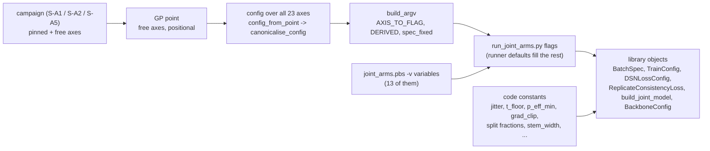

# P0 -- The tunable parameters of the joint DSN + NPE optimisation and training: overview

**Document P0 of the joint documentation set.** Companions: P1-P7 (one per
parameter block), E0 (master notation and glossary). Index and status:
`00_INDEX.md`. **Date:** 2026-10-01 (v1). **Applies to:** the repository
`Simulation-Based-Inference` at `834eb41`, `hpc/joint/` (D-037).

| date | change |
|---|---|
| 2026-10-01 | v1. Written from `tools/inventory.json` (546 rows at `834eb41`) and from the source; the three generated tables (A, F, K) are rendered by `tools/p0_tables.py` and checked with `--check-doc`. No literature claim is made here (S6). |

**Abstract.** The joint stack trains one encoder $h_\psi$ and one conditional
flow $q_\omega(\theta \mid z)$ under the objective of eq. (1) of the plan, and
it exposes the knobs that configure that training on five different surfaces:
the 23 searched axes of the Stage 4 search space, the flags of the Stage 3
runner, the defaults and constants written into the Stage 2 library, the
knobs of the Stage 4 search driver, and the variables of the PBS job scripts.
The scientific question this document serves is practical: when a training
or a search is configured, which parameters exist, where is each one set,
what does it default to on every surface it appears on, which search axis
reaches which runner flag, and which document of the set explains it.
**Covered:** every tunable parameter of `hpc/joint/` (D-037), each with its
surface, type, default(s), range and prior where searched, the flag it reaches,
its Status in the Provenance model's sense, and its owner document; the
value chain from a campaign to a library object; the findings about the code
that a configuration must know (F-a..F-r of `00_INDEX.md` S6). **Deliberately
excluded:** what a parameter *means* and the literature behind it (P1-P7, with
the grounding searches); the bench and bank knobs beyond a pointer (P7); the
standalone DSN search and the standalone NPE tuner (D-037); how to run the
stack (`JOINT_DSN_NPE_USAGE_v1.md`). Nothing here is a measurement: no job of
`hpc/joint/` has run on the cluster (`[KB]` usage v1.3 S9).

---

## 1. Notation and symbols

| Symbol | Name / Meaning | Type & domain | Units | First used in S |
|---|---|---|---|---|
| $\theta$ | the inference parameters of one simulated row | $\theta \in \Theta \subset \mathbb{R}^{d_\theta}$ | mixed (per axis) | S3.1 |
| $d_\theta$ | parameter-space dimension; 26 on the DUP15HD bank, 10 on the bench | $\mathbb{N}$ | dimensionless | S3.1 |
| $x$ | one IFR window | $x \in \mathbb{R}^{W}_{\ge 0}$ | counts per bin (bank-dependent scale) | S3.1 |
| $W$ | window length in samples | $\mathbb{N}$ | samples | S3.1 |
| $h_\psi$ | the encoder (DSN backbone) | $h_\psi: \mathbb{R}^{W} \to S^{E-1} \subset \mathbb{R}^{E}$, weights $\psi$ | -- | S3.1 |
| $z$ | the embedding of a window, $z = h_\psi(x)$ | $z \in S^{E-1}$ (unit sphere) | dimensionless | S3.1 |
| $E$ | embedding dimension (`embedding_size`); 10 at the runner's default, 12 as the search anchor | $\mathbb{N}$ | dimensionless | S3.1 |
| $p$ | latent dimension of a bank, as its sidecar records it; 26 on the DUP15HD bank, 10 on the bench | $\mathbb{N}$ | dimensionless | S3.1 |
| $q_\omega(\theta \mid z)$ | the conditional flow (zuko NSF through sbi), weights $\omega$ | a density on $\Theta$ for each fixed $z$ | -- | S3.1 |
| $\lambda_{\rm dsn}$, $\lambda_{\rm rep}$ | weights of the DSN term and of the replicate term in eq. (1) | $\mathbb{R}_{\ge 0}$ | dimensionless | S3.2 |
| $S_{\rm mc}$ | posterior draws per well in the replicate term (`n_posterior_draws`) | $\mathbb{N}$ | draws | S3.2 |
| $B_{\rm sim}, B_{\rm met}, B_{\rm rep}$ | rows per optimiser step in the simulated, metric and replicate streams (`--b-sim`, `--b-met`, `--b-rep`) | $\mathbb{N}$ | rows (pairs for $B_{\rm rep}$) | S3.3 |
| $\beta_1, \beta_2$ | AdamW exponential decay rates; $\beta_1 = 1 - $ `one_minus_beta1` | $(0, 1)$ | dimensionless | S3.4 |
| $\Sigma_0$ | prior covariance used by the replicate term, $\mathrm{diag}((b_k - a_k)^2 / 12)$ for the box $[a_k, b_k]$ | PSD $d_\theta \times d_\theta$ | (param units)$^2$ | S3.4 |
| $T$ | the replicate statistic of two wells (one number per pair) | $\mathbb{R}_{\ge 0}$ | dimensionless | S3.4 |
| $p_{\rm eff}$ | the replicate term's target, the effective number of constrained directions | $[0, d_\theta]$ | dimensionless | S3.4 |
| $\kappa_S$ | the finite-draw inflation factor of $T$ left after the $d_\theta / S_{\rm mc}$ correction | $\mathbb{R}_{> 1}$ | dimensionless | S3.4 |
| $N_{\rm train}$ | rows of the training split (`n_train`, a shape anchor of the search) | $\mathbb{N}$ | rows | S3.5 |
| $\bar C$ | the symmetrised posterior covariance of a well pair, computed from the $S_{\rm mc}$ draws of each well (computed level; its analytic counterpart is P3's) | PD $d_\theta \times d_\theta$ | (param units)$^2$ | S3.4 |
| $\phi$ | the bench's structural parameters, stored in the unit box | $\phi \in (0, 1)^{d_\theta}$, $d_\theta = 10$ on the bench | dimensionless | S3.1 |

### 1.1 Conventions

- Code names are in backticks: an axis of the search space (`lr`), a runner
  flag (`--lr`), a dataclass field (`TrainConfig.lr`), a job variable
  (`EPOCHS`). The same knob can carry all four; S3.7 lists where they differ.
- **Default** means the value a knob takes on a given surface when nothing
  sets it there. A knob can have several defaults, one per surface; the one
  that acts at run time is the one of the surface that is actually invoked
  (S3.1).
- **Reaches** names the runner flag a search axis is written to by
  `build_argv`; an axis that reaches nothing would be searched without being
  trained (none, at `834eb41`; the two FIXED knobs that are not passed are
  F-a and F-b).
- **Status** follows the Provenance model: every knob in this document is
  `configured` (set by a person, a job variable or the search) unless the row
  says otherwise. The exceptions are `analytic` ($\Sigma_0$, the unit prior
  box), `measured` from the bank ($d_\theta$, $p$, $W$, the class count,
  $N_{\rm train}$ after the split) and `computed` (the resolved ranges of
  S3.2, which are functions of the measured shapes).
- Every `file:line` is `[REPO]` at `834eb41`; every resolved number is
  `[RAN]` in the sandbox of 2026-10-01 (`00_INDEX.md` S8); the ranges and
  defaults are the inventory's (`tools/inventory.json`), and the three
  generated tables are checked against the code by `tools/p0_tables.py --check-doc`.
- Booleans appear as the code writes them: `False` in a dataclass, `0` on a
  flag. `head_fusion` False and `--head-fusion 0` are one value.

## 2. Glossary

Ordered by first appearance; the master glossary is E0.

**Surface.** One of the five places a knob can be set: a searched axis, a
runner flag, a library default or constant, a driver knob, a job variable.
(S3.1)

**Searched axis.** One of the 23 coordinates of `JOINT_KNOB_ORDER`, the
tuple the Stage 4 search moves on. Its order is load-bearing: a GP point is
a positional list over the free axes. (S3.2)

**Campaign.** A named partition of the 23 axes into *free* (searched) and
*pinned* (held at a value for the whole campaign): `S-A1`, `S-A2`, `S-A5`,
and the union `S-A25`. (S3.2)

**Pin / free.** A pinned axis is fixed for the campaign; a free one is
sampled by the optimiser. A campaign pins a whole block by switching it off.
(S3.2)

**Switch.** `dsn_on` and `rep_on`: the two binary axes that turn the DSN term
and the replicate term on or off. Off, the block's other axes are *inactive*.
(S3.2)

**Inactive axis, canonical pin.** An axis the configuration does not read on
this trial (its switch is off, or its loss type does not use it). It is set
to a fixed *canonical* value from `INACTIVE_CANONICAL` -- a legal coordinate
of the axis chosen to be inert, not the runner's default and not necessarily
zero -- so two points differing only in inactive coordinates build
byte-identical configurations. (S3.2, S3.5)

**Derived weight.** The runner takes a weight, not a switch and a log-weight:
`--lambda-dsn` is `10 ** log10_lambda_dsn` when `dsn_on = 1` and exactly
`0.0` when `dsn_on = 0`; likewise `--lambda-rep` from `rep_on` and
`log10_lambda_rep`. (S3.2)

**Runner.** `stage3/run_joint_arms.py`: one process per (arm, seed) that
assembles the backbone, the batcher, the criteria and the loop, trains, and
writes one record. Every knob reaches training through it. (S3.1)

**Driver.** `stage4/npe_tune_joint.py`: proposes configurations, turns each
into a runner command line (`build_argv`), runs it, reads the record back
into the ledger. (S3.5)

**Library default vs runner default.** A library object (`TrainConfig`,
`BatchSpec`, `build_joint_model`) has defaults of its own; the runner passes
every value explicitly, so in a Stage 3 or Stage 4 run the runner's default
wins and the library's is never seen. A direct caller of the library gets the
library's. (S3.1, S3.7)

**Plumbing.** Paths, selectors, switches and outputs (`--out-dir`,
`--sim-shards`, `--dry-run`, ...): configured, listed here, no deep dive.
(S3.3)

**Stream.** One of the three batches an optimiser step consumes: `sim`
(simulated $(\theta, x)$ rows, the NPE term), `met` (class-labelled rows, the
DSN term), `rep` (same-donor pairs, the replicate term). (S3.3)

**Arm.** A named experiment of Stage 3 (`A0`, `A0s`, `A1`, `A2`, `A2s`,
`A3`, `A5`, `A_ref`, `shuffled`): which terms are on, on which domain, and
whether the encoder is frozen. Chosen by `--arm`; the arm overrides the two
weights (S3.3). (S3.3)

**Bank, shard, sidecar.** The training data: `shard_%04d.npz` files plus a
JSON sidecar that records the shapes ($p$, $W$, the label axes). The runner
reads $d_\theta$ and $W$ from them. (S3.1)

**Legality projection, activity mask.** The DSN's rule that maps an illegal
(mining, loss type, strict) triple to a legal one, and the set of loss
hyper-parameters a loss type reads. Both are imported from the DSN's
`condition_space`, never copied. (S3.2, P2)

**Ledger, trial.** The driver's record of every evaluated configuration,
one JSON per trial, keyed by a `trial_id` of the configuration and the
split. (S3.5)

**Control.** A finalist's shuffled twin: the same recipe with the
$(\theta, z)$ pairing permuted, which measures the "learned nothing" floor
for that recipe. (S3.5)

**Shape anchors.** $p$, $E$, $d_\theta$ and $N_{\rm train}$: the numbers that
resolve the two shape-dependent ranges and the batch-size set of the space.
(S3.2, S3.5)

---

## 3. Main body

### 3.1 The map: five surfaces and one value chain

This section establishes where a knob can live and in which order the
surfaces override one another, so that every later table can be read as "this
row, on this surface".

One would expect a training knob to have one home and one default. In this
stack a knob such as the learning rate has four: a searched range in the
space (`lr` in `[1e-4, 2e-3]`), a runner flag (`--lr`, default `1e-3`), a
library default (`TrainConfig.lr = 5e-4`) and, for some knobs, a job variable
(`EPOCHS=10`). The four are consistent only because the runner passes every
value explicitly, so the library default is never read in a Stage 3 or Stage
4 run; and the job variable is consistent with the flag only where the job
script defines one (`joint_arms.pbs` defines thirteen, S3.6). Regardless of
how a run is launched, if a value reaches `run_joint_arms.py` as a flag, that
value is what trains; if it does not reach a flag, the runner's own default
trains, whatever the space, the ledger or the job script says (findings F-a
and F-b are exactly this gap, S3.2).

The chain, from a search campaign down to the objects that train:



ASCII fallback:

```
campaign --> GP point --> config (23 axes, canonicalised) --> build_argv --> runner flags --> library objects
                                                                            ^                  ^
                                                   joint_arms.pbs -v vars --+   code constants +
```

The five surfaces, with their table in this document:

| surface | what it is | who sets it | table |
|---|---|---|---|
| searched axis | one of the 23 coordinates of `JOINT_KNOB_ORDER` (`stage4/joint_space.py:92-105`) | the GP, or the campaign's pin | A (S3.2) |
| runner flag | an argument of `stage3/run_joint_arms.py` (`:205-271`) | the driver's `build_argv`, the job script, or a person | B (S3.3) |
| library default or constant | a keyword default of `stage2/*` or a module constant | the code; never changed by a run | C (S3.4) |
| driver knob | an argument of `stage4/npe_tune_joint.py` or of `joint_space.default_joint_space` | a person launching a campaign | D (S3.5) |
| job variable | a `: "${VAR:=default}"` of `stage3/jobs/joint_arms.pbs` or `stage4/jobs/joint_tune.pbs` | `qsub -v` | E (S3.6) |

What the bank fixes before any knob is read: $d_\theta$ is the width of the
shards' `theta` (`run_joint_arms.py:347`), $W$ is the sidecar's `W` (`:346`),
the class count is the number of distinct `cls` values (`:402`), and the
prior the runner hands to the flow and to $\Sigma_0$ is the unit box
`BoxUniform(0, 1)` in $d_\theta$ dimensions (`:386-388`): the bank's $\theta$
is expected in that box (the bench's $\phi \in (0, 1)^{d_\theta}$ is; a real bank must
be stored in its normalised coordinates). These four are `measured`, not
configured, and they are what the search's shape anchors must agree with
(S3.5).

### 3.2 Table A -- the 23 searched axes

This section establishes, for each searched axis, its type, the range the
optimiser samples at the DUP15HD shapes, the prior it samples with, which
campaigns pin it and at what, the runner flag it reaches, and the runner's
own default for that flag. The table is generated from `joint_space.py` and
`npe_tune_joint.py` (imported) and from the inventory; `tools/p0_tables.py
--check-doc` keeps it equal to the code.

How to read it. *Range at (26, 12, 26)* is `default_joint_space(p=26,
embedding_dim=12, d_theta=26)` `[RAN]`: two ranges are shape-resolved --
`hidden_features` by the width rule (`lo = min(max(32, 2 s), 64)`,
`hi = max(max(2 lo, 8 s), 256)` with `s = max(p, E)`: about `[2, 8] * s`,
widened so that it always contains `[64, 256]`; at these shapes `[52, 256]`;
`joint_space.py:297-300`) and `n_posterior_draws` by the floor
$4 d_\theta = 104$ (`:308-309`). *Prior* is how `space_dimensions` builds the skopt
dimension (parsed from its branches by `p0_tables.priors_from_source`):
log-uniform where the axis spans decades, categorical for switches and
choices, uniform otherwise. *S-A1 / S-A2 / S-A5* say whether the campaign
searches the axis or pins it; a pin on an inactive axis is the canonical
value of `INACTIVE_CANONICAL` (`joint_space.py:161-186`), resolved against
the spec for `n_posterior_draws` (its own lower bound, 104). *Reaches* is the
runner flag of `AXIS_TO_FLAG` (`npe_tune_joint.py:86-106`); the four axes of
`DERIVED` reach the runner as the two weights (`:112-117`). *Runner default*
is the value `run_joint_arms.py` uses for that flag when invoked without it
(Stage 3); for the derived rows it is the weight flag's default, `0.1` and
`0.05`, which the arm may override (S3.3).

<!-- p0:A:begin -->
| # | block | axis | type | range at (26, 12, 26) | prior | S-A1 | S-A2 | S-A5 | reaches | runner default | doc |
|---|---|---|---|---|---|---|---|---|---|---|---|
| 1 | encoder | `depth_exponent` | int | `[3, 6]` | integer, uniform | free | free | free | `--depth-exponent` | `3` | P1 |
| 2 | encoder | `width_multiplier` | float | `[1.5, 3.0]` | real, uniform | free | free | free | `--width-multiplier` | `2.0` | P1 |
| 3 | encoder | `block_family` | int | `{0, 1}` | categorical | free | free | free | `--block-family` | `0` | P1 |
| 4 | encoder | `embedding_size` | int | `[8, 16]` | integer, uniform | free | free | free | `--embedding-size` | `10` | P1 |
| 5 | encoder | `head_fusion` | int | `{0, 1}` | categorical | free | free | free | `--head-fusion` | `0` | P1 |
| 6 | encoder | `dropout` | float | `[0.0, 0.3]` | real, uniform | free | free | free | `--dropout` | `0.0` | P1 |
| 7 | dsn_loss | `dsn_on` | int | `{0, 1}` | categorical | pin 0 | free | pin 0 | `--lambda-dsn` (derived) | `0.1` | P2 |
| 8 | dsn_loss | `log10_lambda_dsn` | float | `[-3.0, 1.0]` | real, uniform | pin 0.0 | free | pin 0.0 | `--lambda-dsn` (derived) | `0.1` | P2 |
| 9 | dsn_loss | `loss_type` | str | `{triplet, joint, joint_sep}` | categorical | pin 'triplet' | free | pin 'triplet' | `--loss-type` | `'joint_sep'` | P2 |
| 10 | dsn_loss | `mining_strategy` | str | `{hard, easy_positive, easy_pos_semihard_neg}` | categorical | pin 'hard' | free | pin 'hard' | `--mining-strategy` | `'easy_pos_semihard_neg'` | P2 |
| 11 | dsn_loss | `margin` | float | `[0.1, 1.0]` | real, uniform | pin 0.2 | free | pin 0.2 | `--margin` | `0.2` | P2 |
| 12 | dsn_loss | `angular_alpha_deg` | float | `[2.0, 20.0]` | real, uniform | pin 18.0 | free | pin 18.0 | `--angular-alpha-deg` | `18.0` | P2 |
| 13 | dsn_loss | `lambda_sep` | float | `[0.001, 1.0]` | real, log-uniform | pin 0.1 | free | pin 0.1 | `--lambda-sep` | `0.1` | P2 |
| 14 | replicate | `rep_on` | int | `{0, 1}` | categorical | pin 0 | pin 0 | free | `--lambda-rep` (derived) | `0.05` | P3 |
| 15 | replicate | `log10_lambda_rep` | float | `[-3.0, 1.0]` | real, uniform | pin 0.0 | pin 0.0 | free | `--lambda-rep` (derived) | `0.05` | P3 |
| 16 | replicate | `warmup_frac_rep` | float | `[0.0, 0.5]` | real, uniform | pin 0.0 | pin 0.0 | free | `--warmup-frac-rep` | `0.3` | P3 |
| 17 | replicate | `n_posterior_draws` | int | `[104, 400]` | integer, uniform | pin 104 | pin 104 | free | `--n-posterior-draws` | `128` | P3 |
| 18 | flow | `hidden_features` | int | `[52, 256]` | integer, log-uniform | free | free | free | `--hidden-features` | `48` | P4 |
| 19 | flow | `num_transforms` | int | `[4, 12]` | integer, uniform | free | free | free | `--num-transforms` | `3` | P4 |
| 20 | optimiser | `lr` | float | `[0.0001, 0.002]` | real, log-uniform | free | free | free | `--lr` | `0.001` | P5 |
| 21 | optimiser | `one_minus_beta1` | float | `[0.01, 0.1]` | real, log-uniform | free | free | free | `--one-minus-beta1` | `0.1` | P5 |
| 22 | optimiser | `weight_decay` | float | `[1e-05, 0.01]` | real, log-uniform | free | free | free | `--weight-decay` | `0.0` | P5 |
| 23 | optimiser | `batch_size_npe` | int | `{256, 512, 1024}` | categorical | free | free | free | `--b-sim` | `128` | P5 |

Fixed by plan S5.1 and absent from the space, as the resolved spec reports them: `head_pool_ops=1`, `num_bins=10`, `one_minus_beta2=0.001`, `sep_warmup_frac=0.0`, `strict_semihard=1`. Resolved anchors: `hidden_features` range from the width rule `clamp([2,8] * max(p,E), [64,256])`; `n_posterior_draws` floor from `lower bound = 4 * d_theta`.
<!-- p0:A:end -->

Three things the table does not say by itself:

1. **The two switches never reach the runner as switches.** A trial with
   `dsn_on = 0` runs with `--lambda-dsn 0.0`, and the block's other six axes
   are then canonical values that the runner receives as flags but never reads
   (`dsn_loss_fn` is only built when the arm has a DSN domain,
   `run_joint_arms.py:400`). The arm the driver picks is `A1` when both
   switches are off, `A2` when only `dsn_on`, `A5` when only `rep_on`; both
   on has no Stage 3 arm and `arm_for_config` refuses it (`:230-251`), which
   is why `S-A25` cannot be evaluated today.
2. **Five knobs are FIXED by plan S5.1 and absent from the space**, and the
   spec carries them as `fixed`: `strict_semihard=1` is passed to the runner
   as `--strict-semihard` (`build_argv`, `:206-211`); `sep_warmup_frac=0.0`
   and `one_minus_beta2=1e-3` agree with the runner's and `TrainConfig`'s
   defaults (`--sep-warmup-frac 0.0`; `beta2=0.999`) so nothing is lost by
   not passing them; `num_bins=10` and `head_pool_ops=1` are **not passed and
   do not agree** with what the runner builds (8 bins; `("mean",)`): findings
   F-a and F-b, the D-038 patch stream.
3. **Two routes to one sampling law.** `lr`, `lambda_sep`,
   `one_minus_beta1`, `weight_decay` and `hidden_features` are log-uniform
   dimensions: the optimiser draws the logarithm of the value uniformly, and
   the value is what the axis records. The two weight axes record the
   exponent itself (`log10_lambda_dsn`, `log10_lambda_rep`) under a uniform
   prior on `[-3, 1]`: the same law for the weight, uniform in
   $\log_{10} \lambda$ over `[1e-3, 10]`, recorded in the other coordinate.
   A partial-dependence plot of `lr` is therefore read on a log axis of the
   value, one of `log10_lambda_dsn` on a linear axis of the exponent.

### 3.3 Table B -- runner flags outside the space

This section establishes which knobs the runner takes that no search axis
reaches: they configure every Stage 3 and Stage 4 run at a fixed value unless
a person or a job variable moves them. Eleven knobs and the plumbing; the
searched axes' flags are Table A's *reaches* column.

| flag | type | default | job variable (`joint_arms.pbs`) | what it configures | doc |
|---|---|---|---|---|---|
| `--arm` | choice of `ARMS` | required | `ARM` from the array index: `ARMS[IDX % 9]` | the named experiment; sets the encoder freeze, the DSN domain, the weights, the warm start, the fixed summary, the shuffle (`arm_config`, `run_joint_arms.py:175-202`) | P5, E4 |
| `--seed` | int | `0` | `SEED` from the index: `IDX / 9` | the torch seed, the grouped split, the three stream generators (`seed+1`, `+2`, `+3`), the shuffle permutation (`seed+777`) | P5 |
| `--epochs` | int | `10` | `EPOCHS=10` | epochs of the joint loop; with `--steps-per-epoch` the ramp horizon of both warm-ups | P5 |
| `--steps-per-epoch` | int | `25` | `STEPS_PER_EPOCH=25` | optimiser steps per epoch (one `batcher.next()` each) | P5 |
| `--b-met` | int | `32` | none | $B_{\rm met}$, split evenly over the classes (`per = max(1, b_met // n_classes)`, `joint_batches.py:181`); also the batch of the encoder pre-training of the frozen arms | P2 |
| `--b-rep` | int | `4` | none | $B_{\rm rep}$, same-donor pairs per step | P3 |
| `--encoder-steps` | int | `200` | `ENCODER_STEPS=200` | AdamW steps of the encoder-only pre-training of `A0`, `A0s` (the ramp horizon of `sep_warmup_frac` on those arms) | P2 |
| `--num-bins` | int | `8` | none | bins of the rational-quadratic splines of the flow (F-a) | P4 |
| `--sep-warmup-frac` | float | `0.0` | none | fraction of the horizon over which the DSN's separation term ramps in (fixed 0.0 by S5.1) | P2 |
| `--strict-semihard` | 0/1 | `1` | none | the DSN miner's strictness; passed by the driver from `spec.fixed` | P2 |
| `--warm-start-ckpt` | path | `None` | `WARM_START_CKPT` | the `A0` checkpoint that arm `A3` starts from | P5 |
| `--sim-shards`, `--real-shards`, `--out-dir`, `--dsn-main-dir`, `--sbi-hpc-dir`, `--dry-run` | paths / flag | required / `None` / `False` | `SIM_SHARDS`, `REAL_SHARDS`, `OUT_DIR`, --, --, `DRYRUN` | plumbing: the banks, the output stem, an explicit DSN tree (the in-repo `hpc/dsn` resolves by default), the repository's diagnostics, a dry run that trains nothing | -- |

The runner also takes every searched axis as a flag (Table A's *reaches*
column). Thirteen flags have a job variable (Table E); everything else on the
runner's surface is, in the usage reference's words, "reachable only by
editing the script or calling the Python directly" (`[KB]` usage v1.3 S5.2).
Read against Table E `[REPO]`, that is: the six encoder axes, the five
DSN-loss hyper-parameters, `--warmup-frac-rep`, `--hidden-features`,
`--num-transforms`, `--num-bins`, `--embedding-size`, `--lr`,
`--weight-decay`, `--one-minus-beta1`, `--b-met`, `--b-rep`,
`--sep-warmup-frac`, `--strict-semihard`, `--dsn-main-dir`, `--sbi-hpc-dir`.

**The runner's defaults are not a point of the space** (F-r, `[reasoning]`
over Table A's two columns). Four of the runner's defaults lie outside the
range the search samples: `--b-sim 128` is not in `{256, 512, 1024}`;
`--hidden-features 48` is below the lower bound 52 at $(26, 12, 26)$ (it is
inside the bench's `[32, 256]`); `--num-transforms 3` is below `[4, 12]`;
`--weight-decay 0.0` is below `[1e-5, 1e-2]`, which a log-uniform axis cannot
contain. So a Stage 3 arm "at default hyper-parameters" trains a
configuration the Stage 4 ledger can never hold, and a Stage 4 best point is
never the Stage 3 default; a comparison between the two is a comparison of
two recipes, not of a search against its own origin. The fifth gap is F-p:
`--warmup-frac-rep 0.3` is inside `[0.0, 0.5]` but differs from the pin 0.0
that every `rep_on = 0` trial records.

What the arm does to the weights, since the arm is chosen before the flags
are read (`arm_config`, `:175-202`): `A1`, `A0`, `A0s`, `A_ref`, `shuffled`
set both weights of the joint loop to 0 whatever `--lambda-dsn` and
`--lambda-rep` say; `A2`, `A2s`, `A3` take `--lambda-dsn` and set
$\lambda_{\rm rep} = 0$; `A5` takes `--lambda-rep` and sets
$\lambda_{\rm dsn} = 0$. The DSN-loss flags are read only on the arms with a
DSN domain, `A0`, `A0s`, `A2`, `A2s`, `A3` -- on `A0` and `A0s` in the
encoder-only pre-training (`train_encoder_only`, `:458-459`), after which the
encoder is frozen and the joint loop runs with $\lambda_{\rm dsn} = 0$; on
`A2`, `A2s`, `A3` in the joint loop. The replicate flags are read in training
only on `A5`, and in the post-training diagnostics of every arm that has a
real bank (`replicate_report`, `:613-622`).

### 3.4 Table C -- constants configured by code

This section establishes the knobs that no flag, axis or job variable
reaches: they are written into the library or into the runner, and a run
cannot move them. Each is a configuration all the same, and a search cannot
be "about" it.

| constant | value | where | what it does | doc |
|---|---|---|---|---|
| `TrainConfig.grad_clip` | `5.0` | `joint_train.py:42`, applied `:208-210` | global-norm gradient clipping over all trainable parameters, every step; `0` would disable it | P5 |
| `TrainConfig.beta2` | `0.999` | `joint_train.py:44` | AdamW $\beta_2$; equals $1 - 10^{-3}$, the space's fixed `one_minus_beta2` | P5 |
| `patience` | `99` | `run_joint_arms.py:522` | early-stopping patience in epochs on the NPE validation score; at `epochs=10` it cannot fire (F-d); the best-validation state is restored regardless (`joint_train.py:269-270`) | P5 |
| `rho_grad_probe` | `lambda_dsn > 0` | `run_joint_arms.py:523` | the per-epoch gradient-cosine probe between the NPE and DSN terms, on when the DSN term is on | P2, P5 |
| `ReplicateConsistencyLoss.correct_mc` | `True` | `joint_losses.py:264` | subtracts $d_\theta / S_{\rm mc}$ from $T$ (plan eq. 3h); the residual $\kappa_S$ is not corrected (F-e) | P3 |
| `ReplicateConsistencyLoss.jitter` | `1e-6` x mean diagonal | `joint_losses.py:79`, `:184-190` | relative jitter added to $\bar C$ before the Cholesky factorisation | P3 |
| `ReplicateConsistencyLoss.t_floor` | `1e-8` | `joint_losses.py:80`, `:232-235` | clamp on $T$ and on $p_{\rm eff}$ before the logs of plan eq. (3c) | P3 |
| `ReplicateConsistencyLoss.p_eff_min` | `1e-3` | `joint_losses.py:83`, `:320-322` | below this, $p_{\rm eff}$ is clamped and the pair counted as invalid | P3 |
| $\Sigma_0$ | `diag(1/12)` on the unit box | `run_joint_arms.py:514-515`, `joint_losses.py:168-177` | the prior covariance of plan eq. (9); `analytic`, the box second moment; spans all $d_\theta$ axes (D17 option (c)) | P3 |
| prior of the flow | `BoxUniform(0, 1)^{d_theta}` | `run_joint_arms.py:385-388` | the prior `posterior_nn` needs for `z_score_theta="transform_to_unconstrained"`; `analytic` | P4 |
| `z_score_theta`, `z_score_x` | `"transform_to_unconstrained"`, `"none"` | `joint_model.py:197-198` | how sbi standardises $\theta$ and $x$ before the flow | P4 |
| the example batch | `theta_tr[:64]`, `x_tr[:64]` | `run_joint_arms.py:463` | the batch `posterior_nn` is built against (shapes); not a training batch | P4 |
| `grouped_split` | `(0.7, 0.15, 0.15)` by donor, seed `--seed` | `run_joint_arms.py:118-143`, `:369` | the frozen train / selection / report split, grouped by donor; its sha256 is the `split_hash` of the record | P5 |
| `stem_width` | `16` | `run_joint_arms.py:307` | the stem width of the backbone (`BackboneConfig`); the other `BackboneConfig` defaults the runner does not set: `in_channels 1`, `group_width 16`, `norm_target_cpg 16`, `norm_g_max 32`, `stem_kernel 5`, `stem_stride 4`, `stage_kernel 3`, `downsampling_rate 2`, `head_prenorm True`, `l2_normalize True`, `head_pool_ops ("mean",)` (`dsn/backbone.py:56-90`); the fallback `SmallBackbone` built when no DSN tree is found (`run_joint_arms.py:282-333`) ignores the six encoder axes and says so | P1 |
| `DSNLossConfig.swap`, `sep_centre_means`, `sep_gate_threshold` | `True`, `None`, `None` | `dsn_loss_adapter.py:56-70` | the DSN loss fields the runner never exposes | P2 |
| encoder pre-training optimiser | `torch.optim.AdamW(backbone.parameters(), lr=--lr)`: torch's own defaults for `weight_decay` and `betas`, **not** `--weight-decay` and `--one-minus-beta1`; batch `--b-met`; generator `seed+1` | `run_joint_arms.py:150-170` (`:154`), `:458-459` | the stage-one fit of the frozen arms `A0`, `A0s` (F-q; torch's default values are not read here, torch is not installed in the sandbox) | P2, P5 |
| `FixedStatsSummary.N_STATS` | `8` | `run_joint_arms.py:83` | the fixed hand-crafted summary of arm `A_ref` ($E = 8$ there, whatever `--embedding-size` says) | P5 |
| diagnostics caps | 256 report rows; 64 replicate pairs; `evaluate_npe` batch 512 | `run_joint_arms.py:561-562`, `:614`; `joint_train.py:104` | the rows and pairs the post-training diagnostics are computed on | P5 |
| stream generators | `seed+1`, `seed+2`, `seed+3`; shuffle `seed+777`; encoder pre-training `seed+1` | `joint_batches.py:126-128`; `run_joint_arms.py:381`, `:155` | one generator per stream, so resizing one stream cannot perturb another's draws | P5 |

### 3.5 Table D -- the search driver's knobs

This section establishes the knobs of Stage 4 that configure the *search*
rather than one training: the campaign, the shape anchors, the proposal
batch, the ranking and gating splits, and the per-finalist control test.
Subcommands of `stage4/npe_tune_joint.py` (`build_parser`, `:743-812`); `common` flags are on
every subcommand, `common[need_shards]` on `argv` and `evaluate` only.

| knob | subcommand | type | default | what it configures | doc |
|---|---|---|---|---|---|
| `--campaign` | common | `S-A1`, `S-A2`, `S-A5`, `S-A25` | `S-A1` | which axes are free and which pinned (`CAMPAIGNS`, `joint_space.py:375-398`); the ledger directory | P6 |
| `--p`, `--embedding-dim`, `--d-theta` | common | int | `26`, `12`, `26` | the shape anchors that resolve `hidden_features` and `n_posterior_draws`; **must match the bank** (on a bench bank pass `--d-theta 10 --p 10`, `[KB]` usage v1.3 S7) | P6 |
| `--n-train` | common | int | `None` | the training-split size that trims `batch_size_npe` to the sizes giving at least 20 steps per epoch, or to `{256}` when none does (`default_joint_space`, `:305-306`) | P6 |
| `--split-hash`, `--contract-digest` | common | str | `''` | identifiers folded into `trial_id`, so a trial is keyed by its configuration AND its data | P6 |
| `--seed` | common | int | `0` | the seed handed to the runner | P6 |
| `--n-points` | propose | int | `8` | configurations proposed per round (constant-liar batch) | P6 |
| `--n-initial-points` | propose | int | `12` | random points before the GP takes over | P6 |
| `--sigma-seed` | propose, status | float | `None` | the measured across-seed spread; its square is the GP's observation-noise variance; the escalation verdict's scale | P6 |
| `--epochs`, `--steps-per-epoch` | argv, evaluate | int | `10`, `25` | the training length handed to the runner for every trial | P5 |
| `--tag` | evaluate | str | `''` | marks a trial that must not enter the surrogate (a learning-curve point, a control) | P6 |
| `--results-dir`, `--sim-shards`, `--real-shards`, `--out-dir`, `--runner`, `--dsn-main-dir`, `--sbi-hpc-dir`, `--dry-run`, `--config-json`, `--pending-id` | common / `common[need_shards]` / argv, evaluate | paths, flag | `tune_joint`, required, `None`, `runs_joint`, `DEFAULT_RUNNER`, `None`, `None`, `False`, `None`, `None` | plumbing: the ledger root, the banks, the runs, the runner script, the DSN and repository trees handed through to the runner, a dry run, the trial to run (by file or by pending id) | -- |
| `--top` | status | int | `10` | rows of the ledger table printed | P6 |
| `--top-k`, `--rank-split`, `--gate-split` | finalists | int, str, str | `3`, `sel`, `gate` | how many finalists, ranked on which split, gated on which split (rank and gate on different splits, or the test is anti-conservative) | P6 |
| `--plan` / `--score`, `--n-control`, `--n-seeds`, `--alpha`, `--floor`, `--delta-min-provisional` | controls | flag, int, int, float, float, float | --, `5`, `1`, `0.05`, `0.0`, `nan` | the per-finalist shuffled controls: how many, with how many seeds, the Holm level, a floor on the gain, a provisional threshold while the controls run | P6 |
| `default_joint_space(strict_semihard=1, n_posterior_draws_max=400)` | library | int, int | `1`, `400` | the fixed strictness the space declares (passed to the runner); the upper bound of $S_{\rm mc}$ | P6 |
| `INACTIVE_CANONICAL` | library | dict | `joint_space.py:161-186` | the canonical values of the inactive axes: `log10_lambda_dsn 0.0`, `loss_type triplet`, `mining_strategy hard`, `margin 0.2`, `angular_alpha_deg 18.0`, `lambda_sep 0.1`, `log10_lambda_rep 0.0`, `warmup_frac_rep 0.0`, `n_posterior_draws` = its lower bound | P6 |
| `boundary_axes(rel_tol=1e-6)` | library | float | `1e-6` | the tolerance that declares a best configuration "on the edge" of a range (widen the range, not the budget) | P6 |

### 3.6 Table E -- the job variables

This section establishes what `qsub -v` can set, and what it cannot: the two
training job scripts recognise the variables below and nothing else.

| job script | variable (default) | reaches |
|---|---|---|
| `stage3/jobs/joint_arms.pbs` (`select=1:ncpus=4:mem=16gb`, walltime `06:00:00`) | `SIM_SHARDS`, `REAL_SHARDS`, `OUT_DIR` (required), `EPOCHS` (10), `STEPS_PER_EPOCH` (25), `B_SIM` (128), `LAMBDA_DSN` (0.1), `LAMBDA_REP` (0.05), `N_DRAWS` (128), `ENCODER_STEPS` (200), `WARM_START_CKPT`, `ENV_NAME` (`sbi_env`), `DRYRUN` (0) | the runner flags of the same name; `ARM` and the seed come from `PBS_ARRAY_INDEX` through `ARMS=(A1 A0 A0s A2 A2s A3 A5 A_ref shuffled)` (`:69`), 9 arms x seeds |
| `stage4/jobs/joint_tune.pbs` (`select=1:ncpus=4:mem=16gb`, walltime `08:00:00`) | `CAMPAIGN` (`S-A1`), `RESULTS_DIR`, `SIM_SHARDS`, `REAL_SHARDS`, `OUT_DIR`, `EPOCHS` (10), `STEPS_PER_EPOCH` (25), `SEED` (0), `TAG`, `SPLIT_HASH`, `CONTRACT_DIGEST`, `P` (26), `EMBEDDING_DIM` (12), `D_THETA` (26), `DRYRUN` (0), `ENV_NAME` (`sbi_env`), `SKIP_CONDA` (0), `PYBIN` (`python`) | the driver's `evaluate` flags; one pending trial per array index (`PENDING_DIR`); an exported `SBI_HPC_DIR` is forwarded as `--sbi-hpc-dir` (`:157`) |
| `stage4/jobs/launch_joint_tune.sh` | positional `CAMPAIGN`, `RESULTS_DIR`; `PYBIN` (`python`); `--submit`, `--max` | the dry-run-by-default launcher of the pending trials |

The Stage 1 bank job (`stage1/jobs/build_latent_bank.pbs`: `ARM`, `OUT_DIR`,
`N_TRACES`, `WELLS_PER_DONOR`, `N_WINDOWS`, `T_WIN`, `FS`, `PI`, `GAP_MODES`,
`N_PER_THETA`, `PROVIDER` (`reference`!), `SEED`, `MAX_RECORDS`) and the
Stage 3b/3c jobs are P7's.

### 3.7 Table F -- the same knob, different names and defaults

This section establishes the knobs that carry more than one default across
surfaces, so that a configuration can be read off the surface that is
actually invoked. Generated from the inventory (`knob_variants`): the
index's S7 lists 46 knobs under the same heading over all 546 rows; here a
knob is kept only if it still carries two different defaults after the
plumbing rows and the range-bearing dataclasses (`JointSpaceSpec`,
`SpaceSpec`, `SearchConfig`, `RegularizationConfig`, whose "defaults" are
searched ranges) are dropped, which leaves 28. The runner's flag wins at run time wherever the runner
passes the value explicitly -- it does for every row of a library object
below -- so the library default is what a direct caller gets, never a Stage 3
or Stage 4 run. Two rows are encodings, not differences: `head_fusion`
`False` / `0`, and `n_draws` `None` (a keyword that `correct_mc` requires)
against `N_DRAWS` 128.

<!-- p0:F:begin -->
28 knobs with more than one default among the owned rows (plumbing excluded).

| knob | where | name | default | doc |
|---|---|---|---|---|
| `T_win` | build_latent_bank.py | `--T-win` | `60.0` | P7 |
|  | demo_classes_generate.py | `--T-win` | `15.0` | P7 |
|  | latent_sbi_simulator.py | `LatentSBISpec.__init__.T_win` | `60.0` | P7 |
| `b_met` | joint_batches.py | `BatchSpec.__init__.b_met` | `64` | P2 |
|  | run_joint_arms.py | `--b-met` | `32` | P2 |
| `b_rep` | joint_batches.py | `BatchSpec.__init__.b_rep` | `8` | P3 |
|  | run_joint_arms.py | `--b-rep` | `4` | P3 |
| `b_sim` | joint_batches.py | `BatchSpec.__init__.b_sim` | `512` | P5 |
|  | joint_arms.pbs | `B_SIM` | `128` | P5 |
|  | run_joint_arms.py | `--b-sim` | `128` | P5 |
| `correct_mc` | joint_losses.py | `ReplicateConsistencyLoss.__init__.correct_mc` | `True` | P3 |
|  | joint_losses.py | `replicate_statistic.correct_mc` | `False` | P3 |
| `depth_exponent` | backbone.py | `BackboneConfig.depth_exponent` | `4` | P1 |
|  | run_joint_arms.py | `--depth-exponent` | `3` | P1 |
| `drift_period_s` | latent_gap.py | `GapSpec.__init__.drift_period_s` | `120.0` | P7 |
|  | latent_nuisance.py | `NuisanceSpec.__init__.drift_period_s` | `600.0` | P7 |
| `embedding_size` | backbone.py | `BackboneConfig.embedding_size` | `16` | P1 |
|  | probe_dsn_runtime.py | `--embedding-size` | `12` | P1 |
|  | run_joint_arms.py | `--embedding-size` | `10` | P1 |
| `epochs` | joint_train.py | `TrainConfig.__init__.epochs` | `20` | P5 |
|  | joint_arms.pbs | `EPOCHS` | `10` | P5 |
|  | run_joint_arms.py | `--epochs` | `10` | P5 |
|  | joint_tune.pbs | `EPOCHS` | `10` | P5 |
|  | npe_tune_joint.py | `--epochs` | `10` | P5 |
|  | npe_tune_joint.py | `build_argv.epochs` | `10` | P6 |
| `gap_modes` | build_latent_bank.py | `--gap-modes` | `'range_shift'` | P7 |
|  | build_latent_bank.pbs | `GAP_MODES` | `range_shift` | P7 |
| `head_fusion` | backbone.py | `BackboneConfig.head_fusion` | `False` | P1 |
|  | run_joint_arms.py | `--head-fusion` | `0` | P1 |
| `hidden_features` | joint_model.py | `build_joint_model.hidden_features` | `64` | P4 |
|  | run_joint_arms.py | `--hidden-features` | `48` | P4 |
| `lambda_dsn` | joint_train.py | `TrainConfig.__init__.lambda_dsn` | `0.0` | P5 |
|  | joint_arms.pbs | `LAMBDA_DSN` | `0.1` | P2 |
|  | run_joint_arms.py | `--lambda-dsn` | `0.1` | P2 |
| `lambda_rep` | joint_train.py | `TrainConfig.__init__.lambda_rep` | `0.0` | P5 |
|  | joint_arms.pbs | `LAMBDA_REP` | `0.05` | P3 |
|  | run_joint_arms.py | `--lambda-rep` | `0.05` | P3 |
| `loss_type` | config.py | `TrainConfig.loss_type` | `'triplet'` | P2 |
|  | dsn_loss_adapter.py | `DSNLossConfig.__init__.loss_type` | `'joint_sep'` | P2 |
|  | probe_dsn_runtime.py | `--loss-type` | `'joint_sep'` | P2 |
|  | run_joint_arms.py | `--loss-type` | `'joint_sep'` | P2 |
| `lr` | config.py | `TrainConfig.lr` | `0.0003` | P5 |
|  | joint_train.py | `TrainConfig.__init__.lr` | `0.0005` | P5 |
|  | run_joint_arms.py | `--lr` | `0.001` | P5 |
| `margin` | config.py | `TrainConfig.margin` | `0.3` | P2 |
|  | dsn_loss_adapter.py | `DSNLossConfig.__init__.margin` | `0.2` | P2 |
|  | probe_dsn_runtime.py | `--margin` | `0.2` | P2 |
|  | run_joint_arms.py | `--margin` | `0.2` | P2 |
| `mining_strategy` | config.py | `TrainConfig.mining_strategy` | `'hard'` | P2 |
|  | dsn_loss_adapter.py | `DSNLossConfig.__init__.mining_strategy` | `'easy_pos_semihard_neg'` | P2 |
|  | probe_dsn_runtime.py | `--mining-strategy` | `'easy_pos_semihard_neg'` | P2 |
|  | run_joint_arms.py | `--mining-strategy` | `'easy_pos_semihard_neg'` | P2 |
| `n_draws` | joint_losses.py | `replicate_statistic.n_draws` | `None` | P3 |
|  | joint_arms.pbs | `N_DRAWS` | `128` | P3 |
| `n_post_draws` | stage3c.pbs | `N_POST_DRAWS` | `128` | P7 |
|  | run_stage3c.py | `--n-post-draws` | `64` | P7 |
| `n_posterior_draws` | joint_train.py | `train_joint.n_posterior_draws` | `256` | P3 |
|  | run_joint_arms.py | `--n-posterior-draws` | `128` | P3 |
| `n_windows` | build_latent_bank.py | `--n-windows` | `8` | P7 |
|  | demo_classes_generate.py | `--n-windows` | `4` | P7 |
|  | build_latent_bank.pbs | `N_WINDOWS` | `8` | P7 |
| `num_bins` | joint_model.py | `build_joint_model.num_bins` | `10` | P4 |
|  | run_joint_arms.py | `--num-bins` | `8` | P4 |
| `num_transforms` | joint_model.py | `build_joint_model.num_transforms` | `5` | P4 |
|  | run_joint_arms.py | `--num-transforms` | `3` | P4 |
| `patience` | config.py | `TrainConfig.patience` | `10` | P5 |
|  | joint_train.py | `TrainConfig.__init__.patience` | `5` | P5 |
| `steps_per_epoch` | joint_train.py | `TrainConfig.__init__.steps_per_epoch` | `50` | P5 |
|  | joint_arms.pbs | `STEPS_PER_EPOCH` | `25` | P5 |
|  | run_joint_arms.py | `--steps-per-epoch` | `25` | P5 |
|  | joint_tune.pbs | `STEPS_PER_EPOCH` | `25` | P5 |
|  | npe_tune_joint.py | `--steps-per-epoch` | `25` | P5 |
|  | npe_tune_joint.py | `build_argv.steps_per_epoch` | `25` | P6 |
| `strict_semihard` | config.py | `TrainConfig.strict_semihard` | `False` | P2 |
|  | dsn_loss_adapter.py | `DSNLossConfig.__init__.strict_semihard` | `True` | P2 |
|  | probe_dsn_runtime.py | `--strict-semihard` | `1` | P2 |
|  | run_joint_arms.py | `--strict-semihard` | `1` | P2 |
|  | joint_space.py | `default_joint_space.strict_semihard` | `1` | P6 |
| `weight_decay` | config.py | `TrainConfig.weight_decay` | `0.0001` | P5 |
|  | joint_train.py | `TrainConfig.__init__.weight_decay` | `0.0` | P5 |
|  | run_joint_arms.py | `--weight-decay` | `0.0` | P5 |
<!-- p0:F:end -->

The knob that is *renamed* along the chain, beyond those with several
defaults: `batch_size_npe` (space) is `--b-sim` (runner) is `B_SIM` (job);
`dsn_on` + `log10_lambda_dsn` (space) is `--lambda-dsn` (runner) is
`LAMBDA_DSN` (job); `rep_on` + `log10_lambda_rep` is `--lambda-rep` is
`LAMBDA_REP`; `n_posterior_draws` is `--n-posterior-draws` is `N_DRAWS`;
`one_minus_beta1` (space, runner) is $\beta_1 = 1 - $ `one_minus_beta1`
(`TrainConfig.beta1`); `embedding_size` (space, `--embedding-size`) is $E$ and the
driver's `--embedding-dim` anchor, which need not equal it -- the anchor
resolves the range the axis is searched in, the axis is the value trained.

### 3.8 Upstream: the knobs that shape the problem before training

A bank's knobs are not training knobs, but they fix what training sees:
$d_\theta$, $W$, the class count, the number of donors (hence the split and
the replicate pairs), the scale of $x$ and the nuisance on it. They are P7's;
the pointers here are what a configuration must know. `--provider` selects
`reference` (a test fixture, not a simulator), `dsn` or `bench`, and fixes
$p$: 6 by default, from the DSN `LatentSpec`, or 10 structural
(`BENCH_AXES`) respectively; the bank job's `PROVIDER` defaults to
`reference`, so an array submitted without it builds a fixture bank, "a
valid `.npz` with a valid digest and no simulator behind it" (`[KB]` usage
v1.3 S3.1-3.2). The arm `S` or
`R`, `--pi` (the gap severity of the pseudo-real arm, 0 = none), `--gap-modes`
(`range_shift`, `drift`, `contamination`), `--n-per-theta` (realisations per
$\theta$), `--wells-per-donor` and `--donors-per-batch` (the nesting), the
window grid (`--n-windows`, `--T-win`, `--fs`, hence $W$), `--n-neurons`,
`--n-classes`, `--tau-ov`, and the nuisance scales of `NuisanceSpec` (five
components, `NU_COMPONENTS`, at three levels, `NU_LEVELS`: `latent_nuisance.py:42-54`, `:75-91`) are the knobs; the
scale convention of $x$ differs by provider (`per_unit_mean` for `bench`,
`sum_over_units` otherwise) and the nuisance scales were calibrated against
the other convention (`[KB]` usage v1.3 S3.5, open).

### 3.9 Table K -- the alphabetical index of knobs

This section establishes one lookup for the whole document: every owned knob
(plumbing excluded), where it is set, and the document that explains it.
Generated from the inventory.

<!-- p0:K:begin -->
182 knobs, 336 owned rows. A knob is one normalised name; its rows are every place that name carries a value.

| knob | set where (surface: file, name) | doc |
|---|---|---|
| `_ACTIVE` | constant: condition_space.py, `_ACTIVE` | P2 |
| `_DSN_AXES_OFF` | constant: joint_space.py, `_DSN_AXES_OFF` | P6 |
| `_INT_AXES` | constant: joint_space.py, `_INT_AXES` | P6 |
| `_LOSS_TAG` | constant: condition_space.py, `_LOSS_TAG` | P2 |
| `_MINING_TAG` | constant: condition_space.py, `_MINING_TAG` | P2 |
| `_NO_BOUNDARY` | constant: joint_space.py, `_NO_BOUNDARY` | P6 |
| `_REP_AXES_OFF` | constant: joint_space.py, `_REP_AXES_OFF` | P6 |
| `_STR_AXES` | constant: joint_space.py, `_STR_AXES` | P6 |
| `allow_real` | job_var: stage3c.pbs, `ALLOW_REAL` | P7 |
| `alpha` | cli: npe_tune_joint.py, `--alpha` | P6 |
| `anchored_to` | dataclass: joint_space.py, `JointSpaceSpec.anchored_to`; dataclass: npe_tune_search.py, `SpaceSpec.anchored_to` | P6 |
| `angular_alpha_deg` | cli: probe_dsn_runtime.py, `--angular-alpha-deg`; cli: run_joint_arms.py, `--angular-alpha-deg`; dataclass: config.py, `SearchConfig.angular_alpha_deg_range`; dataclass: config.py, `TrainConfig.angular_alpha_deg`; dataclass: joint_space.py, `JointSpaceSpec.angular_alpha_deg`; signature: dsn_loss_adapter.py, `DSNLossConfig.__init__.angular_alpha_deg` | P2 |
| `ARMS` | constant: run_joint_arms.py, `ARMS` | P6 |
| `arms` | job_var: joint_arms.pbs, `ARMS` | P6 |
| `AXIS_TO_FLAG` | constant: npe_tune_joint.py, `AXIS_TO_FLAG` | P6 |
| `b_met` | cli: run_joint_arms.py, `--b-met`; signature: joint_batches.py, `BatchSpec.__init__.b_met` | P2 |
| `b_rep` | cli: run_joint_arms.py, `--b-rep`; signature: joint_batches.py, `BatchSpec.__init__.b_rep` | P3 |
| `b_sim` | cli: run_joint_arms.py, `--b-sim`; job_var: joint_arms.pbs, `B_SIM`; signature: joint_batches.py, `BatchSpec.__init__.b_sim` | P5 |
| `batch_size_npe` | dataclass: joint_space.py, `JointSpaceSpec.batch_size_npe` | P5 |
| `batch_sizes` | dataclass: npe_tune_search.py, `SpaceSpec.batch_sizes` | P5 |
| `BENCH_AXES` | constant: bench_burst_provider.py, `BENCH_AXES` | P7 |
| `BENCH_FREE_IDX` | constant: bench_burst_provider.py, `BENCH_FREE_IDX` | P7 |
| `BENCH_LABEL_IDX` | constant: bench_burst_provider.py, `BENCH_LABEL_IDX` | P7 |
| `beta1` | signature: joint_train.py, `TrainConfig.__init__.beta1` | P5 |
| `beta2` | signature: joint_train.py, `TrainConfig.__init__.beta2` | P5 |
| `block_family` | cli: run_joint_arms.py, `--block-family`; dataclass: backbone.py, `BackboneConfig.block_family`; dataclass: config.py, `SearchConfig.block_family_choices`; dataclass: joint_space.py, `JointSpaceSpec.block_family` | P1 |
| `BLOCKS` | constant: joint_space.py, `BLOCKS` | P6 |
| `bootstrap_dir` | job_var: stage3b.pbs, `BOOTSTRAP_DIR` | P7 |
| `CAMPAIGNS` | constant: joint_space.py, `CAMPAIGNS` | P6 |
| `class_centres` | signature: latent_sbi_simulator.py, `LatentSBISpec.__init__.class_centres` | P7 |
| `contam_frac_max` | signature: latent_gap.py, `GapSpec.__init__.contam_frac_max` | P7 |
| `correct_mc` | signature: joint_losses.py, `ReplicateConsistencyLoss.__init__.correct_mc`; signature: joint_losses.py, `replicate_statistic.correct_mc` | P3 |
| `d_theta` | cli: joint_space.py, `--d-theta`; cli: npe_tune_joint.py, `--d-theta`; job_var: joint_tune.pbs, `D_THETA` | P6 |
| `DEFAULT_JITTER` | constant: joint_losses.py, `DEFAULT_JITTER` | P3 |
| `DEFAULT_P_EFF_MIN` | constant: joint_losses.py, `DEFAULT_P_EFF_MIN` | P3 |
| `DEFAULT_T_FLOOR` | constant: joint_losses.py, `DEFAULT_T_FLOOR` | P3 |
| `delta_min_provisional` | cli: npe_tune_joint.py, `--delta-min-provisional` | P6 |
| `depth_exponent` | cli: run_joint_arms.py, `--depth-exponent`; dataclass: backbone.py, `BackboneConfig.depth_exponent`; dataclass: config.py, `SearchConfig.depth_exponent_range`; dataclass: joint_space.py, `JointSpaceSpec.depth_exponent` | P1 |
| `DERIVED` | constant: npe_tune_joint.py, `DERIVED` | P6 |
| `detach_metric` | signature: joint_losses.py, `replicate_statistic.detach_metric` | P3 |
| `donors_per_batch` | cli: build_latent_bank.py, `--donors-per-batch` | P7 |
| `downsampling_rate` | dataclass: backbone.py, `BackboneConfig.downsampling_rate` | P1 |
| `drift_amp_max` | signature: latent_gap.py, `GapSpec.__init__.drift_amp_max` | P7 |
| `drift_period_s` | signature: latent_gap.py, `GapSpec.__init__.drift_period_s`; signature: latent_nuisance.py, `NuisanceSpec.__init__.drift_period_s` | P7 |
| `dropout` | cli: run_joint_arms.py, `--dropout`; dataclass: backbone.py, `BackboneConfig.dropout`; dataclass: config.py, `RegularizationConfig.dropout_range`; dataclass: joint_space.py, `JointSpaceSpec.dropout` | P1 |
| `dropout_logit0` | signature: latent_nuisance.py, `NuisanceSpec.__init__.dropout_logit0` | P7 |
| `dtype` | signature: joint_losses.py, `box_prior_covariance.dtype` | P3 |
| `embedding_dim` | cli: joint_space.py, `--embedding-dim`; cli: npe_tune_joint.py, `--embedding-dim`; job_var: joint_tune.pbs, `EMBEDDING_DIM` | P6 |
| `embedding_size` | cli: probe_dsn_runtime.py, `--embedding-size`; cli: run_joint_arms.py, `--embedding-size`; dataclass: backbone.py, `BackboneConfig.embedding_size`; dataclass: config.py, `SearchConfig.embedding_size_range`; dataclass: joint_space.py, `JointSpaceSpec.embedding_size` | P1 |
| `encoder_steps` | cli: run_joint_arms.py, `--encoder-steps`; job_var: joint_arms.pbs, `ENCODER_STEPS` | P2 |
| `epochs` | cli: run_joint_arms.py, `--epochs`; cli: npe_tune_joint.py, `--epochs`; job_var: joint_arms.pbs, `EPOCHS`; job_var: joint_tune.pbs, `EPOCHS`; signature: joint_train.py, `TrainConfig.__init__.epochs`; signature: npe_tune_joint.py, `build_argv.epochs` | P5, P6 |
| `extra` | job_var: joint_arms.pbs, `EXTRA`; job_var: stage3b.pbs, `EXTRA`; job_var: stage3c.pbs, `EXTRA` | P7 |
| `fd_seeds` | cli: run_stage3c.py, `--fd-seeds`; job_var: stage3c.pbs, `FD_SEEDS` | P7 |
| `fd_step` | cli: run_stage3c.py, `--fd-step`; job_var: stage3c.pbs, `FD_STEP` | P7 |
| `fixed` | dataclass: joint_space.py, `JointSpaceSpec.fixed` | P6 |
| `floor` | cli: npe_tune_joint.py, `--floor` | P6 |
| `fracs` | signature: run_joint_arms.py, `grouped_split.fracs` | P5 |
| `fs` | cli: build_latent_bank.py, `--fs`; cli: demo_classes_generate.py, `--fs`; job_var: build_latent_bank.pbs, `FS`; signature: latent_sbi_simulator.py, `LatentSBISpec.__init__.fs` | P7 |
| `gap_modes` | cli: build_latent_bank.py, `--gap-modes`; job_var: build_latent_bank.pbs, `GAP_MODES` | P7 |
| `GAP_MODES` | constant: latent_gap.py, `GAP_MODES` | P7 |
| `gate_split` | cli: npe_tune_joint.py, `--gate-split` | P6 |
| `grad_clip` | signature: joint_train.py, `TrainConfig.__init__.grad_clip` | P5 |
| `group_width` | dataclass: backbone.py, `BackboneConfig.group_width` | P1 |
| `head_fusion` | cli: run_joint_arms.py, `--head-fusion`; dataclass: backbone.py, `BackboneConfig.head_fusion`; dataclass: config.py, `SearchConfig.head_fusion_choices`; dataclass: joint_space.py, `JointSpaceSpec.head_fusion` | P1 |
| `head_pool_ops` | dataclass: backbone.py, `BackboneConfig.head_pool_ops`; dataclass: config.py, `SearchConfig.head_pool_ops_choices` | P1 |
| `HEAD_POOL_OPS_LEVELS` | constant: condition_space.py, `HEAD_POOL_OPS_LEVELS` | P1 |
| `head_prenorm` | dataclass: backbone.py, `BackboneConfig.head_prenorm` | P1 |
| `hidden_features` | cli: run_joint_arms.py, `--hidden-features`; dataclass: joint_space.py, `JointSpaceSpec.hidden_features`; dataclass: npe_tune_search.py, `SpaceSpec.hidden_features`; signature: joint_model.py, `build_joint_model.hidden_features` | P4 |
| `ids` | job_var: joint_tune.pbs, `IDS` | P7 |
| `idx` | job_var: build_latent_bank.pbs, `IDX`; job_var: joint_arms.pbs, `IDX`; job_var: joint_tune.pbs, `IDX` | P7 |
| `in_channels` | dataclass: backbone.py, `BackboneConfig.in_channels` | P1 |
| `INACTIVE_CANONICAL` | constant: joint_space.py, `INACTIVE_CANONICAL` | P6 |
| `jitter` | signature: joint_losses.py, `ReplicateConsistencyLoss.__init__.jitter`; signature: joint_losses.py, `replicate_statistic.jitter` | P3 |
| `JOINT_KNOB_ORDER` | constant: joint_space.py, `JOINT_KNOB_ORDER` | P6 |
| `kappa` | signature: latent_nuisance.py, `NuisanceSpec.__init__.kappa` | P7 |
| `kernel_axes` | cli: run_stage3c.py, `--kernel-axes`; job_var: stage3c.pbs, `KERNEL_AXES` | P7 |
| `KNOB_ORDER` | constant: npe_tune_search.py, `KNOB_ORDER` | P4 |
| `l2_normalize` | dataclass: backbone.py, `BackboneConfig.l2_normalize` | P1 |
| `label_idx` | signature: latent_sbi_simulator.py, `LatentSBISpec.__init__.label_idx` | P7 |
| `lambda_dsn` | cli: run_joint_arms.py, `--lambda-dsn`; job_var: joint_arms.pbs, `LAMBDA_DSN`; signature: joint_train.py, `TrainConfig.__init__.lambda_dsn` | P2, P5 |
| `lambda_rep` | cli: run_joint_arms.py, `--lambda-rep`; job_var: joint_arms.pbs, `LAMBDA_REP`; signature: joint_train.py, `TrainConfig.__init__.lambda_rep` | P3, P5 |
| `lambda_sep` | cli: probe_dsn_runtime.py, `--lambda-sep`; cli: run_joint_arms.py, `--lambda-sep`; dataclass: config.py, `SearchConfig.lambda_sep_range`; dataclass: config.py, `TrainConfig.lambda_sep`; dataclass: joint_space.py, `JointSpaceSpec.lambda_sep`; signature: dsn_loss_adapter.py, `DSNLossConfig.__init__.lambda_sep` | P2 |
| `learning_rate` | dataclass: npe_tune_search.py, `SpaceSpec.learning_rate` | P5 |
| `log10_lambda_dsn` | dataclass: joint_space.py, `JointSpaceSpec.log10_lambda_dsn` | P2 |
| `log10_lambda_rep` | dataclass: joint_space.py, `JointSpaceSpec.log10_lambda_rep` | P3 |
| `LOSS_HP_SUPERSET` | constant: condition_space.py, `LOSS_HP_SUPERSET` | P2 |
| `loss_type` | cli: probe_dsn_runtime.py, `--loss-type`; cli: run_joint_arms.py, `--loss-type`; dataclass: config.py, `SearchConfig.loss_type_choices`; dataclass: config.py, `TrainConfig.loss_type`; dataclass: joint_space.py, `JointSpaceSpec.loss_type`; signature: dsn_loss_adapter.py, `DSNLossConfig.__init__.loss_type` | P2 |
| `LOSS_TYPES` | constant: condition_space.py, `LOSS_TYPES` | P2 |
| `lr` | cli: run_joint_arms.py, `--lr`; dataclass: config.py, `SearchConfig.lr_range`; dataclass: config.py, `TrainConfig.lr`; dataclass: joint_space.py, `JointSpaceSpec.lr`; signature: joint_train.py, `TrainConfig.__init__.lr` | P5 |
| `margin` | cli: probe_dsn_runtime.py, `--margin`; cli: run_joint_arms.py, `--margin`; dataclass: config.py, `SearchConfig.margin_range`; dataclass: config.py, `TrainConfig.margin`; dataclass: joint_space.py, `JointSpaceSpec.margin`; signature: dsn_loss_adapter.py, `DSNLossConfig.__init__.margin` | P2 |
| `max_epochs` | dataclass: config.py, `TrainConfig.max_epochs` | P5 |
| `max_probe_rows` | cli: run_stage3b.py, `--max-probe-rows`; job_var: stage3b.pbs, `MAX_PROBE_ROWS` | P7 |
| `max_records` | job_var: build_latent_bank.pbs, `MAX_RECORDS` | P7 |
| `MINING_STRATEGIES` | constant: condition_space.py, `MINING_STRATEGIES` | P2 |
| `mining_strategy` | cli: probe_dsn_runtime.py, `--mining-strategy`; cli: run_joint_arms.py, `--mining-strategy`; dataclass: config.py, `SearchConfig.mining_strategy_choices`; dataclass: config.py, `TrainConfig.mining_strategy`; dataclass: joint_space.py, `JointSpaceSpec.mining_strategy`; signature: dsn_loss_adapter.py, `DSNLossConfig.__init__.mining_strategy` | P2 |
| `modes` | signature: latent_gap.py, `GapSpec.__init__.modes` | P7 |
| `n_background` | cli: demo_classes_generate.py, `--n-background` | P7 |
| `n_classes` | cli: build_latent_bank.py, `--n-classes`; cli: demo_classes_generate.py, `--n-classes`; cli: probe_dsn_runtime.py, `--n-classes` | P2 |
| `N_COMPONENTS` | constant: latent_nuisance.py, `N_COMPONENTS` | P7 |
| `n_control` | cli: npe_tune_joint.py, `--n-control` | P6 |
| `n_draws` | job_var: joint_arms.pbs, `N_DRAWS`; signature: joint_losses.py, `replicate_statistic.n_draws` | P3 |
| `n_electrodes` | signature: latent_nuisance.py, `NuisanceSpec.__init__.n_electrodes` | P7 |
| `n_floor_draws` | cli: run_stage3c.py, `--n-floor-draws`; job_var: stage3c.pbs, `N_FLOOR_DRAWS` | P7 |
| `n_initial_points` | cli: npe_tune_joint.py, `--n-initial-points` | P6 |
| `n_label_axes` | cli: build_latent_bank.py, `--n-label-axes` | P7 |
| `n_latent` | cli: build_latent_bank.py, `--n-latent`; signature: latent_sbi_simulator.py, `LatentSBISpec.__init__.n_latent` | P7 |
| `n_neurons` | cli: build_latent_bank.py, `--n-neurons`; cli: demo_classes_generate.py, `--n-neurons`; signature: latent_sbi_simulator.py, `LatentSBISpec.__init__.n_neurons` | P7 |
| `n_per_class` | cli: demo_classes_generate.py, `--n-per-class` | P7 |
| `n_per_theta` | cli: build_latent_bank.py, `--n-per-theta`; job_var: build_latent_bank.pbs, `N_PER_THETA`; signature: latent_realisation.py, `RealisationSpec.__init__.n_per_theta` | P7 |
| `n_points` | cli: npe_tune_joint.py, `--n-points` | P6 |
| `n_post_draws` | cli: run_stage3c.py, `--n-post-draws`; job_var: stage3c.pbs, `N_POST_DRAWS` | P7 |
| `n_posterior_draws` | cli: run_joint_arms.py, `--n-posterior-draws`; dataclass: joint_space.py, `JointSpaceSpec.n_posterior_draws`; signature: joint_train.py, `train_joint.n_posterior_draws` | P3 |
| `n_posterior_draws_max` | signature: joint_space.py, `default_joint_space.n_posterior_draws_max` | P6 |
| `n_seeds` | cli: npe_tune_joint.py, `--n-seeds` | P6 |
| `n_show` | cli: demo_classes_plot.py, `--n-show` | P7 |
| `N_STATS` | constant: run_joint_arms.py, `FixedStatsSummary.N_STATS` | P5 |
| `n_traces` | cli: build_latent_bank.py, `--n-traces`; job_var: build_latent_bank.pbs, `N_TRACES` | P7 |
| `n_train` | cli: joint_space.py, `--n-train`; cli: npe_tune_joint.py, `--n-train` | P6 |
| `n_windows` | cli: build_latent_bank.py, `--n-windows`; cli: demo_classes_generate.py, `--n-windows`; job_var: build_latent_bank.pbs, `N_WINDOWS` | P7 |
| `n_windows_per_trace` | signature: latent_sbi_simulator.py, `LatentSBISpec.__init__.n_windows_per_trace` | P7 |
| `name` | dataclass: joint_space.py, `Campaign.name` | P6 |
| `norm_g_max` | dataclass: backbone.py, `BackboneConfig.norm_g_max` | P1 |
| `norm_target_cpg` | dataclass: backbone.py, `BackboneConfig.norm_target_cpg` | P1 |
| `note` | dataclass: joint_space.py, `Campaign.note` | P6 |
| `NPE_ADAPTER` | constant: npe_tune_search.py, `NPE_ADAPTER` | P6 |
| `NU_COMPONENTS` | constant: latent_nuisance.py, `NU_COMPONENTS` | P7 |
| `NU_LEVELS` | constant: latent_nuisance.py, `NU_LEVELS` | P7 |
| `num_bins` | cli: run_joint_arms.py, `--num-bins`; dataclass: npe_tune_search.py, `SpaceSpec.num_bins`; signature: joint_model.py, `build_joint_model.num_bins` | P4 |
| `num_transforms` | cli: run_joint_arms.py, `--num-transforms`; dataclass: joint_space.py, `JointSpaceSpec.num_transforms`; dataclass: npe_tune_search.py, `SpaceSpec.num_transforms`; signature: joint_model.py, `build_joint_model.num_transforms` | P4 |
| `one_minus_beta1` | cli: run_joint_arms.py, `--one-minus-beta1`; dataclass: config.py, `SearchConfig.one_minus_beta1_range`; dataclass: joint_space.py, `JointSpaceSpec.one_minus_beta1` | P5 |
| `one_minus_beta2` | dataclass: config.py, `SearchConfig.one_minus_beta2_range` | P5 |
| `out_json` | job_var: stage3b.pbs, `OUT_JSON` | P7 |
| `p` | cli: joint_space.py, `--p`; cli: npe_tune_joint.py, `--p`; job_var: joint_tune.pbs, `P` | P6 |
| `p_eff_min` | signature: joint_losses.py, `ReplicateConsistencyLoss.__init__.p_eff_min` | P3 |
| `PAD_BINS` | constant: bench_burst_provider.py, `BenchBurstProvider.PAD_BINS` | P7 |
| `patience` | dataclass: config.py, `TrainConfig.patience`; signature: joint_train.py, `TrainConfig.__init__.patience` | P5 |
| `pca_dim` | cli: demo_classes_plot.py, `--pca-dim` | P7 |
| `perplexity` | cli: demo_classes_plot.py, `--perplexity` | P7 |
| `pi` | cli: build_latent_bank.py, `--pi`; job_var: build_latent_bank.pbs, `PI`; signature: latent_gap.py, `GapSpec.__init__.pi` | P7 |
| `pinned` | dataclass: joint_space.py, `Campaign.pinned` | P6 |
| `probe_ckpt` | job_var: stage3b.pbs, `PROBE_CKPT` | P7 |
| `provider` | cli: build_latent_bank.py, `--provider` | P7 |
| `RANGE_PROVENANCE` | constant: joint_space.py, `RANGE_PROVENANCE` | P6 |
| `rank_split` | cli: npe_tune_joint.py, `--rank-split` | P6 |
| `rel_tol` | signature: joint_space.py, `boundary_axes.rel_tol` | P6 |
| `rho_grad_probe` | signature: joint_train.py, `TrainConfig.__init__.rho_grad_probe` | P5 |
| `scales` | signature: latent_nuisance.py, `NuisanceSpec.__init__.scales` | P7 |
| `seed` | cli: build_latent_bank.py, `--seed`; cli: demo_classes_generate.py, `--seed`; cli: demo_classes_plot.py, `--seed`; cli: probe_dsn_runtime.py, `--seed`; cli: run_joint_arms.py, `--seed`; cli: run_stage3c.py, `--seed`; cli: npe_tune_joint.py, `--seed`; job_var: build_latent_bank.pbs, `SEED`; job_var: stage3c.pbs, `SEED`; job_var: joint_tune.pbs, `SEED`; signature: latent_sbi_simulator.py, `LatentSBISpec.__init__.seed` | P5, P7 |
| `sep_centre_means` | dataclass: config.py, `SearchConfig.sep_centre_means_choices`; signature: dsn_loss_adapter.py, `DSNLossConfig.__init__.sep_centre_means` | P2 |
| `sep_gate_threshold` | signature: dsn_loss_adapter.py, `DSNLossConfig.__init__.sep_gate_threshold` | P2 |
| `sep_warmup_frac` | cli: probe_dsn_runtime.py, `--sep-warmup-frac`; cli: run_joint_arms.py, `--sep-warmup-frac`; dataclass: config.py, `SearchConfig.sep_warmup_frac_range`; dataclass: config.py, `TrainConfig.sep_warmup_frac`; signature: dsn_loss_adapter.py, `DSNLossConfig.__init__.sep_warmup_frac` | P2 |
| `share_within` | signature: latent_realisation.py, `RealisationSpec.__init__.share_within` | P7 |
| `shift_max` | signature: latent_gap.py, `GapSpec.__init__.shift_max` | P7 |
| `SHUFFLE_FIELDS` | constant: joint_space.py, `SHUFFLE_FIELDS` | P6 |
| `sigma_seed` | cli: npe_tune_joint.py, `--sigma-seed`; cli: npe_tune_joint.py, `--sigma-seed` | P6 |
| `spread_axes` | cli: run_stage3c.py, `--spread-axes`; job_var: stage3c.pbs, `SPREAD_AXES` | P7 |
| `stage_kernel` | dataclass: backbone.py, `BackboneConfig.stage_kernel` | P1 |
| `stem_kernel` | dataclass: backbone.py, `BackboneConfig.stem_kernel` | P1 |
| `stem_stride` | dataclass: backbone.py, `BackboneConfig.stem_stride` | P1 |
| `stem_width` | dataclass: backbone.py, `BackboneConfig.stem_width` | P1 |
| `steps_per_epoch` | cli: run_joint_arms.py, `--steps-per-epoch`; cli: npe_tune_joint.py, `--steps-per-epoch`; job_var: joint_arms.pbs, `STEPS_PER_EPOCH`; job_var: joint_tune.pbs, `STEPS_PER_EPOCH`; signature: joint_train.py, `TrainConfig.__init__.steps_per_epoch`; signature: npe_tune_joint.py, `build_argv.steps_per_epoch` | P5, P6 |
| `strict_semihard` | cli: probe_dsn_runtime.py, `--strict-semihard`; cli: run_joint_arms.py, `--strict-semihard`; dataclass: config.py, `SearchConfig.strict_semihard_choices`; dataclass: config.py, `TrainConfig.strict_semihard`; signature: dsn_loss_adapter.py, `DSNLossConfig.__init__.strict_semihard`; signature: joint_space.py, `default_joint_space.strict_semihard` | P2, P6 |
| `swap` | dataclass: config.py, `TrainConfig.swap`; signature: dsn_loss_adapter.py, `DSNLossConfig.__init__.swap` | P2 |
| `t_floor` | signature: joint_losses.py, `ReplicateConsistencyLoss.__init__.t_floor`; signature: joint_losses.py, `replicate_loss.t_floor` | P3 |
| `T_win` | cli: build_latent_bank.py, `--T-win`; cli: demo_classes_generate.py, `--T-win`; signature: latent_sbi_simulator.py, `LatentSBISpec.__init__.T_win` | P7 |
| `t_win` | job_var: build_latent_bank.pbs, `T_WIN` | P7 |
| `tau_ov` | cli: build_latent_bank.py, `--tau-ov`; cli: demo_classes_generate.py, `--tau-ov`; signature: latent_sbi_simulator.py, `LatentSBISpec.__init__.tau_ov` | P7 |
| `top` | cli: npe_tune_joint.py, `--top` | P6 |
| `top_k` | cli: npe_tune_joint.py, `--top-k` | P6 |
| `total_steps` | cli: probe_dsn_runtime.py, `--total-steps` | P2 |
| `UNREACHABLE` | constant: npe_tune_joint.py, `UNREACHABLE` | P6 |
| `validation` | job_var: stage3c.pbs, `VALIDATION` | P7 |
| `warmup` | signature: joint_losses.py, `ReplicateConsistencyLoss.__init__.warmup` | P3 |
| `warmup_frac_rep` | cli: run_joint_arms.py, `--warmup-frac-rep`; dataclass: joint_space.py, `JointSpaceSpec.warmup_frac_rep` | P3 |
| `weight_decay` | cli: run_joint_arms.py, `--weight-decay`; dataclass: config.py, `RegularizationConfig.weight_decay_range`; dataclass: config.py, `SearchConfig.weight_decay_range`; dataclass: config.py, `TrainConfig.weight_decay`; dataclass: joint_space.py, `JointSpaceSpec.weight_decay`; signature: joint_train.py, `TrainConfig.__init__.weight_decay` | P5 |
| `wells_per_donor` | cli: build_latent_bank.py, `--wells-per-donor`; job_var: build_latent_bank.pbs, `WELLS_PER_DONOR` | P7 |
| `width_multiplier` | cli: run_joint_arms.py, `--width-multiplier`; dataclass: backbone.py, `BackboneConfig.width_multiplier`; dataclass: config.py, `SearchConfig.width_multiplier_range`; dataclass: joint_space.py, `JointSpaceSpec.width_multiplier` | P1 |
| `window` | cli: probe_dsn_runtime.py, `--window` | P7 |
| `z_score_theta` | signature: joint_model.py, `build_joint_model.z_score_theta` | P4 |
| `z_score_x` | signature: joint_model.py, `build_joint_model.z_score_x` | P4 |
| `zoom_s` | cli: demo_classes_plot.py, `--zoom-s` | P7 |
| `zoom_start` | cli: demo_classes_plot.py, `--zoom-start` | P7 |
<!-- p0:K:end -->

---

## 4. Summary of results

- Five surfaces (S3.1): searched axis, runner flag, library default or
  constant, driver knob, job variable; the runner's flag is what trains, the
  library default is never read by a Stage 3 or 4 run, a job variable exists
  for thirteen runner flags (S3.6).
- 23 searched axes over 5 blocks (S3.2, Table A): free 12 / 19 / 16 / 23 on
  `S-A1` / `S-A2` / `S-A5` / `S-A25` `[RAN]`; two shape-resolved ranges,
  `hidden_features` `[52, 256]` and `n_posterior_draws` `[104, 400]` at
  $(26, 12, 26)$; every axis reaches a runner flag, the two switches and the
  two log-weights as derived weights.
- Five knobs fixed by S5.1 and absent from the space: `strict_semihard`
  (passed), `sep_warmup_frac` and `one_minus_beta2` (consistent by default),
  `num_bins` and `head_pool_ops` (**not passed, inconsistent**: F-a, F-b).
- 11 runner knobs outside the space plus the plumbing (S3.3, Table B); four
  runner defaults outside the searched ranges (F-r); 19 rows of constants
  configured by code (S3.4, Table C), among them the encoder pre-training's
  optimiser, which takes torch's defaults rather than the runner's
  `--weight-decay` and `--one-minus-beta1` (F-q); the driver's knobs (S3.5,
  Table D); 28 knobs with more than one default (S3.7, Table F); 182 owned
  knobs in the index (S3.9, Table K) `[RAN]`.
- What a configuration must agree on before any knob matters: the bank's
  $d_\theta$, $W$, class count and donors (measured), the unit prior box, and
  the driver's shape anchors `--p --embedding-dim --d-theta --n-train`
  (S3.1, S3.5).

## 5. Open points, caveats, assumptions

- **Nothing has run.** Every default and every chain in this document is read
  from the source; no Stage 3 or 4 job has run anywhere (`[KB]` usage v1.3
  S9), so no statement here is about behaviour observed.
- **The findings F-a..F-r** (`00_INDEX.md` S6) are the caveats of this
  document: the two parity gaps (F-a, F-b; D-038), the stale provenance
  strings and docstrings (F-c, F-e, F-f), `patience=99` (F-d), the
  library-vs-runner defaults (F-m), the two draw counts of Stage 3c (F-n), the
  dataclass default below the floor (F-o), the runner's `warmup_frac_rep`
  0.3 against the pin 0.0 (F-p), the encoder pre-training's optimiser on
  torch's defaults (F-q, new in this document), the runner's defaults outside
  the space (F-r, new in this document).
- **The shape anchors are the DUP15HD bank's.** The Giulia project (D-039,
  D-041, D-043) will train arm `A1` on its own simulated bank at $W = 18000$
  and one electrode per subregion; its $p$ is its label freeze's (23,
  `[KB]` `claude/PLAN_2026-10-01_giulia_hpc_stages.md` S4), its $d_\theta$
  that project's question, and Table A's resolved ranges are re-computed
  for it with `default_joint_space(p, E, d_theta)` (one command, `00_INDEX.md`
  S8) -- the ranges are functions of the anchors, not constants.
- **Status is assigned by reading**, not by running: `configured` for every
  knob, `analytic` for the prior objects, `measured` for the bank shapes. A
  knob whose status surprised the reading is promoted into the prose
  (S3.1, S3.2).
- **The runner's prior is the unit box.** A bank whose $\theta$ is not stored
  in $[0, 1]^{d_\theta}$ coordinates would be trained against the wrong prior
  silently; the bench's $\phi$ is in the box by construction, and a real bank
  is the P7 / E6 question of the shard contract.

## 6. References / further reading

Everything in this document is read from the repository at `834eb41`
(`[REPO]`) or from project documents (`[KB]`), or reproduced in the sandbox
(`[RAN]`, `00_INDEX.md` S8). No claim about what a method does in the
literature is made here: the named methods (AdamW, the zuko neural spline
flow, the GP search, the triplet and angular losses) appear only as the
names of the code's objects, and the literature grounding they owe -- the
knowledge base's full texts, then PubMed, then bioRxiv -- is the owner
documents' (plan S6: P1-P7). No PubMed or bioRxiv query was run for this
document, for that reason; none is claimed.

- `hpc/joint/stage4/joint_space.py` (the space, the campaigns, the pins);
  `stage4/npe_tune_joint.py` (the driver, `build_argv`); `stage3/run_joint_arms.py`
  (the runner); `stage2/joint_train.py`, `joint_batches.py`, `joint_losses.py`,
  `joint_model.py`, `dsn_loss_adapter.py` (the library); `stage3/jobs/joint_arms.pbs`,
  `stage4/jobs/joint_tune.pbs`, `stage4/jobs/launch_joint_tune.sh` (the jobs);
  `hpc/dsn/backbone.py`, `hpc/dsn/config.py`, `hpc/dsn/condition_space.py`
  (the DSN objects the stack reads) -- all `[REPO 834eb41]`.
- `JOINT_DSN_NPE_USAGE_v1.md` v1.3, S3.1-3.2, S5.2-5.3, S7, S9 `[KB]`.
- `hpc/joint/JOINT_DSN_NPE_PLAN_v0_6.md` S2.2 (eq. 1), S5.1-5.2 (the space
  and the campaigns) `[REPO]`; its S5.1 sentence on `n_posterior_draws` is
  superseded by `claude/METRIC_REPLICATE_v1_4.md` S3.13.1 `[KB]` (F-e).
- `claude/SBI_decisions_and_ideas_log.md` D-035..D-039, D-041, D-043, D-052
  `[KB]`.
- `tools/inventory.json`, `tools/inventory_joint_knobs.py`, `tools/p0_tables.py`
  (this document's generated tables; `python3 tools/p0_tables.py --hpc-dir
  <repo>/hpc --check-doc P0_PARAMETERS_OVERVIEW.md` must print three `OK`).

*Pre-send check (R1-R8): every symbol typed in S1; every "wins" and "never
read" carries its hypothesis (a Stage 3 or 4 run, the runner passing the
value); no literature result transplanted; one name per object with the
renames listed in S3.7; the spaces named where a map appears (bank theta in
the unit box, the encoder's domain and codomain in S1); "default" and
"prior" declared per S1.1 (prior: the optimiser's sampling law in S3.2; the
flow's prior box in S3.4); no borrowed phrasing; the one two-level object,
$\Sigma_0$ as the analytic box moment against the $\bar C$ computed from
draws (status measured, computed level) that P3 compares it with, is named
by level in S1 and left to P3.*
